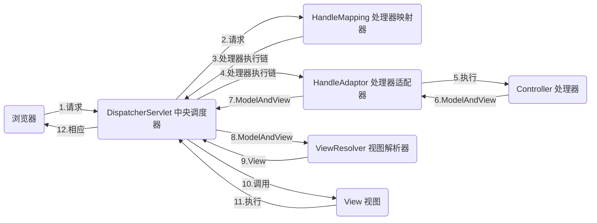

## Spring MVC的主要知识介绍

[TOC]

==本文使用spring mvc为版本5.3.7==

### 1. WEB的主要运行流程

spring mvc是作为一个WEB框架使用，主要的作用就是在我们指定的网址上根据不同的页面需求而返回对应的页面信息。

如浏览器中输入地址：`https://我们的主网址/index.html`

1. 这里用户试图获取对应网址下的`index.html`页面
2. 那么当浏览器将这一请求发送过来时，附带着说明我需要这样一个文件
3. 我们的WEB框架就会根据该需求，识别出需要的是一个`index.html`文件，并将本地资源中的`index.html`文件作为回复发送给浏览器，附带着告诉它这是什么类型的文件
4. 接着浏览器就会按照html文件格式，读取文件并渲染显示在页面中。

大体上，Spring MVC需要做的主要工作就是上述的流程，而这种识别工作就交给被标注了@Controller注解的类来完成。

但是我们的页面很多不是那种仅用于读取的静态页面，而是涉及到数据的交换，此时则需要结合数据库工作，目前常用的就是利用Mybatis作为数据库的操作工具，帮助我们存储和读取数据。

---------------------------

而涉及到spring框架时，常看到的就是容器，IOC。

- 首先，我们对数据的操作，这里先默认是常用的关系数据库，内部有表，表又有行。
- 行作为一条记录，包含了该表对一条数据要求的各种元素，如一个学生的表，则要求有学号，性别，年龄等信息。此时学生表中的记录可概括为一个学生类，类中包含了这些信息，而每条记录则是一个实例。
- 当然了，由于我们在java中常用的单例模式，一个类仅创建一个对象就足够了。
- 之后的数据库操作中，我们有一个学生的对象，当用户通过页面提交或需要修改一个学生的信息，那么将这些信息纳入到我们的学生对象中的相应的变量上
- 现在，用户提交的信息就放在一个对象中可以被传递，也可以被Mybatis识别内部对应的信息，并通过相应的语句发送给数据库
- 这样，我们就可以通过一个对象完成一个表中各种信息的传递，如果我们有多个表，只需要创建相应的类，并实例出一个对象即可。
- 那么一个大的工程，我们的对象可能有很多，我们在试图使用一个对象时，是否需要判断是否已经有这样一个对象。
- 在一个大工程中，去查询某一个对象是否均有一个对象是枯燥且较为麻烦的事情。
- 容器就是负责对这些对象进行管理，我们会发现spring中的编程动不动就在一个创建对象的方法上加一个@Bean注解，这就是告诉spring需要产生一个对象，并纳入容器中。
- 之后，就会发现我们再使用对象时，指定声明并加上@Autowired之类的注解即可，此时，spring发现这样一个注解，就会从容器中把对应的对象注入到你声明的对象中，这就是IOC。
- 由此，我们可以借助于容器，方便我们进行信息传递。

上述就是，我们使用Spring MVC主要的目的和重要的技术点。而具体到实际的项目，则需要考虑一些细枝末节，对产品做优化，不至于粗糙。

> 所谓的MVC是Model-View-Controller，controller负责判断url请求并分配到对应的负责方法，model就是这个方法，方法内部将各种工作完成后，将结果或直接将任务交给页面负责，即view，由此将一套任务进行分配，各司其职。

 ### 2.  代码的主要内容

前面了解了这一框架的用处，那么实际的使用则需要注重功能的组织。

- 首先在创建项目时，需要引入spring-webmvc的依赖。
- 而由于浏览器发送来的请求多种多样，不一定都是简单地获取页面，即使是页面，当我们的目标复杂时，对网址的各种状况也有明确的任务分类，导致有多个Controller对象，因此需要一个请求的管理器，这里是称为中央调度器DispatcherServlet来根据请求选择不同的应对方案，这是一个继承自类HttpServlet的servlet，需要在web.xml注册
- 需要的话，再写一些页面文件
- 再写几个控制器类即Controller，以负责完成各种内部工作，并可能负责返回页面文件
- 为了保证spring知道你的Controller在哪，还需要一个配置文件指明控制器所在的包的位置
- 此外，我们可能使用了一些视图解析器以处理页面效果，同样需要在配置文件中指明对应的包的位置。

> 读者可以阅读[开源项目]([spring-projects/spring-mvc-showcase: Demonstrates the features of the Spring MVC web framework (github.com)](https://github.com/spring-projects/spring-mvc-showcase)) ，该项目简单同时包含了springmvc较为完整的功能实现，非常适合初学者参考。

### 3. 项目构建

我们可以利用maven或gradle引入`javax.servlet-api`，`spring-webmvc`。

首先，整个项目需要中央调度器，要求在web.xml中告诉tomcat之类的服务器生成一个DispatchServlet的对象【更严格的说，tomcat只能算是Servlet容器】，如果是通过类创建调度器，则要求tomcat支持servlet3.0+，基本现在官网能下载的版本都是支持的（基本上6.0以上的版本就OK）。

#### 3.1 xml构建

大致的源代码文件框架如下：

```basic
├───java
│   └───自定义的
│       └───包名
│           ├───controller(自己随便命名，控制类的包)
│           └───···
│			└───···
├───resources
│		└───springmvc.xml//因为难受而自定义的另一个配置文件
└───webapp
	└───resources
	└───WEB-INF//这里面的文件对用户是不开放的
		└───web.xml//传统做法，需要借助这个文件作为项目的启动入口，现在我们可以直接创建java类取代
		└───dispatcher-servlet.xml//springmvc的配置文件
								//这个名字是随着自己定义的调度器名称而改变（是默认的格式）
```

关于其中的xml文件编写，读者搜索关于springmvc配置的结果，基本上都是这方面的资料。而且，xml配置属于以前的传统方式，本文更注重现有的纯java配置，但这要求使用的servlet版本至少是3.0，如果不是太老旧的，应该是没问题的。

可以了解一下，毕竟现如今存在的一些项目还是使用着上述的大体结构。

#### 3.2 java Bean配置

上述的XML文件配置，对于很多人而言觉得非常繁琐，而且还必须在指定的位置指定的文件名内写大量各种标签，从spring3.1开始，我们可以通过写普通的java类来初始化调度器。

```java
//继承并实现后，将创建出Dispatcher对象
public class MyWebAppInitializer 
    				extends AbstractAnnotationConfigDispatcherServletInitializer{
    @Override
    protected Class<?>[] getRootConfigClasses() {
        return new Class[] { springConfig.class };
    }
    @Override
    protected Class<?>[] getServletConfigClasses() {
        return new Class[] { DispatcherConfig.class };
    }
    @Override
    protected String[] getServletMappings() {
        return new String[] { "/" };
        //告诉dispatcher仅可以捕获仅有"/"的uri，如果使用了"/*"则会将其它uri交给dispatcher直接负责，																则绕过了控制器类，导致无法成功访问
    }
}
```

```java
@Configuration//指明是配置类
public class springConfig {
}
```

```java
@Configuration
@ComponentScan("控制器所在的包")
@EnableWebMvc
@EnableScheduling
public class DispatcherConfig implements WebMvcConfigurer {
    @Override
    public void configureViewResolvers(ViewResolverRegistry registry) {//视图解析器
        registry.jsp("/WEB-INF/jsp/", ".jsp");//假设页面文件都放在了jsp目录下
        //控制类返回的字符串一一般都会认为是逻辑名，将在前后加上这些前后缀
        //更深入的，可以通过prefix,suffix,viewClass指定前后缀，和加载视图的类
    }
}
```

```java
@Controller//本质上就是个特别的@Bean，表明这是一个负责uri的控制器类
@RequestMapping("/views/*")//随意搞些花样，指view/*表示view/之后跟任何字符串，该地址都会交给这个类负							责。而且这个注解既可以放在类上，也可以放在方法上
public class TestController {
    @GetMapping("test")
    public String test(){
        return "index";//返回一个名为index的jsp文件，该文件位于视图解析器前缀的目录下
        //随意写一个自己的页面文件名称，别忘了自己写好页面文件，就是一个html语言写的jsp文件
        //以后可以按照spring给定的模板引擎写相应的页面文件，大体上都是在html之上做些手脚
    }
}
```

现在，可以将项目交给Tomcat运行，例如在IDEA中设置运行的各种属性时，在 `deployment`中添加自己的项目时需要的带有 `exploded`，下面的 `Application context`可以随便填一些字符串，但要记得前面的 `/`不能少，例如写一个 `/suiyi`，运行后【记得对应的目录下有你的页面文件】，访问 `http://localhost:8080/suiyi/views/test`，即可。

### 3. Mapping

前文中，我们已经基本实现了一个spring mvc项目，其中主要的@controller，@requestmapping，@getmapping也都有出场。代码中的使用基本上可以让读者明白大致的使用目的。本节，则需要进一步介绍更为细致的操作，其实也很简单。

如果读者觉得复杂，那是因为没有意识到某些功能对开发的简化。我们在使用浏览器时，

> - 最常用的就是简单的请请求一个页面，
>
> - 若是搜索内容，则uri还包含一个参数；
> - 如果是在页面填一些表格之类的，浏览器也需要将这个表格的相关信息发送过去；
> - 对于同一个uri的请求，如果请求的内容类型不同，返回的结果可能是下载一个文件，也可能就是单纯的页面；
> - 类似地，我们有时也许要特意地指定我们发送的内容，如果图片的具体格式，别把jpeg当作gif给处理了；                                                                                                                                                                                                                                                                                                                                                                                                                                                                                                                                                                                                                                                                                                                                                                                                                                                                                                                                                                                                                                                                                                                                                                                                                                                                                                                                                                                                                                                                                                                                                                                                                                                                                                                                                                                                                                                                                                                                                                                                                                                                                                                                                                                                                                                                                                                                                                                                                                                                                                                                                                                                                                                                                                                                                                                                                                                                                                                                                                                                                                                                                                                                                                                                                                                                                                                                                                                                                                                                                                                                                                                                                                                                                                                                                                                                                                                                                                                                                                                                                                                                                                                                                                                                                                                                                                                                                                                                                                                                                                                                                                                                                                                                                                                                                                                                                                                                                                                                                                                                                                                                                                                                                                                                                                                                                                                                                                                                                                                                                                                                                                                                                                                                                                                                                                                                                                                                                                                                                                                                                                                                                                                                                                                                                                                                                                                                                                                                                                                                                                                                                                                                                                                                                                                                                                                                                                                                                                                                                                                                                                                                                                                                                                                                                                                                                                                                                                                                                                                                                                                                                                                                                                                                                                                                                                                                                                                                                                                                                                                                                                                                                                                                                                                                                                          

1. 路径匹配规则

   在开始具体内容前，先补充一下，上述代码中的 `*`的符号的意义。

   - ?：匹配任意一个字符
   - *：匹配任意多个字符
   - **：匹配多层路径

2. 路径匹配 *( @RequestMapping, @GetMapping, @PostMapping, @PutMapping, @DeleteMapping, @PatchMapping )*

   其中，@RequestMapping是我们常用的一种，类似上面代码中的使用，是要内部对应的uri格式内容匹配到了，则有对应该注解的方法负责该uri。

   但是，浏览器对于请求也有不同的方式，*GET, POST*。@RequestMapping默认是接受GET方式。

   ```java
   @RequestMapping("uri格式"，method=RequestMethod.POST)//对应的就是POST请方式
   //其中uri格式可以包括多个，即不同的uri地址都可以被一个方法或类负责
   //不同的方法则可以使用类似@PostMapping代替
   
   @RequestMapping(value={"第一个uri格式","第二个",...},method=你需要的方式（其中，GET可以不写）)
   //不同的请求方式，则可以简化为对应的@GetMapping,@PostMapping等
   //其中，put和delete方式很少用
   ```

3. 内容类型

   在这些Mapping注解中，可以使用 `consumes`和 `produces`指定内容在发送和接受时的内容类型。

   ```java
   @RequestMapping(...,consumes="application/json",produces="application/json;charset=UTF-8")
   //上述代码，指示内容提交给服务器是json格式，当然还可以是其它格式，可自行查询，如 "text/plain",如果内容格式可以随意，但就是 "text/plain"不行，那就使用 "!text/plain"表示。
   //produces指示了返回的内容也是json格式，并指定了编码格式为 UTF-8。同样可以根据需要改变格式。
   ```

4. 请求头

   所谓请求头示例如下：

   ```
   Host 				 localhost:8080
   Accept 				 text/html,application/xhtml+xml,application/xml;q=0.9
   Accept-Language 	 fr,en-gb;q=0.7,en;q=0.3
   Accept-Encoding 	 qzip,defiate
   Accept-Charset       ISO-8859-1,UTF-8;q=0.7,*;q=0.7
   Keep-Alive           300
   ```

   在这些注解中可以使用 `headers`指定对应的请求头

   ```java
   @RequestMapping(...,headers="Host=localhost:8080")
   //类似的，可以指定header中某些值必须符合某些要求
   //官方文档中举例，如果对应的类型不是指定的值，自然无法匹配
   @RequestMapping(value = "/something", headers = "content-type=text/*")
   
   //另外，如果我们希望可以使用请求头中的某些值，则类似下述方法
   @GetMapping("uri格式")
   public  方法(@RequestHeader("请求头中的类型，如Keep-Alive") 对应的数据类型，如 Long 随意设定一个变量名 就弄个 keepAlive ){
       //方法实现
   }
   ```

5. 参数

   这应该是常用且非常重要的，即判断传递进来的参数是否符合要求，也可以获取对应的参数。

   ```java
   @RequestMapping(value="/uri/{bianliang}")
   public 方法(@PathVariable 类型 bianliang){方法实现}//从uri中获取对应的变量,参数与对应的变量名相同
   
   /*--------------------------------------------------------------*/
   //另外，如果一次传进来大量的参数，而且使用了类似map的形式，即用等号赋值，形成键值对
   //这里使用陈学明的《Spring +Spring MVC+Mybatis 整合开发实战》中的例子
   /*
   	路径为
       /depts/dept001;att1=values/users/user001;att1=value11;att2=value2
   	我们真正需要获得的是那些带有等号的键值对，这些map结构的内容与路径其它部分用`;`分隔
   */
   //用@MatrixVariable提取这些值
   @RequestMapping(value="/depts/{deptId/uers/{userId}}")
   public 方法(
   			@MatrixVariable MultiValueMap<String,String> bianliang1,
       		//上述匹配得到的值为
       		//              {att1=[value1,value11],att2=[value2]}
       		@MatrixVariable(pathVar="userId") MultiValueMap<String,String> bianliang2
       		//上述使用pathVar指定了获取userId位置的变量，因此匹配值为
       		//									   {att1=[value11],att2=[value2]}
   ){方法实现}
   
   /*----------------------------------------------------------------*/
   @RequestMapping("uri格式")
   public 方法 (
   			@RequestParam(value="bianliang",required=false) 类型 bianliang
       		//指示要求传入一个名为bianliang的参数值，默认不传就报异常，
       		//这里可以用required=false取消
       		//且负责参数与方法中的参数名是相同的
   ){方法实现}
   
   /*----------------------------------------------------------------*/
   @RequestMapping("uri格式/{属性名1}/{属性名2}")
   //或者直接用纯粹的参数传递形式@RequestMapping("uri格式")，在浏览器中输入的时候，如下
   //uri?属性名1=某某&属性名2=某某，同样可以达到效果
   public 方法 (
   			@Valid 类型 对象名
       		//更常用的是，如果一次需要接受多个变量，我们则使用一个java对象负责接受
       		//这个对象的类，内部将具有与参数名相同的属性，这样就会框架会自动将参数存到对应的属性中
       		//@Valid指示用来判断对象是否合法
   ){方法实现}
   ```
   
   **如果希望将控制类中获得的数据显示在页面中，简单来说，就是在页面文件中写 `${内写数据名}`，数据名就是对应控制类方法中的变量名或对象名，其中对象也完全可以使用类似 `对象名.属性`指定对应内部属性值。**

--------------------------------

### ------过场-----

> 现在，我们基本上知道了spring mvc大体的使用方式【当然了，还远远不够】。就像是开车上路，前面的知识让我们学会了启动，刹车，踩油门。但好的司机，会把握细节，开得平稳潇洒，什么路段怎么开，车子出毛病怎么修。
>
> 因此，我们需要暂停学技术，简单了解一下，spring mvc的一些内部机制。

> java的web编程，说到底是编写servlet【这是Server和Applet的组合词，Applet是以前java的web客户端技术，现在基本不用了】，它的意思大致为服务端的小程序，可生成动态的web页面，是作为客户请求和后端服务的中间层。【即前面的controller能接受浏览器的请求，即客户端请求，同时能够显示后端做出的回复】（所以前面说了tomcat本质上就是一个servlet的容器）
>
> servlet对应的java接口或类，主要为`javax.servlet`包实现了接口，其中`javax.servlet.http`包提供了派生出的用于处理HTTP请求的抽象类和一半的工具类，我们主要也就是使用这一类型。
>
> 如果想自己常见一种servlet，可以自行实现`javax.servlet.Servlet`接口，但需要实现里面的很多方法。也可以继承一个抽象类`GenericServlet`，只需要覆写里面的service方法即可。当然，我们最主要的还是继承`HttpServlet`，其中的主要方法为`doGet()`和`doPost()`。
>
> 为了运行我们编写的servlet【我们上面编写的项目实际就是一个servlet，当加载到Tomcat后，它会自动识别目录webapp，并找到里面的web.xml文件读取当前servlet的配置信息。
>
> 前文中提及到，项目创建初期要先创建一个中央调度器（Dispatcher），用于将客户端的请求进行分发，而实际上spring的这个调度器最后还是把任务交给了java的`RequestDispatcher`，位于javax.servlet包中，是一个接口，只是Tomcat有它关于该接口的实现类。

> 大致了解了底层的一些实际机制后，我们需要了解一下最直观的页面。这里常用的就是jsp文件，全称是Java server pages，属于动态网页开发技术。我们可以在里面写HTML语言作为静态内容，也可以使用标签`<% %>`在%中间插入java代码，更多的可自行了解jsp中java代码的使用，主要需要了解的就是**JSTL和EL表达式**【不过现在jsp算是一种老技术了（似乎java开发的这类东西总是要被别人替代，但仍然很有用），而且spring框架推荐使用freemarker、thymeleaf等模板编写页面，因此需要了解jsp，但要学会这些新的技术】（由于jsp支持java代码，所以它本质上不是一个单纯的页面文件，而是伪装成页面的servlet）

> 通过上述的描述，我们最终可以获得一个认识，所谓的web框架，就是借着java的servlet完成客户端与服务端的消息传递。其余的琐碎工作就是，如何管理这些servlet(Tomcat)，如何显示内容（页面）。

*下图为spring mvc内部处理请求的基本流程。*



> 具体的运行过程是：我们创建的各种controller对象都保存在一个实现了handleExecutionChain的对象中，通过映射器得到对应的控制器，再将控制器交给适配器运行其中的方法，最后的结果由视图解析器确定视图文件位置，最后调用页面文件，回复浏览器的请求。

--------------------------------

### 4. 文件获取

#### 4.1 静态文件

通过控制器类，我们可以获取对应目录下的页面文件，这源于我们对uri的请求有对应的处理机制，但是对应的静态文件并没有这样的控制器类逐一负责，诸如`js`，`css`文件等都属于静态文件，页面文件内部可能会直接调用进行页面渲染等工作。

我们只需要在 `DispatcherConfig`类中添加：

```java
@Override
public void addResourceHandlers(ResourceHandlerRegistry registry) {
    registry.addResourceHandler("/resources/**").addResourceLocations("/resources/");
    //当用户在页面中请求的uri符合 `/resouces/**`，则对应的文件将从resources目录开始查找，这里的		//														resource是指在webapp目录下的
    //作为WEB框架，资源的获取基本都是以目录 `webapp`为根目录
    /*假设webapp的目录结构如下
    └───webapp
    	└───WEB-INF
    	└───resources
    		└───tupian.jpg
    		└───form.css
    		└───jquery
    			└───1.6
    				└───jquery.js
    */
  /*例如，在页面文件中请求css文件和js文件，以及插入图片
  <link href="<c:url value="/resources/form.css" />" rel="stylesheet"  type="text/css" />
  <script type="text/javascript" src="<c:url value="/resources/jquery/1.6/jquery.js" />">	</script>
  
  //愿意的话，还可以指定图片的尺寸大小
  */
}
```

#### 4.2 上传文件

上传文件相比于索取页面，是一个反向的操作，自然需要在springmvc的框架中设置一下，则需要在本文中负责springmvc入口的DispatcherConfig类中添加内容。

首先，在页面中上传文件的常规操作是利用表单并使用`POST`方式进行传输，如果使用了`GET`方式，则上传的内容将转换为字符串像参数一样跟在uri后面一起传输，而`POST`则将传输内容放在请求体中。

```html
<!--上传文件的表单，其实就是正常的表单，就是用了上传文件的功能而已-->
<form method="POST" enctype="multipart/form-data" action="指定的uri格式，假设为 fileupload">
    <!--enctype用来指定请求内容的MIME编码类型，默认是”application/x-www-form-urlencoded-->
    <!--action指定后端服务的地址，即等会设定的控制类管理的uri格式-->
    <!--action中的uri如果前面有"/"，则代表这里的uri的前缀是我们的域名，不加，则从当前页面的根开始-->
    <!--加入当前页面是 `http://www.baidu.com/suibian/yemian`，
			加了"/"则请求的uri为 
								`http://www.baidu.com/fileupload`，
			否则是 
								`http://www.baidu.com/suibian/fileupload`-->
    <input type="file" name="upfile">
    <input type="submit" value="Upload">
</form>
```

而在这里进行文件上传的表单，则是一种`multipart`表单，意为将表单分成多个块，并以二进制流进行传输。

因此，需要告诉框架我们需要处理这样的`multipart`表单。只要添加如下的代码即可。

> 首先需要添加依赖 `commons-fileupload`

```java
@Bean
public MultipartResolver multipartResolver() {
   return new CommonsMultipartResolver();
    //CommonsMultipartResolver继承自抽象类CommonsFileUploadSupport
    //CommonsFileUploadSupport内部包含了，限制上传文件大小的方法，文件默认编码等方法
}
```

此时，我们仅仅是有了上传文件的底子，还缺少控制类，

```java
@Controller
public class FileUploadController {
	@PostMapping("/fileupload")
	public void processUpload(@RequestParam("页面中上传文件的名字") MultipartFile file, Model model) {方法实现}
}
```

下面我们给出一个较为完整且简单的示例：

> 首先是大体的文件结构
>
> ```basic
> ├───java
> │   └───org
> │       └───example
> │ 			└───DispatcherConfig.java
> │ 			└───MyWebAppInitializer.java//上述的内容即可
> │ 			└───springConfig.java//上述的内容即可
> │           └───controller
> │          		 └───UpfileController.java
> │				 └───ResultController.java
> ├───resources	
> └───webapp
> 	└───resources
> 	└───WEB-INF
> 		└───html
> 			└───upload
>     			└───upfile.jsp
>     			└───result.jsp
> ```

> ```java
> @Configuration
> @ComponentScan("org.example.controller")
> @EnableWebMvc
> @EnableScheduling
> public class DispatcherConfig implements WebMvcConfigurer {
>     @Override
>     public void configureViewResolvers(ViewResolverRegistry registry) {
>         registry.jsp("/WEB-INF/html/", ".jsp");
>     }
>     @Bean
>     public MultipartResolver multipartResolver(){
>         return new CommonsMultipartResolver();
>     }
> }
> ```
>
> ```jsp
> <!--upfile.jsp-->
> <%@ page contentType="text/html;charset=UTF-8" language="java" %>
> <html>
> <head>
>     <title>文件上传</title>
> </head>
> <body>
> <form method="POST" enctype="multipart/form-data" action="fileupload">
>     <!--action 对应的是将要调用的uri，用于触发对应的控制器-->
>     <input type="file" name="upfile">
>     <!--上面的name可自定义，后面的控制类中获取的file需要注意就是这个名字-->
>     <input type="submit" value="Upload">
> </form>
> </body>
> </html>
> ```
>
> ```java
> /*UpfileController.java*/
> @Controller
> public class FileUploadController {
>    @PostMapping("/fileupload")
>    public String fileupload(@RequestParam("upfile") MultipartFile file, Model model){
>        //获取之前upfile.jsp上传的名为upfile的文件
>         if (!file.isEmpty()) {
>             try {
>                 File dir = new File("E:/tmp" + File.separator + "tmpFiles");
>                 //File.separator用于生成一个分隔符，用于创建一个名为"E:/tmp/tmpFiles"的目录
>                 if (!dir.exists()) dir.mkdirs();//此时才真正创建了目录
>               	// 准备好一个文件壳子
>                 File serverFile = new File(dir.getAbsolutePath() +
>                         File.separator + file.getOriginalFilename());
>                 file.transferTo(serverFile);//将实际的文件诸如到壳子里，获得实际的文件
>                 model.addAttribute("message","你的文件"
>                                    +file.getOriginalFilename()+"已上传成功！");
>             } catch (Exception e) {
>                 model.addAttribute("message","You failed to upload " +
>                       file.getOriginalFilename() + " => " +e.getMessage());
>             }
>         } else {model.addAttribute("message","You failed to upload "+        			      			file.getOriginalFilename() +" because the file was empty.") ;
>         }
>         return "upload/result";
>     }
> }
> ```
>
> ```jsp
> <!--result.jsp-->
> <%@ page contentType="text/html;charset=UTF-8" language="java" %>
> <html>
> <head>
>     <title>文件上传状况</title>
> </head>
> <body>
>     <div>${message}</div>
> </body>
> </html>
> ```
>
> upfile.jsp中包含了负责上传文件的表单，并指定点击上传后，将调用`你的uri/fileupload`，并触发对应的控制器类，方法内完成文件的存储，并返回一个新的页面，用以显示文件上传情况。

#### 4.3 跳转

在控制类中，我们通常根据用户的请求而返回对应的页面文件，但是当我们的整个业务发生了变化，原有的工作转移到其它地址负责，而之前的地址不想再多余在里面写相关的方法实现，于是我们就希望直接将用户的请求转移到新的地址上由对应的地址负责。则使用`redirect`或`forward`。

```java
@RequestMapping("/uri")
public String tiaozhuan(){
        return "redirect:/新uri";
        //此时将以当前页面的父级uri为起点查询新uri，浏览器会接受这个新地址并主动发送请求
        /*如果没有加上”/“，则代表返回的是某个页面文件，需要注意的是WEB-INF目录下的文件无法被浏览器直接获			得，对应的文件需要放在webapp其它目录下
        	也可以使用 return new RedirectView("页面文件"),默认以webapp目录为起点，因此，需要写入完整的路径，但是大工程尽量不同，这属于硬编码耦合。*/
        /*如果不希望浏览器主动发送请求，而是服务器自己完成这些工作，那就使用forward
        return "forward:/新uri";
        */
        //如果需要访问全新的页面，那就使用完成的地址，即包含http这些协议字眼
}
```

关于redirect，由于通过用户的浏览器实现跳转，导致信息缺失，为了保证能携带信息进行跳转，框架准备了flash属性，用于临时存储指定的信息，当完成跳转后，这部分信息传递给对应的控制器，原本的信息将自动删除。更具体的是，内容信息使用了map结构进行存储，称为flashmap，另外还有flashmapmanger用于管理flashmap。

但我们实际使用，则代码如下：

```java
public String 方法名(RedirectAttributes attr){
    	//其它实现内容
        attr.addFlashAttribute("key值", "对应信息");//这里可以看出实际存储的就是map结构
   		//也可以创建一个map提前存储对应的信息，通过 `addAllAttributes` 一次性存储
        return "跳转地址";
}
```


#### 4.4 文件下载

类似于静态文件的获取，我们可以把文件放在 `webapp`的任意目录下，这里做一些简化，首先需要一个负责下载文件的页面【当然，也可以在已有的页面中，增加个链接】

```jsp
<%@ page contentType="text/html;charset=UTF-8" language="java" %>
<html><head>
    <title>下载文件</title>
</head><body><div id="global">
    <p><a href="downloadfile">Download file</a></p></div></body></html>
```

我们只需要再增加一个控制器，负责 `downloadfile`的uri，

```java
@Controller
public class downloadController {
    @GetMapping(value = "/downloadfile")
    public void download(HttpServletRequest request,HttpServletResponse response){
        String datadir = request.getServletContext().getRealPath("/resources");
        Path file = Paths.get(datadir, "data.txt");
        //这里设置为在`webapp/resources`下存放一个data.txt文件
        if (Files.exists(file)) {
            response.setContentType("text/plain");//不同文件的类型有所不同
            response.addHeader("Content-Disposition","attachment;filename="+ "data.txt");
            try { Files.copy(file, response.getOutputStream());//将文件放入流中进行返回
            } catch (IOException e) { e.printStackTrace();
            } } }}
```

user.withoutpasswordview

### 5. 数据

类似于前面所述的，利用对象进行数据存储的操作，由于大型项目中由于各部分工作重点不同，处理数据所需要的数据格式不一定相同，比如单纯需要数据可以使用对象传递，而负责页面渲染而言，更希望直接传递过来的是模型类型的数据。

其它的，由于需要的数据格式不同，也要求我们需要进行数据格式转换，对于一些常用场景，我们可以使用注解简单地完成任务。

#### 5.1 JSON格式

json格式由于非常简洁，在WEB前端中已成为常用的数据类型，也普遍用于前后端的数据交换【由于前后端可能不共享java对象，因此需要共同支持的数据格式】。这里先简单介绍几种关于json格式的第三方库。

这里主要介绍几种json库：`Gson`，`Fastjson`，`Jackson`。

其中`Jackson`需要倒入3个依赖包：`jackson-core`，`jackson-annotations`，`jackson-databind`。

>  具体使用可阅读对应库的文档，主要的操作就是将原有的对象转换为字符串或数组格式。

如果单纯使用，自然需要利用不同依赖对应的处理方法，将对象进行转化，但是既然使用到了框架，则不需要我们做这些工作【凡是机械，没有额外需要创造的工作，框架基本都会替我们完成大部分工作】。

- 首先，我们仍然需要为项目添加对应的json依赖包，最好是`Gson`或`Jackson`，因为框架似乎对它们具有较好的支持。
- 其次也是最后，当我们希望将数据按照json格式输出，在原有具有类型输出的方法上添加注解`@ResponseBody`。
  - 此时，方法原本输出的各种对象，包括数组，都会自动转化为json。

json格式本身是javascript的数据格式，因此为了真正地使用这种数据，则需要配合ajax之类的工具进行显示。暂且不谈。

#### 5.2 格式转换

使用格式转换不只是将某一种对象转换为另一种对象，而是可以按照你给定的格式将传进来的数据转换为指定的格式，例如一串字符串可以转为对应的对象。

这里先举一个最简单的日期格式，我们给定一个日期 格式的字符串，它可以转化为对应的日期对象，

```java
SimpleDateFormat format=new SimpleDateFormat("yyyy-MM-dd");
Date date=format.parse("日期字符串");//这要求字符串符合指定的格式，即类似2021-05-01
```

上述是最纯粹的字符串转日期，框架有更为广泛的转化，名为属性编辑器，将这些内部操作封装起来，

```java
public class MyDate extends PropertyEditorSupport{//随意自定义一个类名
    @Override
    public void SetAsText(String text) throws IllegalArgumentException{
        SimpleDateFormat format=new SimpleDateFormat("yyyy-MM-dd");
        Date date=null;
        try{
            date=format.parse(text);
        }catch(ParseException e){}
        setValue(date);
    }
}
/* 接下来使用这个属性编辑器*/
PropertyEditorSupport editor=new Mydate();
editor.setAsText(日期字符串);
Date date=(Date) editor.getValue();
```

spring已实现了各种属性编辑器，读者可在`org.springframework.beans.propertyeditors`包中查阅已有的类。

上述的属性编辑器是在原有用于设计界面的类上进行操作的，原本的类中存在许多额外的方法，为简化，3.0之后，提供了转换器接口 `Convert`，不同的转换器类需要实现该接口，而spring又提供了一个转化器容器接口`ConversionService`，该接口的实现有：`DefaultConversionService`【简单的实现，可利用不同的转换器进行不同类型的转换】、`DefaultFormattingConversionService`【在前面简单实现的基础上，增加国际化的格式化和解析】。

spring框架本身也已经实现了很多类型转换的类，具体的可在包 `org.springframework.core.convert.support`中查看，在我们使用时，不需要指定转换器，而是由容器自己判断，如：

```java
public 方法(){
    ConversionService conversionService=new DefaultConversionService();
    Date date=conversionService.convert("2021/05/01", Date.class);
    System.out.println(date);
}
```

如果自定义转换器，示例如下：

```java
public class myconvert implements Converter<String, User> {
    //我们这里的转换器，用于从字符串中提取User对象的名字和其中的日期
    //所谓的User类只有简单的name和birthday两个属性
    @Override
    public User convert(String source) {
        User user=new User();
        String[] result=source.split(",");
        Date birthday=null;
        try{
            birthday=(new SimpleDateFormat("yyyy-MM-dd")).parse(result[1]);
        }catch(ParseException e){}
        user.setName(result[0]);
        user.setBirthday(birthday);
        return user;
    }
    public static void main(String[] args) throws ParseException {
        DefaultConversionService conversionService=new DefaultConversionService();
        conversionService.addConverter(new myconvert());//将我们的转换器加入容器中
        User user=conversionService.convert("学生名字,2021-05-01",User.class);
        //字符串将两种属性用逗号分隔
        System.out.println(user);
        //下面，我们顺便再介绍json的格式转换，
        Gson gson=new Gson();
        String user_string=gson.toJson(user);//转化成json，方便我们确定是否是我们指定的对象格式
        System.out.println(user_string);
        User user1=gson.fromJson(user_string,User.class);//这里从json格式反向转为对应的对象
        System.out.println(user1);
    }
}
```

#### 5.3 封装、绑定

##### 5.3.1 封装

`BeanWrapperImpl`可以吸纳给定的对象，完成属性的装载和提取，虽然本质上就是普通的setter/getter操作，但是相对于不同对象具体方法名的多样，使用封装后，我们的方法中，可以传入任意对象，并且能够以同样的方法完成属性操作。

具体的操作可见下面的代码：

```java
//假设我们定义User类,并包含name，age属性
//【要记得实现setter/getter方法】
方法(){
        User user=new User();
        BeanWrapperImpl beanWrapper=new BeanWrapperImpl();
        beanWrapper.setBeanInstance(user);
        beanWrapper.setBeanInstance(student);
        PropertyValue[] propertyValues={new PropertyValue("name", "lisi"),
                new PropertyValue("age", "26")};
	    //PropertyValue用于保存属性与对应的赋值
        for (PropertyValue s:propertyValues){
            beanWrapper.setPropertyValue(s);//装载对应的属性赋值
            //如果属性不多，想直接赋值，可以直接setPropertyValue("属性名",赋值)
        }
        Object name= beanWrapper.getPropertyValue("name");
    	System.out.println(name.toString()+
                beanWrapper.getPropertyValue("age").toString());
}
```

假如我们需要传递不同的对象作为参数，这种做法就可以极大简化了不同对象属性的操作。

假如，属性中包含一些特有的类型，如Date，我们希望赋值的时候转化为对应的类型，即格式转换，这里有简单的实现，

```java
class 类名{
    @DateTimeFormat(pattern="yyyy+mm+dd")
    private Date date;//之后，在赋值的时候，对应的日期字符串需要符合该格式，并且会自动转换为Date类型
}
```

##### 5.3.2 绑定

所谓的绑定其实就是针对特定的格式进行转换，本质还是格式转换。

- DataBinder

  ```java
  方法(){//这里假设user包含name和date属性，其中date为Date类型
          User user=new User();
          DataBinder databinder=new DataBinder(user);
          databinder.addCustomFormatter(new DateFormatter("yyyy-MM-dd"));
          MutablePropertyValues propertyValues=new MutablePropertyValues();
          propertyValues.add("name","8989");
          propertyValues.add("date","8989-12-12");
          databinder.bind(propertyValues);
          BindingResult bindingResult=databinder.getBindingResult();
          user=(User) bindingResult.getTarget();
          System.out.println((new Gson()).toJson(user));
  }
  ```

  > 读者也发现了，上面的代码中格式转换使用Formatter为后缀的方法实现，而不是converter的方法，其实二者都是同样的功能，只不过在这里，我们需要专门使用formatter的方法。

  另外，我们需要保证指定的字符串格式是正确的，否则程序是无法识别出来的。

  如果我们希望实现我们自己指定的转换方式，也只需要学习DateFormatter的实现，即实现接口Formatter，完善对应的方法。这里我们再额外实现一下，上面的converter已经实现过字符串转User，主要的实现代码也就是那些。

  - 首先，我们假设在一个Person类中，包含User的属性为user，把上面的代码稍微调整调整类和对象，然后，就需要增加关于user的代码

    ```java
    propertyValues.add("user","user 1 ,2021-05-01");
    ```

  - 为此，我们额外实现一个Formatter类，`UserFormatter`，增加一个转换器

    ```java
    databinder.addCustomFormatter(new UserFormatter());
    ```

  - 现在就是实现UserFormatter

    ```java
    public class UserFormatter  implements Formatter<User> {
        /*其中Formatter对应的源码为
        public interface Formatter<T> extends Printer<T>, Parser<T> {}
        进一步的，我们发现就是需要实现两个方法 `print` 和 `parse`
        */
        @Override
        public String print(User user, Locale locale) {
            return (new Gson()).toJson(user);//这里随便实现，就是返回一个String值，到时候
        }
        @Override
        public User parse(String source, Locale locale) throws ParseException {
            //就是之前转换的代码
            User user=new User();
            String[] result=source.split(",");
            Date date=null;
            try{
                date=(new SimpleDateFormat("yyyy-MM-dd")).parse(result[1]);
            }catch(ParseException e){}
            user.setName(result[0]);
            user.setDate(date);
            return user;}}
    ```

- WebDataBinder

  这里的绑定主要针对浏览器发来的请求参数。

  前面我们提及过，可以通过uri传递参数，这里则视图将这些参数由框架直接转化为我们希望的对象等。读者也应该记得前面的参数最下面也提及了，通过指定参数位置，可以直接转化为方法指定的对象。【实际框架的调度器底层就已经利用WebDataBinder】。

  而我们只需要使用注解@InitBinder指定即可，在其中加载指定的转换器，将把符合对应格式的参数进行转换。

  ```java
  @InitBinder("随便指定对象名")
  public void initBinderAddr(WebDataBinder binder) {
      binder.setFieldDefaultPrefix("随便什么对象名.");
  }
  //这里主要针对的是表单传入参数，在表单中，通过设置对应数据的name,符合指定的前缀，后面跟着的不同的属性名
  //例如
  /*
  <form action="uri" method="post">
      <input type="text" name="user.name" >
  	<input type="text" name="user.age" >
      <input type="submit" value="提交">
  */
  //此时，对应的属性将假如到指定方法参数中，如
  /*
  @ResponseBody
  @RequestMapping("/user")
  public User userinit11(@ModelAttribute("user") User user){
  									 //"user"需要对应的是上面"随便指定对象名"
  	return user;
  }
  */
  //当对象中包含其它类型的属性，我们就可以使用自己的转换器将传入参数的字符串转换为我们需要的类型对象
  ```

  

  


### 6. 拦截过滤

诸如我们在一些网站种试图进入某些会员页面时，都会强行进入一个登录页面，这就是程序对这类uri地址的特殊照顾。对uri地址先进行判断，再决定是否有必要照顾一下，这种实现就包括了spring mvc的拦截器以及servlet自身的过滤器。

**需要注意的是，这里虽然把拦截--过滤混在一起，但二者的侧重点不同，上面强行进入登录页面属于拦截的做法，而过滤器是运行在调度器之前，即提前判断客户端发送来的内容其中的属性是否符合我们设定的要求，否则根本不会接受，即没有过滤器的允许，连框架都进不了。**

spring产品的主要的看点【容器、注入、切面】，前面的各种注解已经大范围使用的容器和注入。现在的拦截器则是面向切面编程（AOP）的一个典型使用，我们需要做的就是看情况实现指定的接口，再实现其中几个不同阶段的方法即可。


handlerExecutionChain: 保存处理器对象，拦截器，内部使用集合保存

实际完成工作的是处理器适配器对象（是实现了HandlerAdapter接口的），用于执行对应处理器对象种方法


