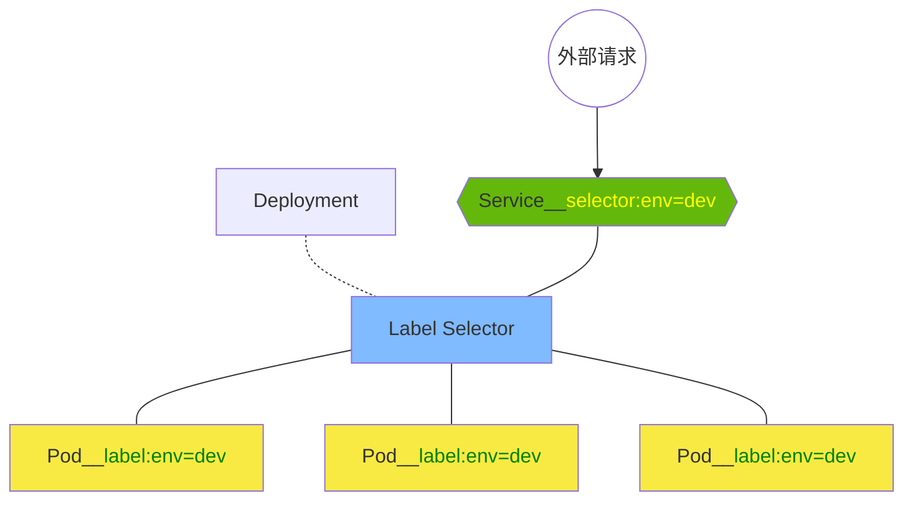
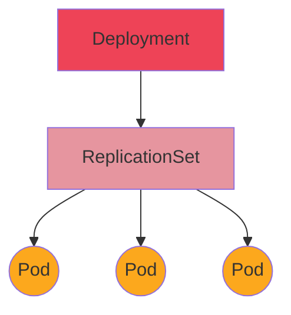
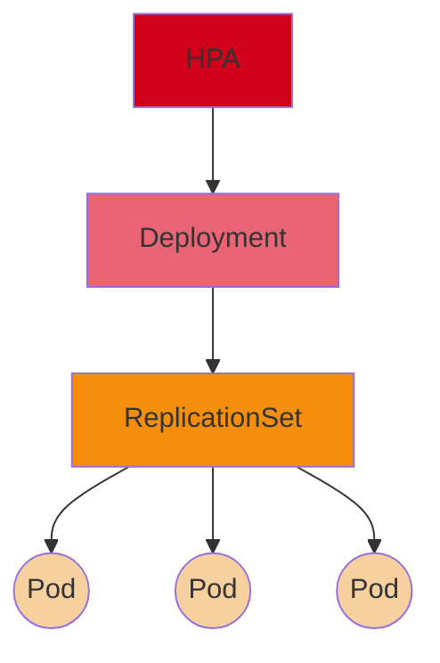
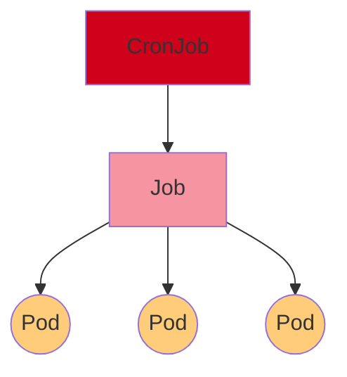
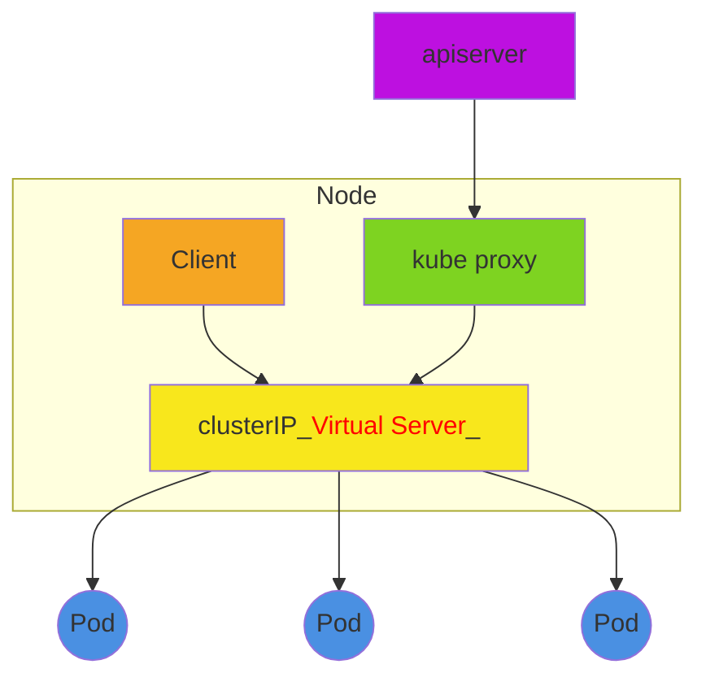

> Kuberbetes常被称为k8s。k8s可以视为是容器平台的控制系统，现在的生产环境动不动就涉及几十个，上百个大大小小的组件，而每个组件都需要我们一个个地负责配置，后来就出现了Docker这样可以一键安装对应组件的工具，Docker则称之为容器。现在的问题是，这个的问题是，项目过大，安装方便的了，但是管理还是需要一个个操作，如果遇到一些意外状况，还必须人工去手动干预，因此k8s就是让这些容器化的组件能够按照指定的规则自行处理自身的相关事态。
>
> > 形象地说，以前我们安装软件需要一个个去官网下载，再自己安装，并指定安装位置，和是否开机启动之类的。
> >
> > 现在我们有了应用商店，直接搜索并点击即可完成对应的安装，中间确认几个选项即可完成操作。
> >
> > 现在，软件安装了，但是我们希望能让软件保持为最新版本，另外我们还有其它几台电脑，还是不同操作系统的，还有其它一些平板，手机，都希望自己的软件始终是最新的，且要求它们在更新的时候使用的是wifi流量，而且是在我不使用它们的使用，悄悄更新。
> >
> > > 那么，为了完成上述的功能，自然需要一个额外的组件，能够操纵各机器各系统的应用商店，还需要考虑各种因素是否符合要求，以做出合适的方案，实现我们希望的结果。


# 安装

> 建议读者准备一个linux系统。我这里使用的时Centos。

安装自然是可以像其它组件那样下载对应的安装包，直接解压安装再配置。

但是，需要注意的是，Kubernetes相比于其它组件而言稍显复杂，内部又包含了其它组件以及对应的配置也繁复。因此，官网也推荐在学习期间，可以使用对应的工具进行安装。

安装工具可以看一下官网的[文档](https://kubernetes.io/docs/tasks/tools/)。那里提供了各种工具，均可使用体验，我们这里就介绍其中的`kubeadm`工具，因为在生产环境做集群部署时，官方也是支持这个工具的。

## 准备工作

- 在自己的电脑上，由于k8s需要安装的时集群，自然就有主节点和从节点之分，为了方便之后的使用，我们可以在系统的hosts文件中指明其它几个机器的机器名和对应的ip地址。

  一般是在对应的`/etc/hosts`文件中加上类似`ip 机器名`的格式即可。

- 另外k8s要求不同的节点之间的时间必须保持一致，我们可以使用网络同步时间

  例如使用`chronyd`

  ```bash
  systemctl start chronyd
  systemctl enable chronyd
  ```

- 关闭防火墙。安装了k8s，我们必然还要安装注入Docker之类的容器组件，它们都会产生很多iptables规则，容易与系统的规则发生冲突，

  ```bash
  systemctl stop firewalld
  systemctl disable firewalld
  # 关闭了防火墙，当然实际的工作中，肯定不会随便就把防火墙给关了，只是如果我们自己调整，不方便后面的学习
  #下面关闭iptable服务
  systemctl stop iptables
  systemctl disable iptables
  ```

- selinux，这个也需要关掉，本质是一个安全服务，但跟很多组件都会有这样那样的冲突，

  ```bash
  # 找到/etc/selinux/config 文件，修改其中的SELINUX
  SELINUX=disabled
  ```

- 禁用swap分区，这本是作为linux的物理内存，作为虚拟内存，只不过对系统有一些负面影响，而k8s则要求机器禁用它。是在不能禁，则需要在安装的时候做对应的说明。

  ```bash
  # 编辑/etc/fstab文件
  # 如果其中发现有类似下面的语句，则注释它
  路径 swap            swap  defaults 0 0
  ```

- 内核参数。

  ```bash
  # 新键一个文件，在/etc/sysctl.d/中，创建一个kubernetes.conf文件
  # 添加配置
  net.bridge.bridge-nf-call-ip6tables = 1
  net.bridge.bridge-nf-call-iptables = 1
  net.ipv4.ip_forward = 1
  # 上述添加了网桥过滤和地址转发的功能
  # 重新加载配置
  sysctl -p
  # 加载网桥过滤模块
  modprobe br_netfilter
  # 查看加载是否都成功
  lsmod | grep br_netfilter
  ```

- 配置ipvs功能。这是一种代理模型，另外还有基于iptables的代理，只不过，这种性能更好而已，

  ```bash
  # 缺点是，我们需要额外地安装对应的模块
  yum install ipset ipvsadmin -y
  # 另外，为了加载该模块，我们需要写一个脚本文件来运行
  # 脚本名字可以写作 ipvs.modules
  # 内容是(读者注意，没有那些横杠)
  ---------------
  #! /bin/bash
  modprobe -- ip_vs
  modprobe -- ip_vs_rr
  modprobe -- ip_vs_wrr
  modprobe -- ip_vs_sh
  modprobe -- nf_conntrack_ipv4
  ---------------
  # 运行脚本即可，一般教程可能会要求修改脚本权限之类的，实际在对应的目录下，source即可
  # 比如 
  source ipvs.modules
  # 即可运行
  # 检查一下是否加载成功
  lsmod | grep -e  ip_vs -e nf_conntrack_ipv4
  ```

完成以上的工作后，需要重启服务器，以生效。

之后查看一下，

```bash
getenforce
# 看返回的是否是 disabled
free -m
# 看一下swap分区是否是 0
```

## 组件安装

- 首先是容器组件，一般就是Docker，但是目前最新的1.22版本，应该是移除了Docker的支持，应该说，从1.20开始，似乎就有这个想法，建议读者使用1.19或1.18。我这里使用的是1.18版本。

  > 虽说移除了docker，但是容器化处理不是必须依赖docker的。
  >
  > 可以看一下k8s支持的底层系统，docker只是其中一个，
  >
  > 

  ​	我这里使用的docker版本是18.06.3，具体安装如下，

  ```bash
  # 首先获得docker的镜像源
  wget https://mirrors.aliyun.com/docker-ce/linux/centos/docker-ce.repo -o /etc/yum.repos.d/docker-ce.repo
  # 现在，我们获取了docker的可用版本，查看一下版本列表
  yum list docker-ce --showduplicates
  # 选项18.06.3版本，如果是系统是centos8版本的，则没有这个版本
  # 如果愿意的话，可以直接去
  # https://mirrors.aliyun.com/docker-ce/linux/centos/7.5/x86_64/stable/Packages/
  # 下载该版本，其实其它版本也可以
  yum install --setopt=obsoletes=0 docker-ce-18.06.3.ce-3.e17 -y
  # --setopt=obsoletes=0 用以禁止yum自动安装最新版
  # 添加配置文件
  # 在/etc目录下新键一个目录 docker
  # 在里面新建一个json文件 daemon.json
  # 内容是
  ----------------------
  {
  "exec-opts" : ["native.cgroupdriver=systemd"],
  "registry-mirrors": ["https://kn0t2bca.mirror.aliyuncs.com"]//这是指明默认仓库，国情所致
  }
  ----------------------
  # 之后启动docker
  systemctl start docker
  # 看一下版本，顺便确认安装成功
  docker -v
  # 之后也可以设置为开机启动
  systemctl enable docker
  ```

- k8s

  ```bash
  # 我们还是编辑一个软件源的配置文件，指明对应的镜像源
  # 在/etc/yum.repos.d 目录下新建一个kubernetes.repo文件
  # 内容如下
  -----------------
  [kubernetes]
  name=Kubernetes
  baseurl=http://mirrors.aliyun.com/kubernetes/yum/repos/kubernetes-el7-x86_64
  enabled=1
  gpgcheck=0
  repo_gpgcheck=0
  gpgkey=http://mirrors.aliyun.com/kubernetes/yum/doc/yum-key.gpg
  	   http://mirrors.aliyun.com/kubernetes/yum/doc/rpm-package-key.gpg
  -----------------
  # 安装
  yum install --setopt=obsoletes=0 kubeadm-1.17.4-0 kubelet-1.17.4-0 kubectl-1.17.4-0 -y
  # 然后在/etc/sysconfig/ 目录下的kubelet文件中添加以下内容
  ----------
  KUBELET_CGROUP_ARGS="--cgroup-driver=systemd"
  KUBE_PROXY_MODE="ipvs"
  ----------
  # 然后也可以将其设置为开机启动
  systemctl enable kubelet
  ```

  虽然真正意义上的安装没有完成，但是当我们使用kubeadm安装的话，其实基本需要的已经准备好了，最后就是利用kubeadm完成最后最麻烦的那部分即可。

  但是，还是限于国内网络，kubeadm需要下载的组件还是需要切换到国内的镜像，

  ```basic
  # 输入以下命令，查看一下我们需要的下载的组件
  kubeadm config images list
  # 我这里可以看到需要的组件是
  ---------
  k8s.gcr.io/kube-apiserver:v1.17.17
  k8s.gcr.io/kube-controller-manager:v1.17.17
  k8s.gcr.io/kube-scheduler:v1.17.17
  k8s.gcr.io/kube-proxy:v1.17.17
  k8s.gcr.io/pause:3.1
  k8s.gcr.io/etcd:3.4.3-0
  k8s.gcr.io/coredns:1.6.5
  ---------
  # 我们使用阿里的镜像，但是我们还需要对阿里下载的镜像做一些稍稍的修改
  # 总之，就是利用docker拉去对应的镜像，在打个标签
  # 所有的工作，我们都放在脚本中运行，随便找个地方编辑一下脚本文件，内容如下
  ------------
  #! /bin/bash 
  images=(
      kube-apiserver:v1.17.17
      kube-controller-manager:v1.17.17
      kube-scheduler:v1.17.17
      kube-proxy:v1.17.17
      pause:3.1
      etcd:3.4.3-0
      coredns:1.6.5
  )
  for imageName in ${images[@]}
  do
      docker pull registry.cn-hangzhou.aliyuncs.com/google_containers/$imageName
      docker tag registry.cn-hangzhou.aliyuncs.com/google_containers/$imageName k8s.gcr.io/$imageName
      docker rmi registry.cn-hangzhou.aliyuncs.com/google_containers/$imageName
  done
  -------------
  ```

  ```basic
  # 直接source 命令运行一下这个脚本即可安装对应的组件，当然docker需要启动起来
  # 然后，使用docker可以看一下我们下载的镜像
  docker images
  # 例如
  ---------
  REPOSITORY                                      TAG        IMAGE ID       CREATED         SIZE
  k8s.gcr.io/kube-proxy                           v1.17.17   3ef67d180564   7 months ago    117MB
  k8s.gcr.io/kube-controller-manager              v1.17.17   0ddd96ecb9e5   7 months ago    161MB
  k8s.gcr.io/kube-scheduler                       v1.17.17   d415ebbf09db   7 months ago    94.4MB
  k8s.gcr.io/kube-apiserver                       v1.17.17   38db32e0f351   7 months ago    171MB
  k8s.gcr.io/coredns                              1.6.5      70f311871ae1   21 months ago   41.6MB
  k8s.gcr.io/etcd                                 3.4.3-0    303ce5db0e90   22 months ago   288MB
  k8s.gcr.io/pause                                3.1        da86e6ba6ca1   3 years ago     742kB
  ---------
  # 前面的k8s.gcr.io就是我们打标签的结果，目的是让k8s可以识别到。因为官方下载的话，就是这个样子
  ```

  > ==**上面这些步骤需要在所有的集群节点中操作**==

  下面就是最后的集群初始化，只需要在我们的主节点上操作即可，

  ```bash
  # 使用kubeadm
  kubeadm init \
  --kubernetes-version=版本号，这里我们是 v1.17.17 \
  --pod-network-cidr=10.244.0.0/16 \
  --service-cidr=10.96.0.0/12 \
  --apiserver-advertise-address=主节点的ip
  # 再创建几个必要文件
  mkdir -p $HOME/.kube
  sudo cp -i /etc/kubernetes/admin.conf $HOME/.kube/config
  sudo chown $(id -u):$(id -g) $HOME/.kube/config
  # 实际上面几句命令，是在init命令成功后，自动显示处理的提示
  ```

  > $HOME/.kube 是kubectl的配置文件，如果缺少它，则命令执行会失败。
  >
  > 因此，我们再从节点执行kubectl是有问题的，如果希望做，就把这个文件复制到从节点即可，可以使用下面的方式拷贝
  >
  > ```bash
  > scp -r ~/.kube 从节点ip:~/
  > # 执行后，可能需输入密码，即可
  > ```

  此时，基本是完成集群操作，但是其它的从节点还没有设置，

  ```basic
  # 在前面的init运行后，最后还有一串命令，形似
  # kubeadm join ip:6443 --token xxx \ --discovery-token-ca-cert-hash sha256:xxx
  # 复制，放到其它的从节点上运行即可与当前的主节点建立称为集群
  # 在主节点运行一下命令，就可以看到加入了新节点
  kubectl get nodes
  ```

  但此时，节点直接的通信还是存在问题的，需要在主节点额外安装一个网络插件，

  ```basic
  # wget https://raw.githubusercontent.com/coreos/flannel/master/Documentation/kube-flannel.yml
  # 很不幸，又是国情，估计是下不了，读者可以自己想办法，或到
  # https://github.com/flannel-io/flannel/blob/master/Documentation/kube-flannel.yml
  # 但作为国内的环境，即使下载了，也需要该其中的仓库地址，不如直接使用阿里云的
  # https://github.com/flannel-io/flannel/blob/master/Documentation/kube-flannel-aliyun.yml
  # 下载到对应的文件中，随便放在linux的什么位置，运行它
  kubectl apply -f kube-flannel-aliyun.yml
  # 运行成功即可
  ```

# 使用

我们这里先用nginx测试一下。

```basic
# 部署nginx
kubestl create deployment nginx --image=nginx:1.14-alpine
# 暴露端口
kubectl expose deployment nginx --port=80 --type=NodePort
# 查看服务状态
kubectl get pod
kubectl get service
```

# 资源管理

就像java中一切皆是对象那样，在k8s中，一切皆是资源，对k8s的操作就是对资源的操作。

> 我们知道k8s是用来管理容器的，但是，实际情况确实，k8s并不会直接去接触容器。
>
> 我们部署的注入nginx都属于一个容器，它是放在一个`	Pod`中，这是k8s的最小管理单位。
>
> 但是，k8s也不常直接处理Pod，而是使用`Pod控制器`，来做管理。
>
> 当Pod准备提供服务时，k8s则使用`Service`资源帮助k8s访问Pod的服务。
>
> ```mermaid
> flowchart TD
> 
> subgraph Pod
> c1[Container];c2[Container]
> end
> style c1 fill:#7ceed4,stroke:#333
> style c2 fill:#7ceed4,stroke:#333
> subgraph PodController
> 	d[DaemonSet];r[ReplicaSet];Job;s[StatefulSet];Deployment --- r;ConJob---Job
> 	style d fill:#9ff63b
> 	style r fill:#9ff63b
> 	style Job fill:#9ff63b
> 	style s fill:#9ff63b
> 	style Deployment fill:#9ff63b
> 	style ConJob fill:#9ff63b
> end
> d---Pod;r---Pod;Job---Pod;s---Pod
> o---v[(Volume__负责资源数据存储)]
> Pod---S[Service__负责让外部与容器建立联系]
> v---ConfigMap
> v---PVC
> v---Secret
> style ConfigMap fill:#fcef54
> style PVC fill:#fcef54
> style Secret fill:#fcef54
> ```


> 还是主要拿nginx做示范

- 命令式对象管理

  ```basic
  kubectl run nginx-pod --image=nginx:版本号 --port=80
  # 直接操作对应的资源
  ```

- 命令式对象配置

  ```basic
  kubectl create或patch -f nginx-pod.yaml
  # 使用配置文件操作资源
  # create自然代表创建，而patch则对应的是更新
  ```

- 声明式对象配置

  ```basic
  kubectl apply -f nginx-pod.yaml
  # 换了各方式利用配置文件做操作
  # 该方式，只能做创建和更新操作
  # 其中一个优势是，可以对目录做操作
  # 我们可以把所需要使用的yaml文件放在一个目录下
  # 声明式的操作可以一次性利用目录下的所有yaml文件做操作
  ```

## 命令式对象管理

```basic
kubectl [command] [type] [name] [flags]
# 详细的细节可以 kubectl --help 查看一下
# command: 可行的操作，如create、edit、get、patch、delete、explain
# type: 资源类型，如deployment、pod、service
    # type的支持的类型，可以使用 kubectl api-resources 查看
# name: 资源名称
# flags: 额外的可选参数
    # 比如可以让展示的结果更详细，可以加个 -o wide，例如
    kubectl get pod pod_name -o wide
    # 又或者，让展示的结果显示为jsoN格式，并且信息可能更丰富。其它，还可以yaml格式
    kubectl get pod pod_name -o json
# -----------
# 例如
# 查看所有pod
kubectl get pod
# 查看某个pod
kubectl get pod pod_name
# 查看某个pod，以yaml格式展示
kubectl get pod pod_name -o yaml
```

## 命令式对象配置

这里写一个nginxpod.yaml的配置文件

```yaml
apiVersion: v1
kind: Namespace
metadata:
 name: dev

---

apiVersion: v1
kind: Pod
metadata:
 name: nginxpod
 namespace: dev
spec:
 containers:
 - name: nginx-containers
   image: nginx:1.17.17
```

上面的配置非常简陋，然后，

```basic
kubectl create -f nginxpod.yaml
# 就会创建出两个资源，分别对应着
# namespace/dev
# pod/nginxpod
# 如果像删除这个配置文件创建的资源，可以
kubectl delete -f nginxpod.yaml
```

## 声明式对象配置

```basic
# 不同于上面的操作，可以有不同的操作命令。这里只有apply可以使用
# 还是使用之前的那个配置文件
kubectl apply -f nginxpod.yaml
# 首次执行配置文件时，会创建其中的资源
# 上面的命令如果再执行一次，则是查看配置文件是否有改动，那么就更新
```

# 资源

## Namespace

namespace作为一种资源隔离措施，我们也可以对不同的namespace分配不同的硬件资源。

```basic
# 如果没有设置其它自定义的namespace，可以看一下原装的namespace
kubectl get ns
----
default 
kube-node-lease # 集群节点之间的心跳维护，1.13引入
kube-public 	# 所有人可访问其中的资源
kube-system		# kubernetes系统创建的资源
----
# 我们也可以单独看一下某个命名空间
kubectl get ns 命名空间名
# 具体的内部信息可以使用
kubectl describe ns 命名空间名
# 返回的信息包括该命名空间是否有具体的硬件资源限制，以及如何倍限制
# 我们自己创建的话
kubectl create ns 命名空间名
# 删除
kubectl delete ns 命名空间名
        # 同样的我们也可以使用配置文件创建，就如同之前的配置文件中的内容
---yaml
apiVeriosn: v1
kind: Namespace
metadata:
 name: 命名空间名
---
# 上述的配置文件就是指明了一个命名空间的基本信息，使用对应的命令即可创建
```

## Pod

程序需要部署的容器中，若干容器需要存在于Pod中，Pod又是集群管理的最小单元。

> Pod生命周期：
>
> 1. pod创建过程
> 2. 运行初始化容器过程
> 3. 运行主容器过程
>    1. 容器启动后钩子（post start），容器终止前钩子（pre stop）
>    2. 容器的存活性探测（liveness probe），就绪性探测（readiness probe）
> 4. pod终止过程

> 集群中的各组件皆是以pod的形式运行。

```basic
# k8s没有提供直接控制pod的命令，因此只能操作其控制器
# kubectl run pod控制器名字 参数
# 还是以nginx为例
kubectl run nginx --image=nginx:版本号 --port=端口号 --namespace=命名空间
# 上述创建了一个指定的pod
# 控制器名字可以随便指定，当然也可以指定为已经有的，那就是同时管理多个pod而已
# -------------------------------------------------------------------------------
# 现在有了对应的pod，我们自然需要使用，就必须获得使用所需的信息
kubectl get pod -n 命名空间 -o wide
# 可以看到这些pod的ip信息，那么结合，之前指定的端口号即可访问该pod
curl ip:端口号
# --------------------------------------------------------------------------------
# 此外，我们也可以查看一下当前的命名空间中有那些pod控制器
kubectl get deployment -n 命名空间
# 而我们在删除一个pod的时候，如果真的是不想要这种pod存在，则必须删除管理这个pod的控制器
kubectl delete deployment 控制器名 -n 命名空间
# 因此，如果两个pod没什么特殊的纽带，尽量别放在同一个pod管理器中
# --------------------------------------------------------------------------------
# 同样的，我们也可以使用配置文件做操作
---pod-nginx.yaml # 随便自定义的名字
apiVersion: v1
kind: Pod
metadata:
 name: nginx
 namespace: dev
spec:
 containers:
 - image: nginx:版本号
   imagePullPolicy: IfNotPresent
   name: pod
   ports:
   - name: nginx-port
   	 containerPort: 80
   	 protocol: TCP
---
# 同样的使用之前的声明操作即可
kubectl create -f pod-nginx.yaml
```

Pod里面除了可以放我们创建的容器，还有一个k8s放在里面的根容器——Pause容器，

> 它的作用是：
>
> - 可以看它的健康状态，作为其它容器的健康结果。
> - 在这个根容器上设置IP地址，里面的其它容器会共享这个IP，实现Pod内部的通信。
>   - Pod之间的通信是虚拟二层网络技术，就是前面安装时，设置的Flannel

## Label

通过在资源上添加标识，可以进行区分和选择。

> - 以键值对的形式附加到各种对象上
> - 资格资源可以有多个标识，标志也可以加在多个资源上
>
> 相比于namespace的隔离，这种更具灵活性。

```yaml
apiVersion: v1
kind: Pod
metadata:
  name: nginx
  namespace: dev
  labels:
    version: "1.0"
    env: "test"
spec:
  containers:
  - image: nginx:版本号
  	name: pod
  	ports:
  	- name: nginx-port
  	  containerPort: 80
  	  protocol: TCP
```

我们可以像之前那样直接声明创建，就可以得到一个具有对应标识的资源。

如果，我们已经有一个资源，

```basic
# 可以在后期给指定的资源打上标签
# 首先可查看一下指定的资源是否有标签，还是以nginx为例
kubectl label pod nginx -n dev --show-labels
# 这样就可以查看dev下nginx的标签情况
# 然后为它添加一个标签
kubectl label pod nginx -n dev version=1.0
# 这里为那个nginx添加了一个version的标签，并且指明是 1.0
# 同样的方法可以创建其它不同的标签，
# 但是，如果修改已有的标签，则需要一个 overwrite的命令
kubectl label pod nginx -n dev version=2.0 --overwrite
# 如果要删除pod的某个标签
kubectl label pod nginx -n dev version-
# 这就把dev下的nginx的version标签删除了
```

筛选标签

```basic
# 前面的操作，可以添加和修改标签，但是终究还是要让标签有作用
# 就在于我们可以通过指定标签来显示出对应的pod
kubectl get pods -l "version=2.0" -n -dev --show-labels
# 上述可以得到dev下的包含等于2.0的version标签的pod
# 其中的判断可以比较灵活
kubectl get pods -l "version!=2.0,env not in (test,pub)" -n -dev --show-labels
# 上述的指令就丰富了一些
# 既指定了筛选的pod包含的version不等于2.0，同时另一个标签env的值不在集合{test,pub}中,注意命令中使用的是圆括号
```

## Deployment

这就是pod的控制器【但并不是唯一的控制器】，它负责自动的维护管理里面的pod，就像之前我们认为的删除了缪个pod，但控制器会自动创建一个新的pod，以避免对应功能的pod消失，这对于我们系统的安全稳定是非常重要的。

```b
# 前面已经提及了deployment的使用,nginx为例
kubectl run nginx --image=nginx:版本号 --port=端口号 --replicas=3 -n dev
# 这里的命令是dev下nginx的控制器内部拉去nginx的镜像，创建pod，并指定对应的端口，
# 同时指明要创建3个这样的pod
# 可以查看一下dev下的deployment和pod
kubectl get deployment,pods -n dev
# 删除deployment
kubectl delete deploy nginx -n dev
```

如果使用配置文件进行创建，假设名字是deploy-nginx.yaml

```yaml
apiVersion: apps/v1
kind: Deployment
metadata:
	name: nginx
	namespace: dev
spec:
	replicas: 3
	selector:
		matchLabels:
			run: nginx 
			# 这个标签与下面的nginx是呼应关系，使得deployment能够与建立的pod确立关系
	template: # 这里是指明创建pod的模板
		metadata:
			labels:
				run: nginx
		spec:
			containers:
			- image: nginx:版本号
			  name: nginx
			  ports:
			  - containerPort: 80
			  	protocol: TCP
```

## Service

这是负责pod与外界交流的。前面提及了，当创建了一个pod之后，如果我们像访问这个pod，则需要获得它的ip值，结合我们设定的端口号便可访问。

但是，一个问题在于，要这么麻烦吗，而且如果pod在我们不知情的情况下宕机，控制器自动创建新的pod，其ip值是必然不同的，难道要重新来过。

> 最关键的是，上面的操作，获得的ip值，仅仅是集群内部可用的ip，意为这是限制在集群内的用法，对于真正外部的用户而言，根本无法访问。



从上图可以看出，Label Selector相当于一个中间件，可以帮助我们与指定的pod进行通话。而指定的条件就是使用前面的标签。

```bash
# 还是使用之前的nginx的情况
kubectl expose deploy nginx --name=svc-nginx --type=ClusterIP ---port=80 --target-port=80 -n dev
# 这里是暴露service，并命名为svc-nginx
# 也同样是一个资源，自己暴露的是80端口
# 目标是对方的80端口
# 同样的看一下自己的service是否创建成功
kubectl get svc -n dev
# 其中的CLUSTER_IP的值，就是我们service的ip值
curl CLUSTER_IP的值:80
# 上面的命令就是我们可以访问service
# 但实际上，此时我们的请求进入了service，然后service去访问Label Selector,然后从内部的几个符合条件的pod中挑选一个负责处理请求
# 相当于servie成为了网关，而selector成为了负载均衡器
# pod则是真正干活的机器
```

让读者失望的是，现在我们获得的servie还是只能在集群内部使用，看名字也知道ip是cluster的。

但现在，情况就简单很多了，就是换个外部的ip而已，

```bash
# 把之前的那个type换成NodePort即可
kubectl expose deploy nginx --name=svc-nginx --type=NodePort ---port=80 --target-port=80 -n dev
# 现在再去看一下创建的这个service
kubectl get svc -n dev
# 可以看到的对应的port属性，不再是简单的一个80，而是多了另一个端口值
# 形似 80:31172/TCP
# 此时，外部请求可以通过访问 这个 31172达到同样的目的
curl 自己机器的ip:31172
# 当然，集群内部还是可以使用之前的那个集群内的ip与80结合访问
# 如果需要删除service
kubectl delete svc service名 -n dev
```

如果是使用配置文件，假设文件名svc-nginx.yaml

```yaml
apiVersion: v1
kind: Service
metadata:
	name: svc-nginx
	namespace: dev
spec:
	clusterIP: 可以自己指定一个集群内的IP
	ports:
	- port: 80
	  protocol: TCP
	  targetPort: 80
	selector:
		run: nginx
	type: CLusterIP 或是NodePort 
	# 如果这里写了ClusterIP，上面的clusterIP就完全可以不写
```

# 详解yaml的配置方式

前面已经通过各种命令和配置文件使用Pod，但是实际的可设置项非常多，可以使用

```bash
kubectl explain 资源类型 或 资源类型的属性
# 查看对应的可以设置的选项
# 比如
kubectl explain pod
# 就会在结果中看到可设置的有 apiVersion, kind, metadata,spec, status之类的
# 或，查看某个资源的子属性，就是上面显示的几个
kubectl explain pod.metadata
# 同样的，在新的结果中，如果还有需要了解的，再用 . 增加指明的属性即可
```

现在，我们对pod或其它资源的配置将更多的放在配置文件上

```yaml
apiVersion: v1 # 版本号
kind: Pod # 指明资源类型，也可以是其他类型，前面的内容已有展示
metadata: # 元数据
	name: 对应上面的那个类型的资源的名称，也就是我们创建的资源名，不能包含大写
	namespace: 默认是default
	labels： # 自定义标签列表
		version: 1.0 # 比如这样添加一个标签
	- name: 随便写
spec: # 容器的详细定义，是非常重要的一部分
	containers:
	- name: 容器名称
	  iamge: 容器中的镜像名称，比如nginx:1.17.17
	  imagePullPolicy: # 获取镜像的策略，如Always，或Never，或IfNotPresent
	  # 顾名思义，Always就是不管怎样都要从远程仓库那里拉去镜像，而Never则只使用本地仓库的，
	  # IfNotPresent就缓和了很多，没有就去远程那里拉取，否则就用自己本地的
	  command: # 一组启动命令，不指定时，就是打包时使用的启动命令
	  args: 上面启动命令的参数
	  env: # 容器环境变量的配置，使用列表形式创建键值对 name:value
	  ports: 需要暴露的端口列表
	  - name: 端口名
	  	containerPort: 容器监听的端口
	  	protocol: 端口协议，一般是TCP，可选的还有UDP, SCTP
	  	hostPort: 容器在主机上公开的端口，一般，这里不设置，因为这样一个容器只能由一个副本
	  resources: # 资源限制和资源请求的设置
	  	limits: # 限制容器可用机器资源的上限
	  		cpu: "cpu的核数" # 必须加上双引号
	  		memory: "10Gi" # 内存
	  		# 其中的内存单位，Mi就是正常的那个1024*1024，而M则是1000*1000，其它的Gi,G同理
	  		# 因此以后尽量使用Mi之类的
	  	requests: # 容器可用机器资源的下限
	  		cpu: "核数"
	  		memory: "大小"
```

## command

有一个容器名为`busybox`，是一个类似工具集合，用于我们测试linux上的开发，由于不是一个正经的程序，无法正经的启动，因此作为集群的一部分，它是在开始就处于关闭的状态，为此，就需要使用配置中的命令，让这个集合运行起来。

```yaml
spec:
	containers:
	- name: busybox
	  image: busybox:1.30
	  command: ["/bin/sh","-c","touch /tmp/hello.txt;while true;do /bin/echo $(date +%T) >> /tmp/hello.txt; sleep 3; done;"]
	  # 这个命令简单来说就是，每个3秒向文件中写入当前的时间
	  # 就是纯粹没事找事干，目的就是让这个容器别闲着，一旦闲了，它就直接关闭了
```

前面一些内容这里省去了，总之，使用这个命令后，我们再去创建就能确保容器建立成功，

```bash
# 我们可以在pod建立完成后，去容器里执行我们的命令
# 比如，我们需要查看一下那个被写入时间的文件
# 基本的格式如下
kubectl exec pod名称 -n 命名空间名 -it -c 容器名称 /bin/sh 之后写入读取该文件的命令 
# 具体一点的话
kubectl exec pod名称 -n 命名空间名 -it -c busybox /bin/sh / # tail -f /tmp/hello.txt
```

## 初始化容器

加入我们希望在主容器之前，先启动等待mysql和redis启动成功，

```yaml
apiVersion: v1
kind: Pod
metadata:
	name: initcontainer
	namespace: dev
spec:
	containers:
	- name: main-container
	  image: nginx:1.17.17
	  ports:
	  - name: nginx-port
	    containerPort: 80
    initContainers: # 这里就是定义了我们需要的初始化容器
    - name: test-mysql
      image: busybox:1.30 #利用busybox执行命令
      command: ['sh','-c','until ping mysql的ip -c 1;do echo waiting for mysql; sleep 2;done;']
      # 就是每个两秒ping依次mysql，知道ping通
    - name: test-redis
      image: busybox:1.30
      command: ['sh','-c','until ping redis的ip -c 1; do echo waiting for redis; sleep 2; done;']
```

## 钩子函数

比如我们启动nginx，但在这之前项修改它的启动页面，并在主容器结束之前停止nginx服务

```yaml
apiVersion: v1
kind: Pod
metadata:
	name: post
	namespace: dev
spec:
	containers:
	- name: main-container
	  image: nginx:1.17.17
	  ports:
	  - name: nginx-port
	    containerPort: 80
	  lifecycle:
	  	postStart:
	  		exec:
	  			command: ["/bin/sh","-c","echo postStart.. > /usr/share/nginx/html/index.html"]
	  			# 修改了nginx的启动页面
	  	postStop:
	  		exec:
	  			command: ["/usr/sbin/nginx","-s","quit"]
	  			# 停止nginx
```

## 调度

一般而言，从节点可以有很多，但是主节点分派任务选择哪个节点则是由scheduler通过一系列计算确定的。

如果我们希望一些特殊情况下自己指定节点，

> 定向调度：NodeName, NodeSelector
>
> 亲和性调度： NodeAffinity, PodAffinity, PodAntiAffinity
>
> 污点（容忍）调度：Taints, Toleration.【节点通过自己的污点拒绝pod，pod也可以通过容忍进入节点】

具体查看附录的[pod调度](#pod调度)。

# Pod控制器

> - ReplicationController: 已废弃，由ReplicationSet取代
> - ReplicationSet: 保证指定数量的pod运行，支持数量变更，镜像版本变更
> - Deployment: 通过ReplicationSet控制pod，支持滚动升级，版本回退
> - Horizontal Pod Autoscaler: 根据集群负载自动调整pod数量
> - DaemonSet: 在集群中的指定节点上都运行一个副本，一般用于守护进程类的任务
> - Job: 只要它创建的pod完成任务，这个控制器就立即退出
> - Cronjob: 它创建的pod会周期性执行
> - StatefulSet: 管理有状态的应用

## ReplicationSet(rs)

通过持续地监听pod，一旦出问题就重启或重建，保证一定数量的pod保持运行状态。

```yaml
apiVersion: apps/v1 # 指定一个版本号
kind: ReplicationSet
metadata:
	name:
	namespace:
	labels:
		标签名: 标签值
    spec:
        replicas: 整数 # 副本数量
        selector: # 指定管理的是哪些pod
            matchLabels:
                # 随便指定一个标签，如
                标签名: 标签值
            matchExpressions: # 匹配规则
                - 
        template: # po模板
        # 忽略
```

使用这个配置文件创建后，可以

```bash
kubectl get rs pod名 -n 命名空间 -o wide
# 可以看一下这个控制器创建的这个pod的信息
# 也可以在运行期间修改其中的一下设置
kubectl edit rs pod名 -n 命名空间
# 会返回我们对应的yaml格式的配置内容
# 在那个内容上修改并保存即可
# 如果我们希望调整对应的副本数量，除了上面的方法，还可以
kubectl scale rs pod名 --replicas=数量 -n 命名空间
# 即完成对应副本数量的修改
# 如果是需要修改对应镜像的版本，也可以使用之前的那个文件内容的方式，或者
kubectl set iamge rs pod名 配置文件中该镜像的容器名=镜像名:版本号
```

```bash
# 如果是删除当前的控制器以及对应的pod
kubectl delete rs pod名 -n 命名空间
# 当然，原先的用配置文件删除也可以，别忘了
# 仅删除控制器
kubectl delete rs pod名 -n 命名空间 --cascade=false
```

## Deployment(Deploy)

除了rs已有的功能，还有发布的停止、继续，版本滚动更新和版本回退的功能。




```yaml
apiVersion: apps/v1
kind: Deployment
metadata:
	# 忽略
spec:
	replicas: 
	revisionHistoryLimit: # 保留的历史版本，默认是10个，方便版本回退
	paused: false # 暂停部署，这里表示有了这个控制器就立即生产pod
				  # 如果是true，则表示要暂停
	progressGeadlineSeconds: # 部署超时时间
	strategy: 
		type: RollingUpdata # 滚动更新策略，另外还有重建更新策略
		rollingUpdate:
			maxSurge: 30% # 最大额外可以存在的副本数，也可以是整数
			maxUnavailable: 30% # 也可以是整数
		selector:
			matchLabels:
				标签名: 标签值
			matchExpressions: 
				# 匹配规则
				- {key: 标签名, operator: In, value: {xx}}
		template:
			# 忽略
```

```bash
# 副本数量
kubectl scale deploy pod名 --replicas=数量
# 运行时编辑，与rplicationset类似
kubectl edit deploy pod名
```

- 更新

  ```yaml
  # 人为地去提升镜像版本
  # kubectl set image deploy pod名 容器名=镜像:版本号 
  # -----------------------------------------------
  # 重建更新【Recreate】，就是直接把旧的删除，建立新的
  # 滚动更新【RollingUpdate】，就是一边删旧的，一边建新的，是默认的策略
  rollingUpdate:
  	maxUnavailable: # 指定更新过程中，不可用的pod的最大数量，默认25%，
  	#  简单说就是每次能删除多少旧的
  	maxSurge: # 指定更新过程中pod超出期望的最大数量，默认25%
  # 在创建新的副本是，对应的控制器也是新的，这里的控制器就是rs
  ```

- 版本回退

  ```bash
  # 查看升级版本的状态
  kubectl rollout status deploy pod名 
  # 查看升级记录
  kubectl rollout history deploy pod名 
  # 版本回退
  kubectl rollout undo deploy pod名 --to-revision=版本号
  # 每次的升级，都会产生新的rs控制器
  # 实际就是重新启用对应的rs
  ```

- 金丝雀发布

  实际就可以当作一个测试工具使用。当我们在更新pod时，如果数量很多，我们希望先看一下更新好的几个是否是正常的，如果失败，就可是立刻停止，并回退，避免之后较大成本的回退操作。

  ```bash
  # 我们来搞一下这种场景
  # 更新，又暂停
  kubectl set image deploy pod名 容器名=镜像名:版本号 && kubectl rollout pause deploy pod名
  # 看状态
  kubectl rollout status deploy pod名
  # 继续更新
  kubectl rollout resume deploy pod名
  ```

## Horizontal Pod Autoscaler(HPA)



这种控制器最重要的功能就是能够自己根据情况调整pod副本数量。

而说明情况的则是定义的指标，这个指标就是pod所承受的各种负载。

 为了获得这些pod的指标，需要一个额外的一个软件获取信息,

```bash
wget https://github.com/kubernetes-sigs/metrics-server/archive/refs/tags/v0.3.6.tar.gz
# 下载该文件，并解压
# 修改其中的/deploy/1.8+/metrics-server-deployment.yaml文件
# 主要在文件最后的spec那部分修改一下仓库地址，并添加一下其它内容
--------------------
spec:
      hostNetwork: true # 这是添加的
      serviceAccountName: metrics-server
      volumes:
      # mount in tmp so we can safely use from-scratch images and/or read-only containers
      - name: tmp-dir
        emptyDir: {}
      containers:
      - name: metrics-server
        # 这里是修改的仓库地址
        image: registry.cn-hangzhou.aliyuncs.com/google_containers/metrics-server-amd64:v0.3.6
        imagePullPolicy: Always
        args: #这也是添加的
        - --kubelet-insecure-tls
        - --kubelet-preferred-address-types=InternalIP,Hostname,InternalDNS,ExternalDNS,ExternalIP
---------------------
# 在1.8+的这个目录下
kubectl apply -f ./
# 此时就创建了一个对应的pod
kubectl get pods -n kube-system
# 可以看到有一个形似metrics-server的pod
# 此时，可以去查看资源使用情况
kubectl top node
# 这就是查看各节点的硬件资源使用情况，当然也可以查看命名空间的
kubectl top pod -n 命名空间
```

hpa的配置，

```yaml
apiVersion: autoscaling/v1
kind: HorizontalPodAutoscaler
metadata:
	# 忽略
spec:
	minReplicas: # 最小的pod数量
	maxReplicas: # 最大pod数量
	targetCPUUtilizationPercentage: 30 # cpu使用率指标，
								 # 意为cpu使用率达到30%，就考虑增加副本
	scaleTargetRef: # 指定要控制的pod的信息
		apiVersion: apps/v1
		kind: Deployment
		name: pod名
	
```

## DaemonSet(DS)

> 一般用于日志收集，节点监控等场景。也就是对于节点而言，这样的pod有且只需要一个时，可使用这种控制器。

具体的功能是：

- 当集群出现一个新的节点，DS会自动将自己负责的pod搞一份副本放上去
- 如果节点从集群中移除，对应的那个pod也会被垃圾回收

对应的配置文件

```yaml
apiVersion: apps/v1
kind: DaemonSet
metadata:
	# 忽略
spec:
	revisionHistoryLimit:
	updateStrategy:
		# 忽略
	selector:
		# 忽略
	template:
		# 忽略
# 上面的大部分内容都是之前已经介绍过的，没必要赘述
```

使用对应的配置文件创建pod后，这个pod就会在集群中的从节点上创建一个这样的副本，可以使用

```bash
kubectl get pod -n 命名空间 -o wide
# 查看一下对应的几个pod的NODE属性，是否分别对应着几个从节点
```

## Job

> 负责批量处理短暂的一次性任务。
>
> 它会记录自己完成的pod数量，只要达到目标值，就会结束执行。

```yaml
apiVersion: batch/v1
kind: Job
metadata:
	# 忽略
spec:
	completions: # 默认是1，指定需完成的pod数量
	parallelism: # 控制器可并发运行的pod数量，默认1
	activeDeadlineSeconds: # job运行时限，超时则终止
	backoffLimit: # job失败后的重试次数，默认6
	manualSelector:  # 是否使用selector选择pod，默认false
	selector: # 指定控制哪些pod
		# 忽略
	template: # 创建pod副本的模板
		# 忽略
        spec:
        	restartPolicy: # 只能设置为Never或OnFailure
        		# OnFailure是值pod失败后，仍然是重启对应的容器，而不是重新创建一个pod
        # 忽略
```

## CronJob(CJ)



```yaml
apiVersion: batch/v1beata1
kind: CronJob
metadata:
	# 忽略
spec:
	schedule: # cron格式的作业调度运行时间点，用于控制任务在什么时间执行
	concurrencyPolicy: # 并发执行策略
				# Allow: 允许Jobs并发运行（默认）
				# Forbid: 禁止并发运行，如果上次的运行未完成，则跳过本次，放到下一次执行
				# Replace: 取消当前的任务，用新的作业替代
	failedJobHistoryLimit: # 失败任务的历史记录数，默认1
	successfulJobHistoryLimit: # 成功任务的历史记录数，默认3
	startingDeadlineSeconds: # 启动作业错误的超时时长
	jobTemplate: # job控制器的定义
	metadata:
	spec：
		# 和上面的job配置类似
```

# Service

service只是一个表象，真正工作的是每个节点上的`kube proxy`，它们负责监听主节点上的`apiserver`，获取发生的访问，转化为对应的`ipvs`规则，交由ipvs去处理访问。



## 开启ipvs

```bash
# 修改对应的配置
kubectl edit cm kube-proxy -n kube-system
# 修改其中的mode属性为ipvs
-------------
mode="ipvs"
-------------
# 然后删除对应的现有的几个pod
kubectl delete pod -l k8s-app=kube-proxy -n kube-system
# 删除后，他就会按照新的配置生成新的pod
# 此时可以查看一下，有很多规则
ipvsadm -Ln
# 例如
-------------
TCP 172.17.0.1:443 rr
 -> 192.168.0.1:6443
 # rr 表示轮询，同时指示，如果访问了172.17.0.1:443 ，请求会转发给192.168.0.1:6443
-------------
```

## Service类型

service资源清单文件，

```yaml
kind: Service
apiVersion: v1
metadata:
	name:
	namespace:
spec:
	selector:
		标签:标签值
	type: # Service类型，指定service的访问方式
			# ClusterIP: 默认，集群可用的虚拟IP
			# NodePort: 外部端口
			# LoadBalancer: 需外部云环境
			# ExternalName: 把外部服务引入集群内部，直接使用
	clusterIP: # 虚拟服务的ip，可以自己写一个
	sessionAffinity: # 支持ClientIP和None选项，session亲和性
					# 意思是同一个客户端的请求就交由同一个node处理
					# None是不执行那种操作
	ports:
		- protocol: 
		  port: # service端口
		  targetPort: # pod端口
		  nodePort: # 主机端口
```

一个service对应的所有pod的访问地址，都存放在etcd中，是一个Endpoint资源对象。

```bash
# 可以查看一下对应命名空间下的endpoints信息
kubectl get endpoints -n 命名空间 -o wide
```


# 附录

## kubectl的command+type

> 摘自kubectl  --help的结果
>
> > Basic Commands (Beginner):
> >
> > | create | Create a resource from a file or from stdin.                 |
> > | ------ | ------------------------------------------------------------ |
> > | expose | Take a replication controller, service, deployment or pod and expose it as a new Kubernetes Service |
> > | run    | Run a particular image on the cluster                        |
> > | set    | Set specific features on objects                             |
> >
> > Basic Commands (Intermediate):
> >
> > | explain | 展示资源文档                                                 |
> > | ------- | ------------------------------------------------------------ |
> > | get     | Display one or many resources                                |
> > | edit    | Edit a resource on the server                                |
> > | delete  | Delete resources by filenames, stdin, resources and names, or by resources and label selector |
> >
> > Deploy Commands:
> >
> > | rollout   | 管理资源的发布                                               |
> > | --------- | ------------------------------------------------------------ |
> > | scale     | 为部署、ReplicaSet或复制控制器设置新的大小                   |
> > | autoscale | Auto-scale a Deployment, ReplicaSet, or ReplicationController |
> >
> >   Cluster Management Commands:
> >
> > | certificate  | Modify certificate resources.                |
> > | ------------ | -------------------------------------------- |
> > | cluster-info | Display cluster info                         |
> > | top          | Display Resource (CPU/Memory/Storage) usage. |
> > | cordon       | Mark node as unschedulable                   |
> > | uncordon     | Mark node as schedulable                     |
> > | drain        | Drain node in preparation for maintenance    |
> > | taint        | Update the taints on one or more nodes       |
> >
> >   Troubleshooting and Debugging Commands:
> >
> > | describe     | 用于查看资源内部的各种细节                         |
> > | ------------ | -------------------------------------------------- |
> > | logs         | Print the logs for a container in a pod            |
> > | attach       | 进入一个正在运行的容器                             |
> > | exec         | Execute a command in a container                   |
> > | port-forward | Forward one or more local ports to a pod           |
> > | proxy        | Run a proxy to the Kubernetes API server           |
> > | cp           | Copy files and directories to and from containers. |
> > | auth         | Inspect authorization                              |
> >
> >  Advanced Commands:
> >
> > | diff      | Diff live version against would-be applied version           |
> > | --------- | ------------------------------------------------------------ |
> > | apply     | Apply a configuration to a resource by filename or stdin     |
> > | patch     | Update field(s) of a resource using strategic merge patch    |
> > | replace   | Replace a resource by filename or stdin                      |
> > | wait      | Experimental: Wait for a specific condition on one or many resources. |
> > | convert   | Convert config files between different API versions          |
> > | kustomize | Build a kustomization target from a directory or a remote url. |
> >
> >   Settings Commands:
> >
> > | label      | Update the labels on a resource                              |
> > | ---------- | ------------------------------------------------------------ |
> > | annotate   | Update the annotations on a resource                         |
> > | completion | Output shell completion code for the specified shell (bash or zsh) |
> >
> > Other Commands:
> >
> > | api-resources | Print the supported API resources on the server              |
> > | ------------- | ------------------------------------------------------------ |
> > | api-versions  | Print the supported API versions on the server, in the form of "group/version" |
> > | config        | Modify kubeconfig files                                      |
> > | plugin        | Provides utilities for interacting with plugins.             |
> > | version       | Print the client and server version information              |
>
> > type的几种类型，【不全】
> >
> > 集群级别：
> >
> > | nodes      | 集群组成部分 | no   |
> > | ---------- | ------------ | ---- |
> > | namespaces | 隔离Pod      | ns   |
> >
> > > ```bash
> > > # 例如，创建一个dev的命名空间
> > > kubectl create namespaces dev
> > > # 查看一下当前存在的命名空间
> > > kubectl get ns
> > > # 在dev中创建一个运行nginx的Pod
> > > kubectl  run pod --image=nginx:版本号 -n dev
> > > # 查看这个pod
> > > kubectl get pod -n dev
> > > # 结果会返回pod的名字，准备情况，状态和寿命等信息
> > > # 我们可以看一下这个pod的内部细节
> > > kubectl describe pods pod名字 -n dev
> > > # 删除这个pod
> > > kubectl delete pods pod名字 -n dev
> > > # 上面的过程，最大的注意点在于，如果是操作特定命名空间的资源，一定要注意指明对应的命名空间
> > > # 但是，不同读者想的的那样，我们删除了pod，但再去查看dev中时，还会有一个新的pod
> > > # 这是因为pod的控制器会去自动补充缺失的资源
> > > # 删除命名空间 dev
> > > kubectl delete ns dev
> > > # 者就会导致内部所有的资源都删除
> > > ```
> >
> > Pod资源：
> >
> > | pods | 装载容器 | po   |
> > | ---- | -------- | ---- |
> >
> > pod资源控制器
> >
> > | replicationcontrollers   |      | rc     |
> > | ------------------------ | ---- | ------ |
> > | replicasets              |      | rs     |
> > | deployments              |      | deploy |
> > | daemonsets               |      | ds     |
> > | jobs                     |      |        |
> > | cronjobs                 |      | cj     |
> > | horizontalpodautoscalers |      | hpa    |
> > | statefulsets             |      | sts    |
> >
> > 服务发现资源：
> >
> > | services | 统一pod对外接口 | svc  |
> > | -------- | --------------- | ---- |
> > | ingress  | 统一pod对外接口 | ing  |
> >
> > 存储资源：
> >
> > | volumeattachments | 存储 |      |
> > | ----------------- | ---- | ---- |
> > | persistentvolumes |      | pv   |
> >
> > 配置资源：
> >
> > | configmaps |      | cm   |
> > | ---------- | ---- | ---- |
> > | secrets    |      |      |

## Pod生命过程

- 创建过程

  - 用户通过kubectl或其它api客户端提交需要创建的pod信息给apiServer
  - apiServer开始生成pod对象的信息，并存入etcd，返回确认信息至客户端
  - apiServer开始反映etcd中pod信息的变化，其它组件使用watch机制跟踪检查apiServer上的波动
  - scheduler发现有新的pod对象创建，开始为pod分配主机将结果信息更新至apiServer
  - node节点上的kubectl发现有pod调度过来，尝试调用docker启动容器，并将结果回送至apiServer
  - apiServer将接收到pod状态信息存入etcd中

  ```mermaid
  flowchart LR
  
  ku[kubectl];api[ApiServer];sch[Scheduler];con[Controller manager];e[(etcd)]
  kl1[kubelet]
  style e fill:#f5ad36
  fh[访问]
  fh-->kp
  subgraph Node1
  	kl1
  	kp[kube proxy]
  	kp-->Pod1_1
  	subgraph Dokcer1
          subgraph Pod1_1
              c1[container];c2[container]
          end
          subgraph Pod2_1
              c3[container];c4[container]
          end
  	end
  end
  kl1-..->|watch监听|api
  cl[客户端]
  cl-.->|1提交信息|api
  ku-.->|4返回给客户端|cl
  subgraph Master_Node
  	ku-->|认证控制访问|api;api-->sch;api-->con;api-->|2生成信息|e;api-->kl1
  	api-.->|3返回确认信息|ku
  	sch-..->|watch监听|api
  	con-..->|watch监听|api
  end
  ```

- 初始化

  初始化容器是pod的主容器启动之前运行的容器，做相关的前置工作。

  作用举例：

  > - 提供主容器镜像不具备的工具程序或自定义代码
  > - 可用于延后应用容器的启动直至其依赖条件得到满足

  上面的初始化容器在依次完成创建后，就可以开始主容器的创建了。

  - 一开始，我们可能需要完成钩子函数 `Post Start`

    简单来说，就是我们在配置文件中可以定义这么一组命令，例如

    ```yaml
    lifecycle:
    	postStart: # 如果是终止后钩子，就换成postStop即可
    		exec: # 这里就是在机器上做些操作，下面用列表的方式把正常的命令拼起来
    		- cat
    		- 文件路径 # 这里就是简单地要求打开某个文件
    		# 或者是访问指定的socket
    		tcpSocket:
    			port: 端口号
    		# 或是访问url
    		httpGet:
    			path: url地址，如 / 或/user/id
    			port: 端口号
    			host: 主机地址
    			scheme: 协议，HTTP或HTTPS
    			# 总之就是拼接出一个访问地址而已 例如http://主机地址:端口号/user/id
    ```

- 探测

  容器都已经正常运行后，我们还需要一个探测功能时刻检测哪些容器正常，而哪些容器出现问题。

  两种探针：

  > 1. liveness probes: 存活性探针，容器不正常运行的话就重启它
  >    1. 另外，重启不是一致都是立即重启，一开始发现出问题会立即重启，但是第二次发现时，则会延迟一段时间，并且之后延迟的时间不断加长。10s, 20s, 40, 80, 160, 300.
  > 2. readiness probes: 就绪性探针，如果容器不能接收请求，可能就是还没启动完全，k8s就不会为它转发流量
  >
  > 配置的方式，
  >
  > ```yaml
  > livenessProbe: # readiness probes就是切换一下名字而已
  > 	exec:
  > 		command:
  > 		- cat
  > 		- 文件路径
  > 	# 或者
  > 	tcpSocket:
  > 		port: 端口号
  > 	# 或
  > 	httpGet:
  > 		path: 
  > 		port:
  > 		host:
  > 		scheme:
  > # 可以发现和上面的钩子非常像
  > 	# 其它的还有额外的配置属性
  > 	initialDelaySeconds: # 容器启动后，等待多少秒执行探测
  > 	timeoutSeconds: # 探测的超时时间，默认1秒
  > 	periodSeconds: # 频率，默认10秒一次
  > 	failureThreshold: # 连续探测失败几次认为是真正失败，默认3次
  > 	successThreshold: # 探测连续多少次，才认为是真正的成功，默认1次
  > ```
  >
  > 对于重启容器而言，有时我们希望容器失败了就移除而不是重启，
  >
  > ```yaml
  > # 这就涉及到重启策略
  > # 这个策略是直接针对pod的容器，而不是隶属于探测
  > spec:
  > 	containers:
  > 	# 省略
  > 	restartPolicy: [Always|Never|OnFailure]
  > 	# Always就是默认的失败重启
  > 	# Never就是相反的，就是不重启
  > 	# OnFailure是在容器终止运行且退出码不为0时重启，也就是不正常的退出才重启
  > ```

- 终止过程

  - 用户向apiServer发送删除pod对象的命令
  - apiServer中pod对象信息会随时间而更新，在宽限期内（默认30s），pod被视为dead
  - 将pod标记为terminating状态
  - kubelet在监控到pod转为terminating状态的同时启动pod的关闭进程
  - 端点控制器在监控到pod的关闭行为后，把它从其它的service的端点列表中删除
  - 如果，当前的pod定义了**preStop**的钩子处理器，在其标记为terminating后，会以同步的方式执行
  - pod的容器进程收到停止信号
  - 宽限期结束后，若pod中还存在其它在运行的进程，pod会收到立即终止的信号，被强制终止
  - kubelet请求apiServer将此pod的宽限期限设置为0，从而完成删除操作，此时pod对用户已不可见

## pod调度

### 定向

```yaml
spec:
	containers:
	# 省略
	nodeName: node1 # 表示创建的pod需放到node1节点上
	# 如果不清楚自己集群中节点的名字，可以通过 kubectl get nodes 看一下自己的node的名字
	# 我们还可以通过标签选择节点
	nodeSelector: # 下面可以指定对应的标签
		# 比如
		nodeenv: pro # 需要调度到有nodeenv，且值为pro的节点上
		# node打标签的操作，就是
		# kubectl lable nodes node名 nodeenv=pro
```

## 亲和性

上面的方式过于直白，导致如果没有对应的节点就直接失败。

而当前的方式则在于可进可退。

> nodeAffinity：以node为目标
>
> podAffinity：以pod为目标，如果node中存在指定的pod就可以加入
>
> podAntAffinity：与上面的操作相反

> 这种亲和性，在于不同种类的容器，之间存在依赖合作关系，就应该靠近一些。
>
> 而那些一模一样的容器，功能相同，就没必要堆在一起

- 针对node

```yaml
spec:
	containers:
	# 省略
	affinity:
		nodeAffinity: # 设置亲和性，有两种选择，一个是硬，一个是软
			requireDuringSchedulingIgnoreDuringExecution: # 硬限制
				nodeSelectorTerms:
				- matchExpressions: # 匹配标签
					- key: 标签名
					  operator: 比如写 In #关系符，支持Exists, doesNotExist, In, NotIn, Gt,Lt
					  value: ["xx","xxx"] # 是对应的值，只不过上面写的是 In，就各一个集合
			# 如果是软限制
			preferreDuringSchedulingIgnoreDuringExecution:
				- weight: 比如 1 # 设置权重值
				  preference: # 如果有匹配到的节点就用，否则按照权重再选择
				  	  # 下面和上面的操作一样
                      matchExpressions: # 匹配标签
                        - key: 标签名
                          operator: In 
                          value: ["xx","xxx"] 
				# 这里我们就指定了一个匹配策略，如果这个策略匹配不到节点，也会选择其它可用的节点
				# 总之，软限制能保证只要有节点可用就会使用一个节点
```

只要通过该方式加入了一个节点，即使这个节点之后发生了变化，也不会有影响。

- 针对pod

上面的方法是看node自己的标签等自带属性，现在就是看一下node中添加的pod这种外来属性。

```yaml
# 具体的配置和上面非常相似，也分为硬和软
# 这里就简单介绍一下硬的
spec:
	containers:
	# 省略
	affinity:
		podAffinity: # 设置关于pod的亲和性
			requireDuringSchedulingIgnoreDuringExecution: # 熟悉的硬
			- labelSelector:
			  	matchExpressions: # 熟悉的匹配
			  	- key: 标签名
			  	  operator: In
			  	  value: ["xx","xxx"]
			  topologyKey: kubernetes.io/hostname # 这里表示如果匹配到对应的pod，就加入它所在的节点
			  # 这是指定调度时的作用域
			  # kubernetes.io/hostname 代表以Node节点为区分范围
			  # beta.kubernetes.io/os，以Node节点的操作系统类型为区分
```

上面时正常的亲和性，还有反亲和性

```yaml
spec:
	containers:
	# 省略
	affinity:
	podAntAffinity: # 反亲和性
		# 下面的操作还是和上面基本相同
		requiredDuringSchedulingIgnoreDuringExecution:
		- labelSelector:
			matchExpression:
			- key: 标签名
			  operator: In
			  value: ["xx","xxx"]
			  topologyKey: kubernetes.io/hostname
```

## 污点

当节点被设置了污点后，即使当前已存在的pod，只要存在排斥，也可能会被移出。

> 作用方式：
>
> PreferNoSchedule：k8s尽量避免把pod放在有污点的节点上
>
> NoSchedule：绝不放在污点节点上，但不会理会当前存在其中的pod
>
> NoExecute：坚决地不放在污点节点，即使已经存在

```bash
# 污点设置
kubectl taint nodes 节点名 标签名=标签值:作用方式
# 删除pp
kubectl taint nodes 节点名 标签名:作用方式-
# 去除所有污点
kubectl taint nodes 节点名 标签名-
```

> k8s的主节点时默认有NoSchedule的污点的，因此其它新创建的pod是不会放在主节点上。

## 容忍

```yaml
spec:
	containers:
	# 忽略
	toleration: # 添加容忍
		- key: "污点的标签名" # 要容忍的污点的key
		  operator: "Equal" #操作符，选项还有Exists
		  					# 使用Exists的话，就是只要存在对应的标签名即可，下面的value就不需要了。这是默认的操作
		  value: "污点的标签值"
		  effect: "容忍规则" # 即污点作用方式，如果为空，就是所有都可以
		  tolerationSeconds: # 这是针对NoExecute的情况，
		  					 # 因为它会把一些旧的pod也赶走，
		  					 # 这里就是额外指定一下可以有个延迟，即容忍那些旧pod多停留一段时间
```


