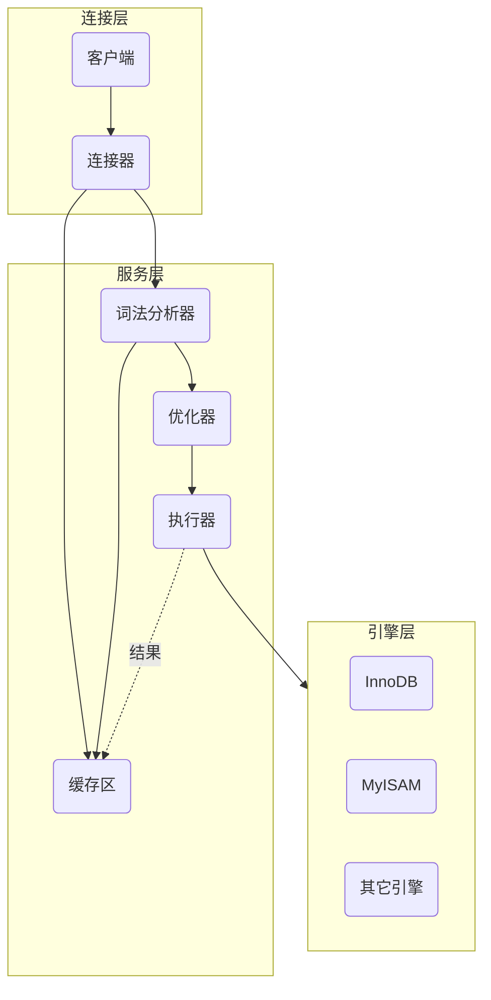
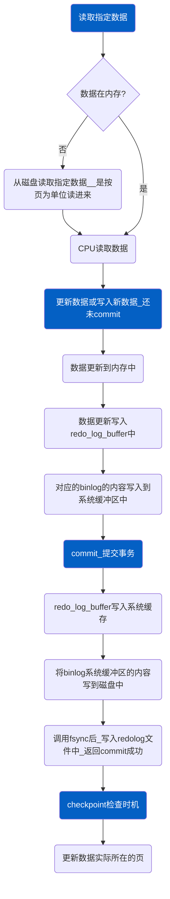

[TOC]

#  逻辑结构

首先mysql的整体逻辑结构可以划分为：连接层、服务层、引擎层、存储层。

连接层自然就是我们如何登录进mysql。服务层则是我们介绍的重点，它提供了我们增删改查以及各种函数等主要功能。引擎层则是对应着不同存储引擎，如InnoDB等。存储层则对应着如何持久化或读取磁盘数据等。

我们这里着重说明一下服务层和引擎层。



其中需要说明的是，缓存区在5.7之后被移除了。

但是，mysql版本8也是假如甲骨文后才搞出来的，应该说目前5.7或5.6版本的用户还是不少的。当然了，现在我们基本上都会用Redis作为缓存区，mysql自己的缓存似乎也确实是可有可无的。类似的，还有mysql自己搞的全文索引，就是利用倒排索引将特定内容的所在位置表示出来，即我们可能会使用的like，这个需要有，但是可以的话，我们就直接用ElasticSearch了。

- 我们通过各种方式进入mysql之后，在发送了查询命令后，首先会到词法分析器中，确定你的命令没问题，然后再到缓存区中查找是否有命中的结果。

  没有的话，再经过优化器，这是一个智能化的过程，如果你的查询命令包含了索引字段，那么自然会使用索引查找，而不是遍历，进一步的，如果事先我们建立的联合索引，优化器必然也需要考察一下给定的字段是否包含主键，以及按照怎样的字段查询顺序符合建立的索引树。

  最终，一切的策略规划好了，就有执行器去在表中进行查找或其它操作。

  引擎是管理表结构的，相当于一个插件，不同的表，我们可以随意设置它的引擎类型。它是真正负责建立记录的各种索引树等信息模块。

  最后，当从引擎中获取了结果后，执行器会顺便把结果放到缓存区中。

- 缓存区在写操作频繁时则有些难受。因为写操作也相当于一次新记录的查询，需要放到缓存区中，这样就会频繁地修改缓存区，使得原本单纯的增加记录，附带了一个修改缓存的操作。

- 由于缓存区存在一定的局限性，因此可在mysql的配置文件`my.cnf`中，设置

  ```bash
  query_cache_type=2 #意味着我们可以在命令语句中指定是否需要缓存
  #如
  #select SQL_CACHE 列名 from 表名; 此时就代表可以使用缓存
  #可以使用命令查看缓存的状态
  #show status like '%Qcache%'; 即对应的query_cache_type，5.7之后的bjbf基本上这条语句查不到什么
  #也可以查看自己的缓存是否开启
  #show variables like '%query_cache_type%';
  ```

- 设置连接等待秒数

  ```bash
  #设置全局服务器关闭非交互连接之前等待的秒数
  set global wait_timeout=xx;
  #设置全局服务器关闭交互连接之前等待的秒数
  set global interactive_timeout=xx;
  ```

# 索引

> 为什么mysql底层没有使用二叉树或红黑树。因为二者本质都是二叉树，一旦数据量巨大，无论其算法怎么优化，都会有巨大的层数。

读者都知道mysql的索引树建立使用的是B+树。至于B-树，读者也知道，就是一个多阶的平衡树，原本的二叉树之类的就是一个节点就包含一个信息，而B-树则可以包含指定最大数量的信息，并且每个信息又附带了它自己的详细数据。

关键就在于节点的信息附带数据，本来这样考虑是想着从磁盘读取信息的时候顺便拿上数据，如果匹配到的话就可以直接获取结果，避免再去走一遍缓慢的IO。

但是，mysql需要考虑的是，面对上千万的数据量，如何快速地找到目标，这要求树的高度要尽可能小。

mysql的B+树，就是把附带的数据去掉了，最后所有的结果都作为叶子节点堆积起来

> 【需要注意的是，因为B+树本来就是一种排序的树，最后的叶子节点对应的信息也是有序的，并且互相构建了一种类似双向链表，因此，如果搜索范围的话，得到一个叶子节点就可以轻松地获取其它结果】。
>
> 对于不同的数据结构，可以在这个[可视化网站](https://www.cs.usfca.edu/~galles/visualization/Algorithms.html)中自己尝试着添加数据看看得到的树到底是什么样。(需要注意的是，该网站的B+树叶子是单向链表，而mysql实际使用的是双向的)

叶子节点是附带数据的。这么做的话一个节点可以以较少的空间存储更多的信息，

> 比如一个节点只被分配了16个字节的空间，如果附带数据的话，数据可能就占据了3个字节，如果信息本身又占据1个字节，那么一个节点能保存的信息只有两个，那么其它百万的信息，按照这种规划需要多少节点，这些节点每次最多是能产生三个子节点，最终又会产生多高的树，每一层都意味着我们可能要通过一次IO读取对应节点的数据，可能树的高度有30层，单纯的内存操作，速度也许能接收，但是如果是IO，那就相当于在晚高峰开大卡车。

B+树建立的索引树，非叶子节点占据的空间非常小，如果索引的信息是一个biginteger (8B)，附带的指针是6B，总共就是14B。

> InnoDB中用页的概念，表示磁盘与内存传输数据的基本单位，默认是16KB,也就是对应着我们所说的节点的空间大小。【不过，操作系统的页是4KB的大小】

默认一个节点的大小是16KB，也就是可以保存约1170个信息，最后的叶子节点由于附带了数据，我们假设一个节点就保存10个记录，那么三层的索引树就可以保存$1170*1170*10=13689000$，可以发现此时就可以有一千多万的记录。

> 前面的索引占据很小的空间大小，可以常驻在内存中，于是内存可以在三层树上获取数据地址，通过一次IO就可以得到最终数据。

> 可能读者想说，如果这样，还分什么节点，直接扩大节点的空间大小，记录信息全部放进去不好吗。
>
> 其实也是可以的。但并不太普遍适用。
>
> 首先，系统从磁盘读取数据是按页为单位读取，一页是4kB，如果对应的几个页不在一起，可能还需要在磁盘上搜索到其它地方获取,甚至其它页读取失败，此时，单纯的读取数据就不那么单纯了。为了减少磁盘查找页的时间，就尽量不去依此提取太多的页。这也是设置节点的大小是4KB的整数倍的原因。
>
> 就算我们将索引常驻在内存中，避免了磁盘的各种因素。如果用户的主键是随机数，那么节点中的索引需要频繁地改动，若这个数据量巨大，千万条数据在一个节点里来回波动，这也是巨大的效率损失。
>
> 因此，如果索引主键是自增的整数，且没有删改，那么一个节点的操作也可以接受。自己小规模的项目可以试一试。

mysql的全文索引创建使用以下的语句，

```mysql
alter table  表名 add fulltext(列名);
```

## 主键的必要性

在表创建时用`primary key`指定哪个列为主键。

前面已经介绍了不同的引擎是负责进行表的索引管理。MyISAM会将索引和数据分开来保存到两个文件中，当从索引文件中获取数据的记录数，然后在从数据文件中利用记录数获取对应的数据。而InnoDB引擎则将二者包含在一起，这种称为聚集索引，而MyISAM称为非聚集索引。

>上面说明的文件也就是对应着存储层，引擎将读取对应的文件，从文件获取信息

那么索引具体是以什么信息作为排序的依据呢？可以是随便什么信息，数据就按数字的大小，字符串就按字典顺序。由于我们现在常用的就是InnoDB，而InnoDB特别强调要一个主键，并推荐是自增的整数。我们来说明一下原因。

索引的排序依据自然需要时表中唯一的，如果没有我们没有指定这样一列数据，mysql会自己费力地审查表中的各个列，直到找到符合条件的列，如果没有，就会自动生成一个列作为索引依据。

因此，最好自己指定主键。另外如果是使用字符串作为索引依据，那么字符串的大小比较要比数字比较麻烦很多，自然效率会损失很多。因此，建议使用整数，自增不就顺便唯一了嘛。

并且，因为主键的数字是递增的，那么对应的索引数，每次只需要将新的记录追加到树的尾部，再可能适当地调整数，而不是那种随机值导致插入到树的中间，影响后面的信息。

> 索引的建立也可以使用哈希表的方式实现，而且速度还更快。但是无法实现范围查找。
>
> ```mysql
> KEY USING HASH(列名) -- 在创建表时，可以指定用hash构建索引
> ```

## 联合索引

所谓联合就是依靠多个字段看作一个整体而视为一种主键，前提是这些字段的信息确实能够唯一地确定一条记录。

之前的索引建立时单纯按照主键的大小进行排序，而这里是依此按照字段的优先性进行排序，前面的字段如果相同，则依靠后面的字段大小进行排序。

这样的好处在于，通过一个索引树，一定程度地完成了多个索引的建立，方便了范围搜索，但前提是，搜索时必须附带上优先性最高的字段，否则mysql根本不知道从何开始，只能遍历。

联合索引的创建做法是，

```mysql
KEY `自定义索引名` (`列名1`, `列名2`, `等等`) # 这是在创建表的时候使用的
#如果表已经有了
alert table 表名 add INDEX `自定义索引名` (`列名1`, `列名2`, `等等`) 
```

## 其它

==**对于聚簇索引，或称之为聚集索引，就是像InnoDB那样数据和索引放在一起的形式，它可以也可能产生了几个隐藏的索引列，可应对没有合适列做索引的情况，也可以在事务隔离的MVCC中的版本链中发挥作用。**==

msql中一行记录的最大字节数不能超过$2^{16}-1$ ，另外每一行不仅仅单纯记录对应的数据，还包括

> - 变长字段长度列表：针对varchar类型
>
> - NULL值列表：针对一些可以设置为空的列，当对应值为空，这里可以标记，以节省空间
>
> - 记录头信息：这里包括
>   - `delete_mask`(记录该记录是否被删除)、
>   - `min_rec_mask`(若是B+树中非叶子层的最小记录的则需要被标记)、
>   - `n_owned`(该记录的记录数)、
>   - `heap_no`(该记录在记录堆中的位置信息)、
>   - `record_type`(该记录的类型，普通，或是B+树的非叶子节点，或是最小的记录，又或是最大的记录)、
>   - `next_record`(下一条记录的相对位置)

每条实际的记录还包括三个隐藏列，

> row_id：【行ID，唯一标识一条记录】不是必须的，占6个字节，
>
> transaction_id：事务的ID，必须的，占6个字节
>
> roll_pointer：回滚指针，必须的，占7个字节

#  日志

这里介绍的日志大多数是与InnoDB有关的。

## log

如果读者之前有了解过一点Redis的知识，应该会记得Redis中为了保证数据的安全，会定期的保存当前数据的快照，另外一种方式则是保存从开始到当前所有的操作，通过运行一遍操作就可以得到当前的结果。

mysql同样有这样的机制，而且有同样的两种方式：Binlog称为逻辑日志（是二进制日志），Redolog称为重做日志（物理日志）。此外还有undo log（回滚日志）。

> InnoDB为了保证事务的持久性，会首先将操作和操作的结果产生的日志先保存到磁盘中，其中InnoDB为了进一步保证事务的正确性（万一日志写入磁盘是出现故障，导致结果不完整，那么对应的信息也是没有价值的），就有了双写机制，即日志实际是写写到一个双写日志文件中，在从这个文件中转移内容，只要双写文件的内容是完整的就好，不完整也不会影响当前的日志内容。
>
> 双写机制可在[InnoDB的架构](# InnoDB架构)中看一下位置。
>
> 但是双写机制终究是比较影响效率的，可以关闭这一功能。

### bin log

这个日志是所有引擎通用的。主要记录哪些对数据库有改动的语句，像select之类的是不会记录的。因为我们把一开始的所有改动的语句执行一遍就可以得到当前的数据，所以，bin log文件是没有大小限制的，并且是不断在文件尾部追加新内容。

```mysql
show variables like 'log_bin';#查看自己是否开启了binlog
```


所有的变动操作都需要先写入这些日志文件，最后在挑选实际对数据库做实际的改动。

> 比如，我们适用delete删除数据，这一操作是先写入日志，但不一定数据的磁盘文件中就已经删除了，即使删除了，通过bin log文件，也可以返回到删除之前的状态。【当删除的内容很多时，则可能觉得速度慢，这就是一方面并不断调整数据库的内容结构，另一方面还需要写入日志】
>
> 但是，如果使用truncate命令来清空表，速度就非常快，一个原因就在于它是不写日志的，导致无法回溯。

由于bin log内容是二进制，我们需要使用`mysqlbinlog `命令来查看内容。

```bash
mysqlbinlog  --base64-output=decode-rows -v 对应的日志文件 
# base64等命令 是进一步解码文件 ，不写也大致能看出来主要内容
```

```mysql
show global variables like "%log_bin%";#查看日志的文件目录

#也可以在mysql中简单看一下日志文件记录的情况
show binary logs;#显示当前使用的日志文件，可能有多个
show master status\G;#当前被写入的日志文件
show binlog events in '日志文件名' \g #显示文件内部包含的事务情况
```

----------------------

我们这里在数据库my_test_base中创建了一个my_test的表，mysqlbinlog查看的部分日志内容表示为

```bash
# at 444                                                                            #210714 15:32:10 server id 1  end_log_pos 670 CRC32 0x33b4cc30  Query   thread_id=14    exec_time=0     error_code=0    Xid = 72              
use `my_test_base`/*!*/;                                                            
SET TIMESTAMP=1626247930/*!*/;                                                     /*!80013 SET @@session.sql_require_primary_key=0*//*!*/;                            
create table my_test(id int unsigned auto_increment,name varchar(255),primary key (id)) engine=InnoDB default charset=utf8
/*!*/;  
```

show binlog events查看的部分内容表示为

```bash
| Log_name      | Pos | Event_type | Server_id | End_log_pos | Info |             
| binlog.000012 | 444 | Query      | 1         |670          | use `my_test_base`; create table my_test(id int unsigned auto_increment,name varchar(255),primary key (id)) engine=InnoDB default charset=utf8 /* xid=72 */ |      
```

可以发现还是mysqlbinlog显示的内容稍微丰富一些。其中444，670对应的是在日志文件中的字节数位置。

```bash
#210714 15:32:10 //对应的是时间 2021-07-14 15：32：10
SET TIMESTAMP=1626247930/*!*/; //这个就是时间戳
```

现在我们就会发现表示指定的事务既可以使用对应的字节数，也可以用对应的时间，比如，

```mysql
mysqlbinlog 日志名 --start-position 起始字节数，如444 --stop-position 结束字节数，如670 | mysql -u 用户名 -D 数据库名 -p 密码;
# 或者
mysqlbinlog 日志名 --start-datetime 起始时间，如 "2021-07-14 15：32：10" --stop-datetime 结束时间 | mysql -u 用户名 -D 数据库名 -p 密码;
```

### redo log

这一日志负责的是记录磁盘中数据页的物理修改，不单纯是某几行的修改。当机器崩溃，我们需要用这个日志恢复到崩溃前的状态。

> 前面介绍了，读取磁盘数据最小单位是页，那么写入数据也是按页为单位写入的。
>
> redo就是记录这些页被修改的情况。

至于该日志的持久化，有WAL（Write Ahead Log）的做法，即修改修改数据库的磁盘数据前，先把内容写到日志中，再写数据库。

> 【因为数据库的操作更复杂，日志结构简单，写起来方便，总之先把新记录持久化再说】。

> redo log磁盘中的文件一般只有两个，而且有固定大小，对它的修改是在两个文件中循环写入，
>
> `innodb_log_files_in_group`可以设置实际的文件数量
>
> 如果redo log的文件被写满，则需要检查redo log中记录的日志对应的数据是否已经持久化到数据库的磁盘中，即使没有，也要强行让他持久化，那么此时这部分redo log的内容就已经无效了，因此可以删除写入新的日志内容。

而日志的持久化之前也不是那么单纯的内存传递过来，内存中redo log还有一块飞地，用于存储内容，等磁盘这里工作不忙了，再传递给系统缓冲区，最终写到磁盘中，称为落盘。也只有落盘后，mysql的事务提交才会显示成功。

> 到了系统缓冲区也不一定就当场写到磁盘中，为了保证安全性，InnoDB会额外调用 fsync操作，确保缓冲区的内容往磁盘写。
>
> 重做日志没有打开 O_DIRECT选项。【O_DIRECT选项是在Linux系统中的选项，使用该选项后，对文件进行直接IO操作，不经过文件系统缓存，直接写入磁盘)】
>
> `innodb_flush_log_at_trx_commit`参数，可控刷盘的策略
>
> - 0：表示事务提交时不进行写入redo log操作，这个操作仅在master thread 中完成，而在master thread中每1秒进行一次重做日志的fsync操作，因此实例 crash 最多丢失1秒钟内的事务。（master thread是负责将缓冲池中的数据异步刷新到磁盘，保证数据的一致性）
>
> - 1：（默认）表示事务提交时必须调用一次 `fsync` 操作，最安全的配置，保障持久性
> - 2：则在事务提交时只做 **write** 操作，只保证将redo log buffer写到系统的页面缓存中，不进行fsync操作，因此如果MySQL数据库宕机时 不会丢失事务，但操作系统宕机则可能丢失事务。

上述的工作主要是保证日志尽可能被持久化，可能我们commit了好几次，实际的数据库对应的磁盘的页并没有改变，而是要由checkpoint机制判断当前的时机是否合适，才能决定更新磁盘页。

>修改日志文件主要是在文件尾部追加，对于磁盘写内容而言是在连续的地址修改，更方便。
>
>而数据库对应的数据可能一次涉及多个页，这其中又可能涉及到数据库中表的索引的修改，总之，涉及的修改更复杂，远不是直接写入数据的事情。
>
>为了避免数据库更新带来的IO和其它因素的干扰，我们自然希望数据库的更新少一点。尤其是对一个页频繁的操作，我们IO数据库100次，和最后IO一次的效果是一样的。



- mini-transaction

  前面提到了，操作的一个数据可能对应着多个页。因为redo log的记录就是以页为单位，这样原本的一个原子操作的sql语句，实际对应着多个redo log的原子记录，而我们需要额外考虑的就是，如何保证这些redo log记录能够原子化地加载的磁盘中的日志文件中。

  即，如果redo log对应的记录保存不完整，那么其它写入的记录也是无效的，且要求有序性。这就是mini-transaction需要做的工作。【如果记录失败，那所有当前录入的记录都不要写入】

  因为这些操作可能对应着不同的页，或是一个页中的不同位置，那我们就细化出多个小操作对应这些不同位置的操作，就对应着不同的mini-transaction。这样的化话，所有的redo log的原子操作基本上都会同时完成工作。

  每个mini-transaction都有自己的一个可变的内存缓冲区，当操作完成后，这些缓冲区再并发转移到真正日志的缓冲区，这里进一步地保证这些原子操作同时完成，且能够按照指定的循序进行加载，避免某些操作有较大的延迟而无法同时写入或顺序错乱。

  > 每个mini-transaction可以知道自己缓冲区的大小，一次确定下一个mini-transaction的起始位置。

  ```mermaid
  flowchart TD;
  redo1[原子操作1];redo2[原子操作2];
  rf1[缓冲区1];rf2[缓冲区2];
  subgraph mini [mini-transaction]
  
      subgraph mini1 [mini-transaction_1]
  		redo1-->buffer1
      end
      subgraph mini2 [mini-transaction_2]
  		redo2-->buffer2
      end
  end
  buffer1-->|拷贝|rf1
  buffer2-->|拷贝|rf2
  subgraph rebuf [Redo_log_buffer]
  	rf1 ;rf2;
  end
  subgraph refile [Redo_log_file]
  	文件1;文件2;
  end
  rebuf-->refile
  ```

- Block

### undo log

逻辑日志，记录被修改的数据的原始值，innodb特有的，用来回滚事务。保证了数据库的原子性。

执行undo的时候，仅仅是将数据从逻辑上恢复至事务之前的状态，而不是从物理页面上操作实现的，这一点是不同于redo log的。

大多数对数据的变更操作包括INSERT/DELETE/UPDATE，其中INSERT操作在事务提交前只对当前事务可见，因此产生的Undo日志可以在事务提交后直接删除（谁会对刚插入的数据有可见性需求呢！！），而对于UPDATE/DELETE则需要维护多版本信息，在InnoDB里，UPDATE和DELETE操作产生的Undo日志被归成一类，即update_undo。

一张表的某一行记录一旦被修改，undo log中就会增加一条内容，表示是哪个记录被哪个事务做了怎样的操作，同时指向该记录上次被修改的对应的内容。

undo log每次的内容主要有trx_id（修改该记录的事务id）、roll_pointer（指向上次该记录的修改内容）、row_id（一个隐藏列，可能作为主键）、 delete_mask（该记录是否被删除）、主键列。

## MVCC

MVCC（multiversion concurrency control）【多版本并发控制】。事务的隔离性就是有这一机制实现的。

我们知道，根据不同的隔离机制，不同事物之间互相产生的影响不同，但我们使用的mysql默认是可重复读，即对于当前事务而言，使用的数据库就像是额外的一个备份，对于其中的操作都限制在当前的事务内，不会对其它事务产生影响。

MVCC就是使用undo log对把不同事务的操作记录，提取出当前事务可以获取的数据。

首先，当我们开启一个事务时，mysql并没有为这个事务分配一个事务id，只有当该事务中执行了非查询类的操作，才会得到一个事务id。【事务id是不断增长的】

我们为了保证读取的数据具有可重复性，就需要明确我们当前事务处于的mysql的执行状态阶段，即对于我们创建事务的时刻，数据对应的哪些状态是我们可以读取的

> 如果我们创建事务时，另外有其它几个事务正在运行，那么对于我们而言，这些事务就是一直在运行的，即使它们后来提交了操作，数据库中的数据被它们修改，我们仍然不会认可它们修改的结果

> 于是，在我们创建事务时，需要指明当前有哪些活动的事务，意味着我们不会读取这些事务修改的数据。另外还需要记录当前最大的事务id，意味着之后如果碰到更大事务id，我们也不会关心它的结果。

我们当前的事务会生成一个read-view,其中一个数组记录了当前活动事务的id`[活动事务id1,活动事务id2,...]`,并记录当前最大的事务id。

活动事务id的最小值与最大事务id组成一个事务范围，若当前的事务试图读取一条记录，则进入undo log文件中，从最新的内容开始读取对应记录的修改内容，

【首先查看对应的deleted_mask视为为false】,如果对应的事务id小于事务范围，则读取，如果等于当前的事务id，也读取，除此之外，都属于不可读的记录，需要根据指针去查看上一个版本的记录，并继续判断，直到符合要求再读取数据。

# 锁

锁，总体上只有两种：共享锁和排他锁。共享也就是读取的操作，排他自然是写操作。

> 被设置为共享锁，则可以被很多进程、线程读取，但不允许写。被设置了排他锁，自然不允许其它任何用户使用。

> 但我们常用的单纯的select 查询语句，非常厉害，它不加锁，且任何锁也拦不住它

加锁的操作基本就是直接给表或给指定行加。

下面介绍的几种锁大多是概念上的，我们基本不会直接通过语句赋予那么具体的锁，但是mysql的底层确实存在对应的锁的算法，【很多这样的锁是mysql自己内部运行的】

```mysql
LOCK TABLES 表名1 write, 表名2 read; -- 表的读写锁,即可用于下述的意向锁
UNLOCK TABLES; -- 解除所有表的锁
-- 对行加锁
select [选择出一些行] lock in share mode; -- 加共享锁
select [选择出一些行] for share;  -- 8版本后的改动
select [选择出一些行] for update; -- 加排他锁
```

- 此外又引申出意向锁【作用于表】，如果表被标记为意向共享锁，那么其它试图占用整个表进行写入的进程则无法占用。如果被标记为意向排他锁，自然谁也无法占用该表。

  > 如果一个进程正在读取表中的某一行，那此时就可以把表标记为意向共享锁，或者正在写入某一行，也可以标记为意向排他锁。总之，都是为了快速地判断当前表是否可以被直接占用。
  >
  > 如果没有这样的意向表，那么占用一个表就需要一行行地判断是否有无法接受的占用，效率极为低下。

- 之后，又按照锁能控制的范围划分出表锁、页锁、行锁。【顾名思义】

~~下面将主要使用官方文档~~

## 表锁

- AUTO-INC锁

  AUTO-INC 锁是一种特殊的表级锁，由插入到具有 AUTO_INCREMENT 列的表中的事务获取。在最简单的情况下，如果一个事务正在向表中插入值，则任何其他事务都必须等待自己插入到该表中，以便第一个事务插入的行接收连续的主键值。 
  [innodb_autoinc_lock_mode](# innodb_autoinc_lock_mode) 变量控制用于自动增量锁定的算法。
  它允许您选择如何在可预测的自动增量值序列和插入操作的最大并发之间进行权衡。

- 表锁中还有一种称为元数据锁（meta data lock，MDL)，是mysql自动使用的，用于防止在查询的时候修改了表结构。

## 行锁

行锁又有一些变种，如记录锁、间隙锁、临键锁【InnoDB默认行锁算法】

行锁可以是一行也可以是多行，而记录锁只能是一行。【MyISAM不支持行锁】

- 需要注意的是，**两阶段锁协议。**
  - **在 InnoDB 事务中，行锁是在需要的时候才加上的，但并不是不需要了就立刻释放，而是要等到事务结束时才释放。**有可能出现死锁。

- 记录锁：

  ```mysql
  SELECT c1 FROM t WHERE c1 = 10 FOR UPDATE; -- 精准匹配
  ```

  记录锁是对索引记录的锁定。如果该表没有定义索引，那么InnoDB就会使用隐藏列作为索引标记该记录。

- 间隙锁

  ```mysql
   SELECT c1 FROM t WHERE c1 BETWEEN 10 and 20 FOR UPDATE;
  ```

  间隙锁是锁定索引记录之间的间隙，或锁定在第一个或最后一个索引记录之前的间隙。 

  间隙可能跨越单个索引值，多个索引值，甚至可能为空。

  另外，

  ```mysql
  SELECT * FROM child WHERE id = 100;-- 如果id是唯一索引，这无所谓
  -- 如果id不是唯一的，这个语句可能对应着多条记录，则可能需要间隙锁
  ```

  不同事务对同一间隙的间隙锁即使冲突，也是可以接受的。即不同事务之间的间隙锁是互不干扰的。

  - 插入意向锁（Insert Intention Locks）

    插入意向锁是一种在行插入之前由 INSERT 操作设置的间隙锁。

    > 官方解释：
    >
    > 此锁表示插入意图，如果插入同一索引间隙的多个事务未插入间隙内的相同位置，则它们无需相互等待。
    > 假设存在值为 4 和 7 的索引记录。 分别尝试插入值 5 和 6 的单独事务，在获得插入行的排他锁之前，每个事务都使用插入意向锁锁定 4 和 7 之间的间隙，但不会相互阻塞，因为行不冲突。

    > 以下示例演示了在获取插入记录的排他锁之前采用插入意向锁的事务。该示例涉及两个客户端 A 和 B。
    >
    > 客户端 A 创建一个包含两条索引记录（90 和 102）的表，然后启动一个事务，对 ID 大于 100 的索引记录放置排他锁。 排他锁包括记录 102 之前的间隙锁：
    >
    > ```sql
    > mysql> CREATE TABLE child (id int(11) NOT NULL, PRIMARY KEY(id)) ENGINE=InnoDB;
    > mysql> INSERT INTO child (id) values (90),(102);
    > 
    > mysql> START TRANSACTION;
    > mysql> SELECT * FROM child WHERE id > 100 FOR UPDATE;
    > +-----+
    > | id  |
    > +-----+
    > | 102 |
    > +-----+
    > ```
    >
    > 客户端 B 开始一个事务以在间隙中插入一条记录。事务在等待获得排他锁时使用插入意向锁。
    >
    > ```sql
    > mysql> START TRANSACTION;
    > mysql> INSERT INTO child (id) VALUES (101);
    > ```

- 临键锁（Nex-key locks）

  > *InnoDB 以这样的方式执行行级锁定：当它搜索或扫描表索引时，它会在遇到的索引记录上设置共享锁或排它锁。*
  >
  > *因此，行级锁实际上是索引记录锁。 索引记录上的临键锁也会影响该 索引记录之前 的 间隙 。*

  也就是说，临键锁是索引记录锁定加上索引记录之前的间隙上的间隙锁定。

  示例：

  > 假设索引包含值10,11,13和20.此索引的可能的下一个键锁定覆盖以下间隔，其中圆括号表示排除间隔端点，方括号表示包含端点：
  >
  > ```
  > （负无穷大，10]
  > （10,11]
  > （11,13）
  > （13,20）
  > （20，正无穷大）
  > ```

  > 默认情况下， `InnoDB` 以 `可重复读`事务隔离级别运行。 在这种情况下， `InnoDB` 使用临键锁进行搜索和索引扫描，这会阻止[幻像行](# 幻像行)

## 全局锁

此外，mysql 还有一种全局读锁，可用于进行全局备份

```mysql
Flush tables with read lock;
```

## 空间索引的谓词锁

InnoDB 支持包含空间数据的列的空间索引（参见[优化空间分析](# 优化空间分析)）

为了处理涉及 SPATIAL 索引的操作的锁定，next-key 锁定不能很好地支持 REPEATABLE READ 或 SERIALIZABLE 事务隔离级别。多维数据中没有绝对排序的概念，所以不清楚哪个是“下一个”键。

为了支持具有 SPATIAL 索引的表的隔离级别，InnoDB 使用谓词锁。 SPATIAL 索引包含最小边界矩形 (MBR) 值，因此 InnoDB 通过在用于查询的 MBR 值上设置谓词锁来强制对索引进行一致读取。其他事务无法插入或修改与查询条件匹配的行。

# 集群


# 执行计划


# 附录

## 事件类型

<table>
	<thead><tr><th>事件类型</th><th>说明</th></tr></thead>
	<tbody>
	<tr><td>UNKNOWN_EVENT</td><td>此事件从不会被触发，也不会被写入binlog中；发生在当读取binlog时，不能被识别其他任何事件，那被视为UNKNOWN_EVENT</td></tr>
	<tr><td>START_EVENT_V3</td><td>每个binlog文件开始的时候写入的事件，此事件被用在MySQL3.23 – 4.1，MYSQL5.0以后已经被 FORMAT_DESCRIPTION_EVENT 取代</td></tr>
	<tr><td>QUERY_EVENT</td><td>执行更新语句时会生成此事件，包括：create，insert，update，delete；	</td></tr>
	<tr><td>STOP_EVENT</td><td>当mysqld停止时生成此事件</td></tr>
	<tr><td>ROTATE_EVENT</td><td>当mysqld切换到新的binlog文件生成此事件，切换到新的binlog文件可以通过执行flush logs命令或者binlog文件大于 <code>max_binlog_size</code> 参数配置的大小；</td></tr>
	<tr><td>INTVAR_EVENT</td><td>当sql语句中使用了AUTO_INCREMENT的字段或者1436753函数；此事件没有被用在binlog_format为ROW模式的情况下</td></tr>
	<tr><td>LOAD_EVENT</td><td>执行LOAD DATA INFILE 语句时产生此事件，在MySQL 3.23版本中使用	</td></tr>
	<tr><td>SLAVE_EVENT</td><td>未使用</td></tr>
	<tr><td>CREATE_FILE_EVENT</td><td>执行LOAD DATA INFILE 语句时产生此事件，在MySQL4.0和4.1版本中使用</td></tr>
	<tr><td>APPEND_BLOCK_EVENT</td><td>执行LOAD DATA INFILE 语句时产生此事件，在MySQL4.0版本中使用</td></tr>
	<tr><td>EXEC_LOAD_EVENT</td><td>执行LOAD DATA INFILE 语句时产生此事件，在MySQL4.0和4.1版本中使用</td></tr>
	<tr><td>DELETE_FILE_EVENT</td><td>执行LOAD DATA INFILE 语句时产生此事件，在MySQL4.0版本中使用</td></tr>
	<tr><td>NEW_LOAD_EVENT</td><td>执行LOAD DATA INFILE 语句时产生此事件，在MySQL4.0和4.1版本中使用</td></tr>
	<tr><td>RAND_EVENT</td><td>执行包含RAND()函数的语句产生此事件，此事件没有被用在binlog_format为ROW模式的情况下</td></tr>
	<tr><td>USER_VAR_EVENT</td><td>执行包含了用户变量的语句产生此事件，此事件没有被用在binlog_format为ROW模式的情况下</td></tr>
	<tr><td>FORMAT_DESCRIPTION_EVENT</td><td>描述事件，被写在每个binlog文件的开始位置，用在MySQL5.0以后的版本中，代替了START_EVENT_V3</td></tr>
	<tr><td>XID_EVENT</td><td>支持XA的存储引擎才有，本地测试的数据库存储引擎是innodb，所有上面出现了XID_EVENT；innodb事务提交产生了QUERY_EVENT的BEGIN声明，QUERY_EVENT以及COMMIT声明，如果是myIsam存储引擎也会有BEGIN和COMMIT声明，只是COMMIT类型不是XID_EVENT</td></tr>
	<tr><td>BEGIN_LOAD_QUERY_EVENT</td><td>执行LOAD DATA INFILE 语句时产生此事件，在MySQL5.0版本中使用</td></tr>
	<tr>
<td>EXECUTE_LOAD_QUERY_EVENT</td>
<td>执行LOAD DATA INFILE 语句时产生此事件，在MySQL5.0版本中使用</td>
</tr>
<tr>
<td>TABLE_MAP_EVENT</td>
<td>用在binlog_format为ROW模式下，将表的定义映射到一个数字，在行操作事件之前记录（包括：WRITE_ROWS_EVENT，UPDATE_ROWS_EVENT，DELETE_ROWS_EVENT）</td>
</tr>
<tr>
<td>PRE_GA_WRITE_ROWS_EVENT</td>
<td>已过期，被 WRITE_ROWS_EVENT 代替</td>
</tr>
<tr>
<td>PRE_GA_UPDATE_ROWS_EVENT</td>
<td>已过期，被 UPDATE_ROWS_EVENT 代替</td>
</tr>
<tr>
<td>PRE_GA_DELETE_ROWS_EVENT</td>
<td>已过期，被 DELETE_ROWS_EVENT 代替</td>
</tr>
<tr>
<td>WRITE_ROWS_EVENT</td>
<td>用在binlog_format为ROW模式下，对应 insert 操作</td>
</tr>
<tr>
<td>UPDATE_ROWS_EVENT</td>
<td>用在binlog_format为ROW模式下，对应 update 操作</td>
</tr>
<tr>
<td>DELETE_ROWS_EVENT</td>
<td>用在binlog_format为ROW模式下，对应 delete 操作</td>
</tr>
<tr>
<td>INCIDENT_EVENT</td>
<td>主服务器发生了不正常的事件，通知从服务器并告知可能会导致数据处于不一致的状态</td>
</tr>
<tr>
<td>HEARTBEAT_LOG_EVENT</td>
<td>主服务器告诉从服务器，主服务器还活着，不写入到日志文件中</td>
</tr>
</tbody>
</table>

----摘自[MySQL Binlog 介绍]([MySQL Binlog 介绍 (juejin.cn)](https://juejin.cn/post/6844903794073960455))

## 幻像行

当同一查询在不同时间产生不同的行集时， 所谓的 幻像 问题发生在事务中。 例如，如果a [`SELECT`](http://www.deituicms.com/mysql8cn/cn/sql-syntax.html#select) 执行两次，但第二次返回第二次没有返回的行，则该行是 “ 幻像 ” 行。

假设 表 的 `id` 列 上有一个索引， `child` 并且您要读取并锁定标识符值大于100的表中的所有行，以便稍后更新所选行中的某些列：

```
SELECT * FROM child WHERE id> 100 FOR UPDATE;
```

查询从 `id` 大于100 的第一个记录开始扫描索引 。让表包含 `id` 值为90和102的行。如果在扫描范围内的索引记录上设置的锁不会锁定在间隙中进行的插入（在这种情况下，90和102之间的差距），另一个会话可以 `id` 在101中以101的形式 在表中插入一个新行 。如果要在同 [`SELECT`](http://www.deituicms.com/mysql8cn/cn/sql-syntax.html#select) 一个事务中 执行相同 的操作，则会看到一个 `id` 101 的新行 （一个 “ 幽灵 ” ）在查询返回的结果集中。 如果我们将一组行视为数据项，则新的幻像子将违反事务应该能够运行的事务的隔离原则，以便它在事务期间读取的数据不会更改。

为了防止幻像， `InnoDB` 使用一种称为 临键锁 的算法 ， 该算法 将索引行锁定与间隙锁定相结合。 `InnoDB` 以这样的方式执行行级锁定：当它搜索或扫描表索引时，它会在遇到的索引记录上设置共享锁或排它锁。 因此，行级锁实际上是索引记录锁。 此外，索引记录上的临键锁也会影响该 索引记录之前 的 “ 间隙 ” 。 也就是说，临键锁是索引记录锁定加上索引记录之前的间隙上的间隙锁定。 如果一个会话在记录中具有共享或独占锁定 `R` 在索引中，另一个会话不能 `R` 在索引顺序 之前的间隙中插入新的索引记录 。

当 `InnoDB` 扫描索引，它也可以锁定在指数的最后一个记录之后的间隙。 恰好在前面的示例中发生：为了防止任何插入到表中 `id` 大于100的锁，设置的锁 `InnoDB` 包括在 `id` 值102之后 的间隙上的锁 。

您可以使用临键锁在应用程序中实现唯一性检查：如果您在共享模式下读取数据并且没有看到要插入的行的副本，那么您可以安全地插入行并知道在读取期间在行的后继上设置的临键锁可防止任何人同时为您的行插入副本。 因此，临键锁使您能够 “ 锁定 ” 表中某些内容的不存在。

## innodb_autoinc_lock_mode

| Command-Line Format                 | `--innodb-autoinc-lock-mode=#` |
| :---------------------------------- | ------------------------------ |
| System Variable                     | `innodb_autoinc_lock_mode`     |
| Scope                               | Global                         |
| Dynamic                             | No                             |
| [`SET_VAR`](# SET_VAR) Hint Applies | No                             |
| Type                                | Integer                        |
| Default Value                       | `2`                            |
| Valid Values                        | `0`,`1`,`2`,                   |

用于生成自动增量值的锁定模式。
允许值为 0、1 或 2，分别表示传统、连续或交错。
从 MySQL 8.0 开始，默认设置为 2（交错），在此之前为 1（连续）。
将交错锁模式更改为默认设置反映了从基于语句的复制更改为作为默认复制类型的基于行的复制，这发生在 MySQL 5.7 中。
基于语句的复制需要连续的自增锁模式，以保证给定的SQL语句序列以可预测和可重复的顺序分配自增值，而基于行的复制对SQL语句的执行顺序不敏感

## SET_VAR

SET_VAR 进行临时变量更改，如以下语句所示：

```sql
mysql> SELECT @@unique_checks;
+-----------------+
| @@unique_checks |
+-----------------+
|               1 |
+-----------------+
mysql> SELECT /*+ SET_VAR(unique_checks=OFF) */ @@unique_checks;
+-----------------+
| @@unique_checks |
+-----------------+
|               0 |
+-----------------+
mysql> SELECT @@unique_checks;
+-----------------+
| @@unique_checks |
+-----------------+
|               1 |
+-----------------+
```

使用 SET_VAR，无需保存和恢复变量值。这使您能够用单个语句替换多个语句。考虑以下语句序列：

```sql
SET @saved_val = @@SESSION.var_name;
SET @@SESSION.var_name = value;
SELECT ...
SET @@SESSION.var_name = @saved_val;
```

该序列可以用以下单个语句替换：

```sql
SELECT /*+ SET_VAR(var_name = value) ...
```

独立的 SET 语句允许使用以下任何语法来命名会话变量：

```sql
SET SESSION var_name = value;
SET @@SESSION.var_name = value;
SET @@.var_name = value;
```

由于 SET_VAR 提示仅适用于会话变量，因此会话范围是隐式的，并且不需要也不允许 SESSION、@@SESSION. 和 @@。包含显式会话指示器语法会导致 SET_VAR 提示被忽略并发出警告。并非所有会话变量都允许与 SET_VAR 一起使用。单独的系统变量描述表明每个变量是否是可提示的；您还可以通过尝试将系统变量与 SET_VAR 一起使用来在运行时检查系统变量。如果变量不可提示，则会出现警告：

```sql
mysql> SELECT /*+ SET_VAR(collation_server = 'utf8') */ 1;
+---+
| 1 |
+---+
| 1 |
+---+
1 row in set, 1 warning (0.00 sec)

mysql> SHOW WARNINGS\G
*************************** 1. row ***************************
  Level: Warning
   Code: 4537
Message: Variable 'collation_server' cannot be set using SET_VAR hint.
```

SET_VAR 语法只允许设置单个变量，但可以给出多个提示来设置多个变量：

```sql
SELECT /*+ SET_VAR(optimizer_switch = 'mrr_cost_based=off')
           SET_VAR(max_heap_table_size = 1G) */ 1;
```

如果多个具有相同变量名称的提示出现在同一语句中，则应用第一个提示，并忽略其他提示并显示警告：

```sql
SELECT /*+ SET_VAR(max_heap_table_size = 1G)
           SET_VAR(max_heap_table_size = 3G) */ 1;
```

在这种情况下，第二个提示将被忽略并警告它是冲突的。
如果没有系统变量具有指定的名称或变量值不正确，则会忽略 SET_VAR 提示并发出警告：

```sql
SELECT /*+ SET_VAR(max_size = 1G) */ 1;
SELECT /*+ SET_VAR(optimizer_switch = 'mrr_cost_based=yes') */ 1;
```

对于第一条语句，没有 max_size 变量。
对于第二个语句，mrr_cost_based 取值 on 或 off，因此尝试将其设置为 yes 是不正确的。
在每种情况下，提示都会被忽略并发出警告。 
SET_VAR 提示仅在语句级别允许。如果在子查询中使用，提示将被忽略并显示警告。
副本忽略复制语句中的 SET_VAR 提示，以避免潜在的安全问题。

## 优化空间分析

对于 MyISAM 和 InnoDB 表，可以使用 SPATIAL 索引优化包含空间数据的列中的搜索操作。
最典型的操作是： 

- 搜索包含给定点的所有对象的点查询 
- 搜索与给定区域重叠的所有对象的区域查询

MySQL 对空间列上的 SPATIAL 索引使用带有二次分裂的 R-Trees。空间索引是使用几何图形的最小边界矩形 (MBR) 构建的。对于大多数几何图形，MBR 是围绕几何图形的最小矩形。对于水平或垂直线串，MBR 是退化为线串的矩形。对于一个点，MBR 是一个退化为该点的矩形。

也可以在空间列上创建普通索引。在非 SPATIAL 索引中，您必须为除 POINT 列之外的任何空间列声明前缀。

MyISAM 和 InnoDB 支持 SPATIAL 和非 SPATIAL 索引。其他存储引擎支持非空间索引。

## InnoDB 架构


<center style="color:#C0C0C0;text-decoration:underline">
   5.7版本
</center>


<center style="color:#C0C0C0;text-decoration:underline">
   8.0版本
</center>

