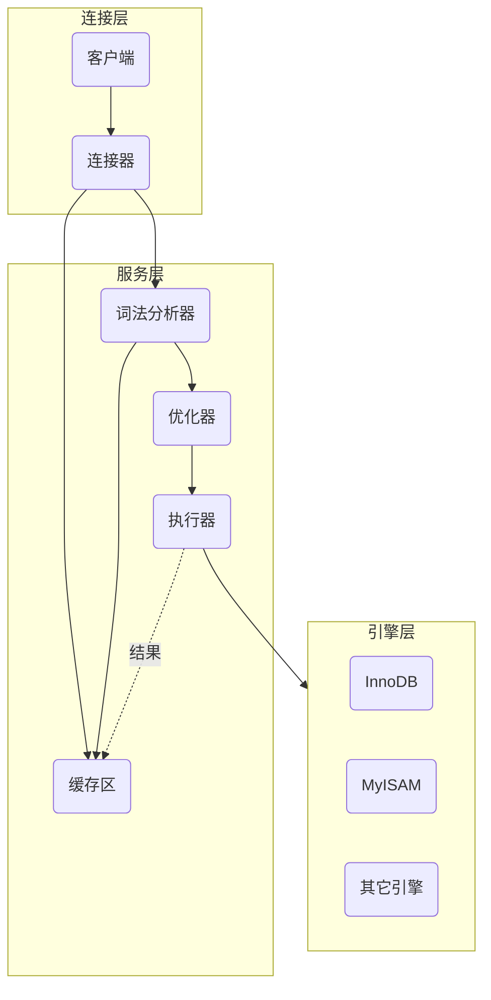

#  逻辑结构

首先mysql的整体逻辑结构可以划分为：连接层、服务层、引擎层、存储层。

连接层自然就是我们如何登录进mysql。服务层则是我们介绍的重点，它提供了我们增删改查以及各种函数等主要功能。引擎层则是对应着不同存储引擎，如InnoDB等。存储层则对应着如何持久化或读取磁盘数据等。

我们这里着重说明一下服务层和引擎层。



其中需要说明的是，缓存区在5.7之后被移除了。

但是，mysql版本8也是假如甲骨文后才搞出来的，应该说目前5.7或5.6版本的用户还是不少的。当然了，现在我们基本上都会用Redis作为缓存区，mysql自己的缓存似乎也确实是可有可无的。类似的，还有mysql自己搞的全文索引，就是利用倒排索引将特定内容的所在位置表示出来，即我们可能会使用的like，这个需要有，但是可以的话，我们就直接用ElasticSearch了。

- 我们通过各种方式进入mysql之后，在发送了查询命令后，首先会到词法分析器中，确定你的命令没问题，然后再到缓存区中查找是否有命中的结果。

  没有的话，再经过优化器，这是一个智能化的过程，如果你的查询命令包含了索引字段，那么自然会使用索引查找，而不是遍历，进一步的，如果事先我们建立的联合索引，优化器必然也需要考察一下给定的字段是否包含主键，以及按照怎样的字段查询顺序符合建立的索引树。

  最终，一切的策略规划好了，就有执行器去在表中进行查找或其它操作。

  引擎是管理表结构的，相当于一个插件，不同的表，我们可以随意设置它的引擎类型。它是真正负责建立记录的各种索引树等信息模块。

  最后，当从引擎中获取了结果后，执行器会顺便把结果放到缓存区中。

- 缓存区在写操作频繁时则有些难受。因为写操作也相当于一次新记录的查询，需要放到缓存区中，这样就会频繁地修改缓存区，使得原本单纯的增加记录，附带了一个修改缓存的操作。

- 由于缓存区存在一定的局限性，因此可在mysql的配置文件`my.cnf`中，设置

  ```bash
  query_cache_type=2 #意味着我们可以在命令语句中指定是否需要缓存
  #如
  #select SQL_CACHE 列名 from 表名; 此时就代表可以使用缓存
  #可以使用命令查看缓存的状态
  #show status like '%Qcache%'; 即对应的query_cache_type，5.7之后的bjbf基本上这条语句查不到什么
  #也可以查看自己的缓存是否开启
  #show variables like '%query_cache_type%';
  ```

- 设置连接等待秒数

  ```bash
  #设置全局服务器关闭非交互连接之前等待的秒数
  set global wait_timeout=xx;
  #设置全局服务器关闭交互连接之前等待的秒数
  set global interactive_timeout=xx;
  ```

# 索引

> 为什么mysql底层没有使用二叉树或红黑树。因为二者本质都是二叉树，一旦数据量巨大，无论其算法怎么优化，都会有巨大的层数。

读者都知道mysql的索引树建立使用的是B+树。至于B-树，读者也知道，就是一个多阶的平衡树，原本的二叉树之类的就是一个节点就包含一个信息，而B-树则可以包含指定最大数量的信息，并且每个信息又附带了它自己的详细数据。

关键就在于节点的信息附带数据，本来这样考虑是想着从磁盘读取信息的时候顺便拿上数据，如果匹配到的话就可以直接获取结果，避免再去走一遍缓慢的IO。

但是，mysql需要考虑的是，面对上千万的数据量，如何快速地找到目标，这要求树的高度要尽可能小。

mysql的B+树，就是把附带的数据去掉了，最后所有的结果都作为叶子节点堆积起来，

> 【需要注意的是，因为B+树本来就是一种排序的树，最后的叶子节点对应的信息也是有序的，并且互相构建了一种类似双向链表，因此，如果搜索范围的话，得到一个叶子节点就可以轻松地获取其它结果】。

叶子节点是附带数据的。这么做的话一个节点可以以较少的空间存储更多的信息，

> 比如一个节点只被分配了16个字节的空间，如果附带数据的话，数据可能就占据了3个字节，如果信息本身又占据1个字节，那么一个节点能保存的信息只有两个，那么其它百万的信息，按照这种规划需要多少节点，这些节点每次最多是能产生三个子节点，最终又会产生多高的树，每一层都意味着我们可能要通过一次IO读取对应节点的数据，可能树的高度有30层，单纯的内存操作，速度也许能接收，但是如果是IO，那就相当于在晚高峰开大卡车。

B+树建立的索引树，非叶子节点占据的空间非常小，如果索引的信息是一个biginteger (8B)，附带的指针是6B，总共就是14B。

默认一个节点的大小是16kB，也就是可以保存约1170个信息，最后的叶子节点由于附带了数据，我们假设一个节点就保存10个记录，那么三层的索引树就可以保存$1170*1170*10=13689000$，可以发现此时就可以有一千多万的记录。

> 前面的索引占据很小的空间大小，可以常驻在内存中，于是内存可以在三层树上获取数据地址，通过一次IO就可以得到最终数据。

> 可能读者想说，如果这样，还分什么节点，直接扩大节点的空间大小，记录信息全部放进去不好吗。
>
> 其实也是可以的。但并不太普遍适用。
>
> 首先，系统从磁盘读取数据是按页为单位读取，一页是4kB，如果对应的页不再一起，可能还需要在磁盘上搜索到其它地方获取，因此，单纯的读取数据也不是那么单纯。为了减少磁盘查找页的时间，就尽量不去依此提取太多的页。这要求，节点的大小是4kB的整数倍。
>
> 就算我们将索引常驻在内存中，避免了磁盘的各种因素。如果用户的主键是随机数，那么节点中的索引需要频繁地改动，若这个数据量巨大，千万条数据在一个节点里来回波动，这也是巨大的效率损失。
>
> 因此，如果索引主键是自增的整数，且没有删改，那么一个节点的操作也可以接受。自己小规模的项目可以试一试。

## 主键的必要性

前面已经介绍了不同的引擎是负责进行表的索引管理。MyISAM会将索引和数据分开来保存到两个文件中，当从索引文件中获取数据的记录数，然后在从数据文件中利用记录数获取对应的数据。而InnoDB引擎则将二者包含在一起，这种称为聚集索引，而MyISAM称为非聚集索引。

>上面说明的文件也就是对应着存储层，引擎将读取对应的文件，从文件获取信息

那么索引具体是以什么信息作为排序的依据呢？可以是随便什么信息，数据就按数字的大小，字符串就按字典顺序。由于我们现在常用的就是InnoDB，而InnoDB特别强调要一个主键，并推荐是自增的整数。我们来说明一下原因。

索引的排序依据自然需要时表中唯一的，如果没有我们没有指定这样一列数据，mysql会自己费力地审查表中的各个列，直到找到符合条件的列，如果没有，就会自动生成一个列作为索引依据。

因此，最好自己指定主键。另外如果是使用字符串作为索引依据，那么字符串的大小比较要比数字比较麻烦很多，自然效率会损失很多。因此，建议使用整数，自增不就顺便唯一了嘛。

并且，因为主键的数字是递增的，那么对应的索引数，每次只需要将新的记录追加到树的尾部，再可能适当地调整数，而不是那种随机值导致插入到树的中间，影响后面的信息。

> 索引的建立也可以使用哈希表的方式实现，而且速度还更快。但是无法实现范围查找。

## 联合索引

所谓联合就是依靠多个字段看作一个整体而视为一种主键，前提是这些字段的信息确实能够唯一地确定一条记录。

之前的索引建立时单纯按照主键的大小进行排序，而这里是依此按照字段的优先性进行排序，前面的字段如果相同，则依靠后面的字段大小进行排序。

这样的好处在于，通过一个索引树，一定程度地完成了多个索引的建立，方便了范围搜索，但前提是，搜索时必须附带上优先性最高的字段，否则mysql根本不知道从何开始，只能遍历。

联合索引的创建做法是，

```mysql
KEY `自定义索引名` (`列名1`, `列名2`, `等等`) # 这是在创建表的时候使用的
#如果表已经有了
alert table 表名 add INDEX `自定义索引名` (`列名1`, `列名2`, `等等`) 
```

#  日志

## log


## MVCC


# 锁


# 集群


# 执行计划


### 附录


