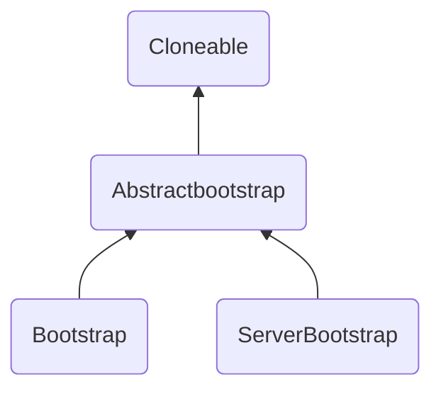

[TOC]

# 介绍

Netty是致力于处理用户高并发请求的场景。很久以前的处理方法是，为用户建立一个普通的socket连接，与用户建立通信通道，并等待用户发送数据，这是一种阻塞方案，一个线程只能单一地等待消息发过来，无法处理其它任务。当然也可以为每个用户分出一个线程建立socket，那样就可以让主线程该干嘛干嘛，但对于上百万的用户数量而言，需要的硬件成本太高了。

因此，Java给出了无阻塞的通信方案，即NIO，主要的不同点在于将连接建立与等待数据作为两个任务处理，简单而言，连接建立完成，就放在一个队列中，至于如何读取用户的数据，不同时代也有不同的实现，

> - select：最早的，自然效率最差，它可以获悉有用户传入数据，但无法确定是谁，需要每次把所有的连接内容送入内核，有内核对存储的所有连接遍历一遍，而且最多支持1024个连接
> - poll：和select一个尿性，只是它的队列结构不同，可以支持任意多的连接
> - epoll：该机制，使用了事件驱动，当设备接受到消息后，该消息对应的事件类型等信息会对应的触发对应的连接，将该连接从原本的睡眠队列中，调到了一个就绪队列中，对于内核而言，是需要隔一段时间看一下就绪队列有没有连接即可，效率非常高。

java的nio提供了完整的方案，但终究具体的使用比较麻烦，实际上我们需要Netty帮我们简化。

> 如果，读者能完全了解java的nio体系，也可以对自己的使用场景做简化的实现，因此，下文将主要介绍nio的操作，顺便提及Netty是如何简化的。

# 设备信息

>  对于很多读者，估计习惯了各种框架的直接上手，对于如何用代码触碰自己使用的机器很是陌生。

这里，我们通过代码简单介绍一下，

```java
public class Device {
    @SneakyThrows//引入lombok依赖，可替代try catch
    public static void main(String[] args){
        //这里获取机器上的各种网络设备
        Enumeration<NetworkInterface> netEn=NetworkInterface.
                getNetworkInterfaces();
        while(netEn.hasMoreElements()){
            //这个得到的设备的对象，将包含该设备的各种信息
            NetworkInterface networkInterface=netEn.nextElement();
            Enumeration<InetAddress> inetAddresses = networkInterface.
                    getInetAddresses();
            byte[] hardwareAddress = networkInterface.getHardwareAddress();
            System.out.println("设备名："+networkInterface.getName()+
                    "\n 设备名称显示："+networkInterface.getDisplayName()+
                    "\n 网络接口索引："+networkInterface.getIndex()+
                    "\n 是否开启并运行："+networkInterface.isUp()+
                    "\n 最大传输单元："+networkInterface.getMTU()+
                    "\n 是否是p2p设备："+networkInterface.isPointToPoint()+
                    "\n 是否为回调接口："+networkInterface.isLoopback()+
                    "\n 是否支持多播："+networkInterface.supportsMulticast()+
                    "\n ip");

            if(!inetAddresses.hasMoreElements()) System.out.println("   无ip");
            while(inetAddresses.hasMoreElements()){
                InetAddress inetAddress = inetAddresses.nextElement();
                System.out.println("    "+"主机名："+inetAddress.getHostName()+
                        "\n"+"    "+"IP地址："+inetAddress.getHostAddress());
            }

            System.out.println(" 硬件地址："+byte2str(hardwareAddress));
            System.out.println("===========================");
        }
    }
    @SneakyThrows
    private static String byte2str(byte[] by){
        if(by!=null){
            StringBuffer sb = new StringBuffer();
            for(int i=0;i<by.length;i++){
                if(i!=0){
                    sb.append("-");
                }
                //mac[i] & 0xFF 是为了把byte转化为正整数
                String s = Integer.toHexString(by[i] & 0xFF);
                sb.append(s.length()==1?0+s:s);
            }
            return sb.toString().toUpperCase();
        }
        return " --无";
    }
}
```

> 大致的结果，部分如下，~~这里使用的是windows系统，如果是linux，那么名称可能有所不同~~
>
> ```bash
> 设备名：lo
>  设备名称显示：Software Loopback Interface 1
>  网络接口索引：1
>  是否开启并运行：true
>  最大传输单元：-1 #-1 说明此时该设备可能禁用
>  是否是p2p设备：false
>  是否为回调接口：true #这里显示为回调接口，因此127.0.0.1归它
>  是否支持多播：true
>  ip
>     主机名：licensing.ultraedit.com
>     IP地址：127.0.0.1
>     主机名：0:0:0:0:0:0:0:1
>     IP地址：0:0:0:0:0:0:0:1
>  硬件地址： --无
> ===========================
> 设备名：net3
>  设备名称显示：Microsoft Teredo Tunneling Adapter
>  网络接口索引：12
>  是否开启并运行：true
>  最大传输单元：1280 # 不同的设备，对应的最大传输单元也是不同的。单位字节。
>  #以太网网卡大多默认1500字节，IPv6下，范围在1280~65535
>  是否是p2p设备：true
>  是否为回调接口：false
>  是否支持多播：false
>  ip
>     主机名：DESKTOP-3NVQLN7
>     IP地址：2001:0:348b:fb58:10b2:ae17:2c75:8b14
>     主机名：DESKTOP-3NVQLN7
>     IP地址：fe80:0:0:0:10b2:ae17:2c75:8b14%net3 #这里说明一个设备可以对应着多个ip地址
>  硬件地址：00-00-00-00-00-00-00-E0
> ===========================
> ```
>
> > 此外linux有一种特有的虚拟接口，即正常的设备可以有多个虚拟设备，可惜我的linux设备没有显示出来，
> >
> > ```java
> > Enumeration<NetworkInterface> subInterfaces = networkInterface.getSubInterfaces();
> > while(subInterfaces.hasMoreElements()){
> >     NetworkInterface networkInterface1 = subInterfaces.nextElement();
> >     System.out.println("");
> >     System.out.println("设备名："+networkInterface1.getName()+
> >                        "\n 设备名称显示："+networkInterface1.getDisplayName()+
> >                        "\n 是否为虚拟接口"+networkInterface1.isVirtual()+
> >                        "\n 父接口哈希值"+networkInterface1.getParent().hashCode()
> >                       );
> > }
> > ```

# 通信

对于通信，我们都知道是使用tcp或udp协议。

对于需要双方的可靠通信，我们自然需要使用tcp，基本上对于需要客户端与服务端建立通信的，也经常是这种方式。而建立的连接也有长短区别，短连接就是发送完数据就断开，而长连接则是需要长久保持的，例如我们经常搞的数据库连接等就属于长的。

## BIO

相比于本文Netty中使用的NIO，BIO则是非常传统的IO模式，它具有明显的阻塞特性，无论是建立连接，还是写入数据，都需要有对应的动作发生，才能进行下一步操作。

### 连接

我们这里先简单地给一个阻塞的连接建立，

```java
public class ServerBio {//建立一个服务器的连接
    @SneakyThrows
    public static void main(String[] args){
        ServerSocket socket=new ServerSocket(自定义一个端口);//ip就是本机地址，或回调地址
        //即，既可以使用127.0.0.1，也可以看一下你的机器在内网或公网的ip
        System.out.println("server 发生阻塞");
        socket.accept();//
        System.out.println("server建立了连接，结束阻塞");
        socket.close();
    }
}
```

到这里基本就可以了，启动它，就会发现，程序停在阻塞哪里，

> 为了方便，可以直接在命令窗口中，使用
>
> ```bash
> telnet ip 端口 # 这就相当于建立了发出了建立连接的请求
> ```
>
> > 在windows上可以使用命令确认一下，自己使用的端口没有与其它程序有冲突
> >
> > ```dash
> > netstat -ano |findstr "端口号"
> > ```
> >
> > linux可以使用
> >
> > ```bash
> > lsof -i:端口号
> > #或者
> > netstat -tunlp | grep 端口
> > ```

> 也可以创建对应的客户端类
>
> ```java
> public class ClientBio {
>     @SneakyThrows
>     public static void main(String[] args){
>         System.out.println("试图建立连接");
>         Socket socket=new Socket("localhost",80);//也可以写对应的网址
>         System.out.println("连接建立完成");
>         socket.close();
> 
>     }
> }
> ```

### 数据

同样的数据读取也会有一个阻塞，

对应的server代码

```java
public class ServerDataBio {
    @SneakyThrows
    public static void main(String[] args){
        char[] chars=new char[3];//这里指定每次读取的信息量
        ServerSocket serverSocket=new ServerSocket(端口);
        System.out.println("开始阻塞");
        Socket socket = serverSocket.accept();
        System.out.println("连接建立");
        InputStream inputStream=socket.getInputStream();
        InputStreamReader inputStreamReader=new InputStreamReader(inputStream);
        System.out.println("等待数据");
        
        //这里按照给定的大小读取数据，即先读取3个字符
        int readLength=inputStreamReader.read(chars);
        while(readLength!=-1){
            String str=new String(chars,0,readLength);
            System.out.println("data::"+str);
            readLength=inputStreamReader.read(chars);
        }
        System.out.println("数据读取结束");
        inputStreamReader.close();
        inputStream.close();
        socket.close();
        serverSocket.close();
    }
}
```

客户端

```java
public class ClientDataBio {
    @SneakyThrows
    public static void main(String[] args){
        Socket socket=new Socket("localhost",端口);
        System.out.println("建立了连接");
        System.out.println("开始休眠3s");
        Thread.sleep(3000);
        OutputStream outputStream=socket.getOutputStream();
        System.out.println("发送数据");
        outputStream.write("我在发送一些信息".getBytes());
        outputStream.close();
        socket.close();
    }
}
```

> 大概的结果如下
>
> ```bash
> server:												  client:
> 开始阻塞												建立了连接		
> 连接建立 												开始休眠3s
> 等待数据 												发送数据
> data::我在发
> data::送一些
> data::信息
> 数据读取结束
> ```
>
> 类似地，服务端也可以用同样的方法像客户端发送数据。
>
> 只要outputStreamReader不被关闭，就可以多次使用write()写入数据进行发送。

到这里，读者就能明显地感觉到，虽然传统的通信方式满足了通信的基本需求，但非常需要对方及时的配合，否则，整个程序的运行将断断续续。

更多关于socket的操作，如传输图片，udp/tcp通信，缓存，远程端口获取、本地端口复用，绑定，ip获取，多线程通信等，可以在附录的[socket简单使用](#socket简单使用)中查看。

## NIO

> 首先说明一下Linux中一些系统机制，Linux中将一切都尽可能地视为文件，所有的设备，包括网络连接都被用文件来表示。
>
> 比如，对一个文件的操作会调用的内核的系统命令，并返回一个文件描述符（file descriptor，fd），而一个对socket的读写，也会返回一个socket文件描述符（socketfd)，Linux底层中有c语言实现了对应的结构体负责存储这些信息，通过对应的各种fd，可以在对应的结构体中获取对应的详细信息。
>
> 其中I/O在系统中包含 几种处理模型，比如基于缓存的非阻塞模型，或是信号驱动模型。这里介绍的NIO，虽然名称上是叫非阻塞IO，但实际是建立在I/O服用模型上，
>
> > 前面提及过的select或者poll，就是Linux的系统调用命令，产生的连接就是转化为对应fd，并放入结构体中，select或poll就是单纯地遍历扫描所有fd的状态，而epoll基于事件驱动机制，当对应的fd就绪，会自动触发其回调函数rollback。
>
> > 而所谓的复用技术，就是体现在对所有fd的扫描或事件驱动上。此时，一个线程不再是专注于一个连接，而是统一起来，由一个或多个线程共同负责，
> >
> > > 就类似于原先一个母亲全心照顾一个孩子，除了孩子的事情，基本做不了其它工作。而现在，可以把孩子放在托儿所，一个老师管理一群孩子，到睡觉事件就一起睡，谁要上厕所就打个报告，老师带你去。
> >
> > 这样的一个另一个好处在于，不同连接之间的数据交流不再需要费力地从一个进程到另一个进程，老师就能直接和各个父母说，你家谁谁跟谁谁搞什么事了。
> >
> > > 另外，由于对于连接的这些处理都必须将对应的fd放入内核中处理，就导致需要把处理的结果再从内核的内存中转移到用户的内存中，epoll则将这个消息数据区域的内存设置为内核与用户共享的区域。
> > >
> > > > 就相当于，原本放学后，老师得一个个找对应的父母说一下今天孩子的状态，但现在，老师直接把每个小孩的情况写在对应的本子上，父母直接过来拿对应的本子看一下就OK了。

> ~~最后补充一个无用的知识，如果管理的连接都是非常活跃的，那么使用epoll命令反而降低效率，不如直接使用poll。~~

通过上述的介绍，我们可以知道，所谓的NIO，就是在系统级别上对连接的统一管理，那么在编程方面，就需要有一个对象是代表这样的管理者，有了管理者，自然也需要有被管理的员工。

管理者就是选择器（Selector），员工就是通道（Channel）。

> 选择器代表的就是负责调度连接的线程，至于线程数则是看实际的连接数量动态调整。默认是，1023个连接就增加一个线程。

通道可以读写数据，而我们还需要额外的一个缓冲区对象（Buffer）负责安放我们操作的数据。

简单实现一个，

```java
public class ServerChannel {
    private static List<SocketChannel> channelList=new ArrayList<>();
    @SneakyThrows
    public static void main(String[] args){
        //用于监听客户端连接，是所有客户端连接的父管道
        ServerSocketChannel serverSocketChannel=ServerSocketChannel.open();
        serverSocketChannel.configureBlocking(false);//设置为非阻塞
        //这里的2,对应的是挂起来的最大待处理连接的数量，也就是当一条连接处理稍微慢一些，而连接的数量又很大
        //此时，如果太多的话，超过我的设定，程序就会报异常。看自己的机器性能好坏，可以提高数量。
        serverSocketChannel.bind(new InetSocketAddress("localhost",端口号),2);
        //获得一个选择器
        Selector selector= Selector.open();
        //这里注册指定的选择器并指定类型。当然也可以获取多个选择器并注册为不同类型。
        //这里对应的是accept，即负责接受新建立的连接
        //其它的还有例如`OP_READ`，负责处理当前连接中发来的数据
        //当有对应的事件发生，将首先注册到该选择器中，等待后续的统一处理
        SelectionKey key=serverSocketChannel.register(selector,SelectionKey.OP_ACCEPT);
        System.out.println("准备开始");

        while(true){
            System.out.println("进入阻塞");
            //这里会处于阻塞状态，直到出现符合该选择器类型的动作出现，避免无意义的空转
            //更底层的epoll,实际上就是硬件设备有对应的电信号才会通过触发对应的回调函数，而结束阻塞
            selector.select();
            //获取该选择器中注册事件类型的SelectionKey实例
            Set<SelectionKey> selectionKeySet=selector.selectedKeys();
            Iterator<SelectionKey> selectionKeyIterator=selectionKeySet.iterator();
            //对发生的事件进行处理
            while(selectionKeyIterator.hasNext()){
                SelectionKey key1=selectionKeyIterator.next();
                //这里判断一下是否真的就是 OP_ACCEPT 事件
                if(key1.isAcceptable()){
                    ServerSocketChannel serverSocketChannel1=(ServerSocketChannel) key1.channel();
                    SocketChannel socketChannel = serverSocketChannel1.accept();
                    socketChannel.configureBlocking(false);
                    //上述获得了一个新的的连接，接下来就是把它在注册一遍，但是需要是read类型
                    SelectionKey selectionKey = socketChannel.register(selector, SelectionKey.OP_READ);
                    System.out.println("客户端建立成功");
                }else if(key1.isReadable()){//如果是一个存在的连接，必然是传入了数据
                    SocketChannel socketChannel=(SocketChannel)key1.channel();
                    ByteBuffer byteBuffer=ByteBuffer.allocate(64);
                    int len=socketChannel.read(byteBuffer);
                    if(len>0){
                        System.out.println("接收的消息"+new String(byteBuffer.array()));
                    }else if(len==-1){
                        socketChannel.close();
                        System.out.println("该客户端已断开连接");
                    }
                }
                //清除迭代器的最后一个元素，否则select会以为最后一个没处理，又搞一遍
                selectionKeyIterator.remove();
        }
    }
}
```

这里的代码基本上，完成了一个NIO的主要结构，我们可以多弄几个 `telnet`命令进行连接，看一下效果。

进一步的，我们会发现，这里实际就是一个线程，既负责建立连接，又负责处理数据，而之前我们看到的[Netty](https://github.com/mudongjing/spring-knowledge-simple-introduction/blob/main/Netty.md)

中，是做了分工的。其实，这种分工的模式就如下面这个图中显示的

![][分工]

这幅图来自[scalable IO in Java][scala]，作者就是java的各种并发包的主要作者。图中指出的就是，让一个小组专门负责建立新连接，而已建立的连接则交给另一个小组，由一组线程共同负责读取等操作。

而更具体的，我们代码是实现的流程如下图

![][架构]

- Channel的连接状态类型

  用于供选择器对连接做出判断

  > - OP_ACCEPT：请求在接收新连接并创建Channel时获得通知
  > - OP_CONNECT：请求在建立一个连接的时候获得通知
  > - OP_READ：请求的数据已就绪时，从Channel读取时获得该通知
  > - OP_WRITE：当请求可以向Channel写入更多数据时，获得该通知。

NIO的处理流程，


## AIO

> 除了BIO、NIO，读者可能听说过AIO，在jdk1.7升级NIO的时候一起加入的，所谓的升级就是底层使用了epoll命令。【虽然准确说是jdk1.5就使用了epoll,但实际使用的java api没有变】
>
> 上面介绍的NIO只是非阻塞IO，和原先的BIO相比，不再需要为每个连接分配线程阻塞处理，但变成了一个线程阻塞着为多个连接服务，而且对于接收数据的操作也是一个简单的阻塞行为。本质上还是靠着阻塞。
>
> 而AIO则彻底的没有阻塞，是纯粹的异步非阻塞IO。这里没有选择器，
>
> 详细的可以参考附录中的[AIO](#AIO)

简单的实现，服务端与客户端的通信，

服务端，

```java
public class ServerAio {
    @SneakyThrows
    public static void main(String[] args) {
        final int port = 666;
        //首先打开一个ServerSocket通道并获取AsynchronousServerSocketChannel实例：
        AsynchronousServerSocketChannel serverSocketChannel =
            AsynchronousServerSocketChannel.open();
        //绑定需要监听的端口到serverSocketChannel:
        serverSocketChannel.bind(new InetSocketAddress(port));
        //实现一个CompletionHandler回调接口handler，
        //之后需要在handler的实现中处理连接请求和监听下一个连接、数据收发，以及通信异常。
        CompletionHandler<AsynchronousSocketChannel, Object> handler =
            ServerCompletionHandler.create(serverSocketChannel);
        //由于是异步，因此不会阻塞，这个程序也会直接退出
        serverSocketChannel.accept(null, handler);
       // 确保应用程序不会立即退出。
        TimeUnit.MINUTES.sleep(Integer.MAX_VALUE);
    }
}
```

其中的关键在于handler的内部逻辑，

```java
public class ServerCompletionHandler {
    public static CompletionHandler<AsynchronousSocketChannel, Object> create(
            AsynchronousServerSocketChannel serverSocketChannel){
        return new
                CompletionHandler<AsynchronousSocketChannel, Object>() {
                    @SneakyThrows
                    @Override
                    public void completed(final AsynchronousSocketChannel result,
                                          final Object attachment) {
                        // 继续监听下一个连接请求
                        serverSocketChannel.accept(attachment, this);
                        System.out.println("建立连接："+result.getRemoteAddress()
                                           .toString());
                        // 给客户端发送数据并等待发送完成
                        result.write(ByteBuffer.wrap("我是服务端发送的数据".getBytes()))
                                .get();
                        ByteBuffer readBuffer = ByteBuffer.allocate(32);
                        // 这里将读取数据和获取一起执行，显示出阻塞的感觉
                        result.read(readBuffer).get();
                        System.out.println("客户端发来的数据："+new String(
                            readBuffer.array()));
                    }
                    @Override
                    public void failed(final Throwable exc, final Object attachment) {
                        System.out.println("出错了：" + exc.getMessage());
                    }
                };
    }
}
```

客户端，

```java
public class ClientAio {
    @SneakyThrows
    public static void main(String[] args) {

            // 打开一个SocketChannel通道并获取AsynchronousSocketChannel实例
            AsynchronousSocketChannel client = AsynchronousSocketChannel.open();
            // 连接到服务器并处理连接结果
            client.connect(new InetSocketAddress("localhost", 666), null,
                    ClientCompletionHandler.create(client));
            TimeUnit.MINUTES.sleep(Integer.MAX_VALUE);
    }
}
```

handler,

```java
public class ClientCompletionHandler {
    public static CompletionHandler<Void, Void> create(AsynchronousSocketChannel client ){
        return new CompletionHandler<Void, Void>() {
            @SneakyThrows
            @Override
            public void completed(final Void result, final Void attachment) {
                System.out.println("建立连接");
                // 给服务器发送信息并等待发送完成
                client.write(ByteBuffer.wrap("我是客户端的数据".getBytes())).get();
                //上述的写操作，也是非阻塞的，如果有需要，也是可以把get方法，放在后面执行
                ByteBuffer readBuffer = ByteBuffer.allocate(32);
                // 去读取数据，但没有阻塞
                Future<Integer> integerFuture = client.read(readBuffer);
                //中间我们可以运行一些其它逻辑
                //这里检测一些读取是否完成，只要没完成就可以获取其内容
                while(!integerFuture.isDone()){
                    //获取结果
                    integerFuture.get();
                    System.out.println("服务器发送的数据："+new String(readBuffer.array()));
                }
            }
            @Override
            public void failed(final Throwable exc, final Void attachment) {
                exc.printStackTrace();
            }
        };
    }
}
```

总的来说，AIO的编程要比NIO简洁许多，就像上面的示例显示的，一个通信的基本功能，只需要简单几行就结束了，剩下的一些对于连接和读写数据的操作就可以在handler中指定的位置上随意发挥。而无需定义选择器，通道之类的对象。

# Netty

经过上述的一番介绍后，我们基本重新了解了一遍java代码如何完成网络连接，但很明显，纯粹的java代码使用起来太过麻烦。

外面的Netty文档中，我们用较为简单的代码给出了一个简单的聊天室功能的实现，而上面的代码显示，只是完成一个简单的NIO的连接并读取数据，就耗费了不少啰嗦的代码，更何况，还要进行线程分工，分连接发送数据。

但是，明明AIO的机制更有优势，为何Netty底层还是使用java的NIO，主要是Linux系统本身还是个同步的机制，相反，windows底层的AIO机制是真正的异步机制，而我们真正的业务大多都是在Linux系统上运行，而Linux的AIO又是个披着异步的NIO，因此还是使用NIO靠谱。

> 可以看一下[Netty作者的回答](https://github.com/netty/netty/issues/2515#issuecomment-44352536)。
>
> 如果读者看得起windows，也可以自己分装一下自己的代码，做个框架，使用综合使用NIO和AIO。
>
> 也许，以后Netty会重新加入AIO的机制。

但使用NIO，并不意味着Netty就是非阻塞但同步的机制，实际上完全的异步和事件驱动的，不必担心比AIO弱。

## 使用

就如前面的NIO，编程需要的几个主要的对象，选择器，通道，缓存。Netty也需要几个主要的模块：通道，回调方法，Future对象，ChannelHander。

我们这里还是简单地实现一个通信功能，

- 服务端

  ```java
  public class ServerEcho {
      private final int port;
      public ServerEcho(int port){
          this.port=port;
      }
      public static void main(String[] args){
          int port=666;
          new ServerEcho(port).start();
      }
      @SneakyThrows
      public void start(){
          final ServerHandler serverHandler=new ServerHandler();
          EventLoopGroup group=new NioEventLoopGroup();
          try{
              ServerBootstrap serverBootstrap=new ServerBootstrap();//服务端专用
              serverBootstrap.group(group).channel(NioServerSocketChannel.class)
                      .localAddress(new InetSocketAddress(port))
                      .childHandler(new ChildHandlerCreator()
                                    .createServer(serverHandler));
              //绑定操作是异步的，但是用了sync造成了Thread阻塞，直到绑定完成
              ChannelFuture channelFuture=serverBootstrap.bind().sync();
              //同样，使用sync将阻塞等待服务器的channel关闭
              channelFuture.channel().closeFuture().sync();
          }finally {
              // 关闭EventLoopGroup，释放所有资源
              group.shutdownGracefully().sync();
          }
      }
  }
  ```

  ServerHandler,

  ```java
  //为了服务器能够响应传入的消息，则需要实现ChannelInboundHandler接口，用来定义响应入站事件的方法
  // 这里我们就直接继承了一个对应的实现类
  @Sharable//可以保证被channel共享
  public class ServerHandler extends ChannelInboundHandlerAdapter {
      //每次有消息传入都会调用
      @Override
      public void channelRead(ChannelHandlerContext ctx, Object msg) throws Exception {
          ByteBuf byteBuf=(ByteBuf) msg;
          System.out.println("服务端接收的数据："+byteBuf.toString(CharsetUtil.UTF_8));
          ctx.write(byteBuf);//重新发送给客户端
          //write是异步操作，该方法及时完成，这个write可能仍没有结束
          //而这样的·消息·最终会在channelReadComplete方法中的writeAndFlush调用后被释放
      }
      //通知ChannelInboundHandler最后一次channelRead()的调用是当前批量读取的最后一条消息
      @Override
      public void channelReadComplete(ChannelHandlerContext ctx) throws Exception {
          //将当前暂存于ChannelOutboundBuffer的消息，刷新到远程节点上，并关闭该channel
          ctx.writeAndFlush(Unpooled.EMPTY_BUFFER).
                  addListener(ChannelFutureListener.CLOSE);
      }
  	@SneakyThrows
      @Override
      public void exceptionCaught(ChannelHandlerContext ctx, Throwable cause) {
          cause.printStackTrace();
          ctx.close();
      }
  }
  ```

- ChildHandlerCreator,

  ```java
  public class ChildHandlerCreator {
      public ChannelInitializer createServer(ServerHandler handler){
          return new ChannelInitializer() {
              @Override
              protected void initChannel(Channel channel) throws Exception {
                  //该handler放到该handler的管道上，负责接收其入站消息
                  channel.pipeline().addLast(handler);
                  //这里的serverHandler是那个@Sharable的类的对象，因此，可以被多个channel使用
              }
          };
      }
      public ChannelInitializer<SocketChannel> createClient(ClientEchoHandler handler){
          return new ChannelInitializer<SocketChannel>(){
              @Override
              protected void initChannel(SocketChannel ch) throws Exception {
                  ch.pipeline().addLast(handler);
              }
          };
      }
  }
  ```

- 客户端

  ```java
  public class ClientEcho {
      private final String host;
      private final int port;
      public ClientEcho(String host,int port){
          this.host=host;
          this.port=port;
      }
      public static void main(String[] args){
          String host="localhost";
          int port=666;
          new ClientEcho(host,port).start();
      }
      @SneakyThrows
      public void start(){
          EventLoopGroup group=new NioEventLoopGroup();
          try{
              //用以处理客户端事件
              Bootstrap bootstrap=new Bootstrap();//客户端专用
              bootstrap.group(group).channel(NioSocketChannel.class)
                      .remoteAddress(new InetSocketAddress(host,port))
                      .handler(new ChildHandlerCreator().createClient(new ClientEchoHandler()));
              ChannelFuture channelFuture=bootstrap.connect().sync();
              channelFuture.channel().closeFuture().sync();
          }finally {
              group.shutdownGracefully().sync();
          }
      }
  }
  ```

  ClientEchoHandler,

  ```java
  //下面的几个重写的方法是必须要写的
  @Sharable//表明该类的示例可以被多个channel共享
  public class ClientEchoHandler extends SimpleChannelInboundHandler<ByteBuf> {
      //这是在一个连接建立后，就自动被调用
      @Override
      public void channelActive(ChannelHandlerContext ctx) {
          //当对应的channel被获悉是激活状态，则发送一条消息
          //该消息将被写入服务器中
          ctx.writeAndFlush(Unpooled.copiedBuffer("channel被激活",CharsetUtil.UTF_8));
      }
      //作为客户端，之后接收到消息，将自动调用这个方法处理
      //这是一个面向流的处理，它会分块接收，即服务端发送的数据可能被客户端使用ByteBuf作为容器分多次接收
      //因为使用TCP协议，能保证数据的字节是按顺序接收的
      @Override
      protected void channelRead0(ChannelHandlerContext ctx, ByteBuf msg) throws Exception {
          //获悉接收到的消息并输出
          System.out.println("客户端接收到的数据："+msg.toString(CharsetUtil.UTF_8));
          //当该方法结束后，SimpleChannelInboundHandler将释放保存消息的ByteBuf的内存引用
      }
      @Override
      public void exceptionCaught(ChannelHandlerContext ctx, Throwable cause) throws Exception {
          cause.printStackTrace();
          //关闭连接
          ctx.close();
      }
  }
  ```

## 组件

### EventLoop

该类将用于处理连接存活期间的所有事件。而整体的功能由Channel，EventLoop，Thread，EventLoopGroup组成。


> EventLoopGroup将管理若干个EventlLoop。
>
> 而一个EventLoop只能和一个Thread绑定。这个Thread将处理该EventLoop负责的I/O事件。
>
> 一个Channel也只能注册一个EventLoop。反之，一个EventLoop可能负责若干个Channel。
>
> 这样就导致，几个Channel的I/O操作可能都是一个Thread负责的。

#### 线程


一个EventLoop需要同时管理多个Channel，上图介绍了Netty是如何保证这些Channel的任务能够快速与EventLoop进行交互，

> 当传入的任务所负责的线程就是当前在EventLoop中正在执行的线程，那么就立即执行。否则，任务放在队列中，等待处理即可。
>
> 由于每个Channel对应着一个ChannelPipeline，这个国管道中的handler又通过它对应的eventLoop处理事件，即上面的过程，这是一个IO线程，一旦阻塞将极大影响效率。
>
> > 于是，为了处理那些长时间运行的事件，ChannelPipeline有一个add()方法，里面可以传入EventExecutorGroup对象。【可使用DefaultEventExecutorGroup类】
> >
> > 一个事件可以用一个Runnable对象实现任务。而这个对象可以被EventExecutorGroup用submit()接收。
> >
> > 之后这个事件将被EventExecutorGroup内部的EventExecutor处理，而不会交给EventLoop处理。


#### 关闭EventLoopGroup

使用方法`shutdownGracefully()`。

```java
//比如
EventLoopGroup group=new NioEventLoopGroup();
Future future=group.shutdownGracefully();//关闭是一个异步操作
```

### ChannelFuture

这一接口，就是Netty能够异步的根源。它相当于一个观察者，当对应的操作完成后，它便会获得对应的通知，既避免了阻塞，也能保证顺序执行。

> 而关于观察什么操作，则是由`addListener()`注册一个`ChannelFutureListener`。

### ChannelHandler

这个接口明显是我们最主要使用和编写组件。它内部包含了处理入站和出站的应用程序逻辑的容器。

>  它有两个常用的扩展：ChannelInboundHandler和ChannelOutboundHandler，分别对应着入站和出站。
>
> Netty能够保证数据会在相同方向的handler中传递。
>
> 而常用的handler的实现类有，
>
> > - ChannelHandlerAdapter
> > - ChannelInboundHandlerAdapter
> > - ChannelOutboundHandlerAdapter
> > - ChannelDuplexHandler

- 编码和解码

  在之前的聊天室实现中，我们在管道上添加了解码与编码的对象。主要在于我们传输的数据会是各种类型的对象，而实际的传输，我们需要把它转化成对应的字节。而我们之所以能够将这些编码器添加到管道上，在于它们也需要实现ChannelInboundHandler或ChannelOutboundHandler接口。
  
- Channel的config()方法对应的ChannelConfig接口，内部包含各种设置方法，如设定允许的连接延迟，设置缓冲区中可写入的最大或最小字节数，以及其它设定。

#### SimpleChannelInboundHandler

上面的描述，似乎表明编码器的对象必须设置，但上面的代码并没有这样的声明，而是继承	`SimpleChannelInboundHandler<ByteBuf>`，这里ByteBuf可以是其它的类型，隐性地实现了编码处理。

而在我们进行连接建立的时候，服务端与客户端的网络行为是有明显差异的，由此，对应的引导类也有明确的分化，比如服务端有专门的`ServerBootstrap`，而客户端则使用`Bootstrap`。

> 这种差异体现在：
>
> - 客户端只需要维护一个与对应服务器的连接即可，只需要一个EventLoopGroup即可管理channel。
> - 服务端既需要维护与客户端的连接，有需要时刻监听自己绑定的端口。因此需要两个EventLoopGroup管理不同类型的channel。【这里的两个当然也可以是同一个实例】

~下图体现的就是服务器使用两个EventLoopGroup的情形~


> ~前一组EventLoopGroup只包含一个ServerChannel用于监听绑定的端口。而第二组包含的是客户端建立的连接的Channel,每次连接建立成功了，EventLoopGroup会为该Channel分配一个EventLoop。~

### ChannelPipeline

当一个Channel被创建时，一个特有的ChannelPipeline会赋予给这个Channel。

> 当ChannelInitializer.initChannel()方法调用时，ChannelInitializer会在ChannelPipeline上加载我们的ChannelHandler。而ChannelInitializer会从ChannelPipeline中移除。

我们在前面编程的使用使用`addLast`为一个管道注册handler，实际上，我们可以注册多个handler，处理不同的事件，并且这些handler会按照添加的顺序排列。

> 当事件进入管道后，事件将依次经历这些handler，并可能被对应的handler做对应的处理。
>
> 当发送事件时，也会按照相反的顺序依次经历对应的handler，完成相应的处理。
>
> > 完成所有handler的处理，事件的数据到达网络传输层，显示为Socket，并大概率触发一个写操作。

ChannelPipeline由于持有了我们赋予的所有handler，因此，我们可以通过实现不同的handler以获得不同的功能，只需要简单地在ChannelPipeline上添加和移除handler即可调整这一通信通道的作用。

> 此外，我们还可以使用以下方法增改删handler
>
> - addFirst
> - addLast
> - addBefore
> - addAfter
> - remove
> - replace

- ChannelHandlerContext

  前面介绍了ChannelPipleline上的handler将放在一个有序链路上依次执行，而传入或需要传出的事件如何在不同handler之间传递，则需要ChannelContextHandler作为参数完成这一工作。

  - 我们可以使用其中的`pipeline()`获得当前的ChannelPipeline的引用，相当于可以在运行期间添加或删改某些管道上的handler。
  - 当然也可以自己准备一个ChannelHandlerContext的引用，比如继承`ChannelHandlerAdapter`类，实现其中的`handlerAdded`方法，获取ChannelHandlerContext引用，那么，我们就可以选择在何时使用该引用进行操作。


# 传输

由于每个客户端的连接都有对应的Channel负责，通过对这个Channel的操作，我们可以实现数据的传输，比如简单的方法，

> - write：将数据写到远程节点，但此时仅是传递给ChannelPipeline，让它排队等待刷新
> - flush：所谓刷新，就是将数据直接移动到底层传输出去，而不仅仅是排队等待
> - writeAndFlush：这是我们之前常使用的，读者也明白其含义。

## 监听传输结果

如果我们希望能够在数据传输完成后返回成功信息，则可以使用下述的基本示例，

```java
// 比如之前服务端中handler中channelRead的方法就是简单的write，并没有指定成功后有返回
//这里可以将其做一些简单的改写
@Override
public void channelRead(ChannelHandlerContext ctx, Object msg) throws Exception {
    ByteBuf byteBuf=(ByteBuf) msg;
    System.out.println("服务端接收的数据："+byteBuf.toString(CharsetUtil.UTF_8));
    // ctx.write(byteBuf);//重新发送给客户端
    //write是异步操作，该方法及时完成，这个write可能仍没有结束
    //而这样的·消息·最终会在channelReadComplete方法中的writeAndFlush调用后被释放
    ChannelFuture channelFuture = ctx.writeAndFlush(byteBuf);
    channelFuture.addListener(new ChannelFutureListener() {
        @Override
        public void operationComplete(ChannelFuture future) throws Exception {
            if(future.isSuccess()) System.out.println("写入成功");
            else{System.out.println("写入失败"); future.cause().printStackTrace();}
        }
    });
}
```

这里要求无论成功与否，都需要返回信息。 ChannelFuture的addListener添加了一个监听器，是一个异步的操作，只有完成或失败才会做出反应。

## 多线程写入

```java
//还是使用上面的例子
//如何让一个缓冲区由多个线程写入数据
@Override
public void channelRead(ChannelHandlerContext ctx, Object msg) throws Exception {
    ByteBuf byteBuf=(ByteBuf) msg;
    System.out.println("服务端接收的数据："+byteBuf.toString(CharsetUtil.UTF_8));

    //Channel的多线程
    //创建持有要写数据的ByteBuf
    final ByteBuf byteBuf1=Unpooled.copiedBuffer("数据",CharsetUtil.UTF_8).retain();
    //将数据写入这个Channel的Runnable
    Runnable writer=new Runnable() {
        @Override
        public void run() {
            ctx.writeAndFlush(byteBuf1.duplicate());
        }
    };
    Executor executor=Executors.newCachedThreadPool();//获取线程池executor的引用
    executor.execute(writer);
    executor.execute(writer);//每次调用execute()方法，都会让一个线程执行以此写操作
     ctx.write(byteBuf1);
}
```

## 内部传输

- 零拷贝：是将我们的数据直接放到对应的磁盘文件中，

  > 而不是先IO把磁盘中对应的数据拿到用户内存空间，在调到系统内存空间，一番操作，再调用IO放入磁盘文件中

  前提是，我们需要加入的数据是不需要使用磁盘中的数据，即我们知识单向地修改磁盘中的数据，那么，我们就调用sendfile函数，指明磁盘中那个文件，准备好我们自己的数据，指定磁盘文件存放数据的位置起始点，一次调用IO，之间塞进去。

  > 只有我们使用NIO和epoll传输时，才可用。
  >
  > 由于这一机制只能简单地传送数据，对于数据加密或压缩的文件系统是无法使用。

- Local传输

  这是Netty提供的功能，用于在同一个JVM中运行的客户端和服务端的程序间进行异步通信。

  > 这种传输并不是真正的网络传输。
  >
  > 和服务器的Channel关联的SocketAddress并没有绑定物理的网络地址，而是作为注册表存在，随Channel的开启而存在或注销。

- Embedded传输

  也是Netty提供的传输。详细可了解[Embedded传输](#Embedded传输)

# 缓冲区

## ByteBuf

> 这是Netty为简化jdk的byteBuffer而提供的一个缓存类。

ByteBuf的特点：

- 内置的复合缓冲区类型可实现透明的零拷贝
- 容量可增长
- 缓冲区中的读和写具有不同的索引(readerIndex、writerIndex)


> 我们可以指定ByteBuf的最大容量，默认是Integer.MAX_VALUE

### ByteBuf使用模式 

- 堆缓冲区

  将数据存储在JVM的堆空间。该模式称之为支撑数组（backing array）。它能在没有池化的情况下快速地分配和释放。

  ```java
  //我们这里用客户端的handler中的一个方法简单介绍一下
  @Override
  protected void channelRead0(ChannelHandlerContext ctx, ByteBuf msg){
      ByteBuf byteBuf=(ByteBuf) msg;
      if(byteBuf.hasArray()){//检查是否存在一个支撑数组
          //获取该支撑数组的引用
          byte[] array=byteBuf.array();
          //计算第一个字节的偏移量
          //计算的方式是：该支撑数组在缓冲区中的偏移量+读索引偏移量
          int offset=byteBuf.arrayOffset()+byteBuf.readerIndex();
          int length=byteBuf.readableBytes();//可读的字节数
          自定义方法(array,offset,length);//我们可以对可读的内容进行操作
      }
  }
  ```

- 直接缓冲区

  这一缓冲区的内容是放在垃圾回收覆盖的堆之外的内存空间。传统的I/O方式，需要把数据读取到一个中间的缓冲区，再复制到JVM的堆中，而这种模式则省去了中间缓冲的操作。

  ```java
  @Override
  protected void channelRead0(ChannelHandlerContext ctx, ByteBuf msg) {
      if(!byteBuf.hasArray()){//如果不是支撑数组，那么就作为直接缓冲区
          int length=byteBuf.readableBytes();//获取可读字节数
          byte[] array=new byte[length];
          byteBuf.getBytes(byteBuf.readerIndex(),array);//将对应的字节复制到准备的数组中
          自定义方法(array,0,length);//自定义的方法
      }
  }
  ```

- 复合缓冲区

  这是一种将多个缓冲区表示为一个缓冲区的虚拟表示的方式。Netty提供了CompositeByteBuf类实现该模式。

  > 这一模式，对于那些由不同程序分工完成的内容非常有用，传统方式是，将不同模块的结果再放到一个缓冲区中重新组装，这就导致必须多复制一次。

  ```java
  CompositeByteBuf compositeByteBuf=Unpooled.compositeBuffer();
  ByteBuf byteBuf=Unpooled.copiedBuffer("something",CharsetUtil.UTF_8);
  ByteBuf byteBuf1=Unpooled.copiedBuffer("something",CharsetUtil.UTF_8);
  //现在由两个缓冲区的结果，byteBuf和byteBuf1
  compositeByteBuf.addComponents(byteBuf,byteBuf1);
  //由于多个缓冲区的底层类型可能不同，有的可能是支持数组的，有的可能是直接缓冲的
  /*对于支撑数组的*/
  for(ByteBuf buf:compositeByteBuf){
      System.out.println(buf.toString());
  }
  /*对于直接缓冲之类的*/
  //读取可读字节数
  int length=compositeByteBuf.readableBytes();
  byte[] array=new byte[length];
  //将字节放入该数组中
  compositeByteBuf.getBytes(compositeByteBuf.readerIndex(),array);
  自定义方法(array,0,array.length);//自己随意操作
  ```


### ByteBuf操作

- getByte()：可读取缓冲区中指定位置的字节

- discardReadBytes()：回收可丢弃字节的空间

  

  从图中也可以看出，回收过程涉及到数据的移动，因此需要时才使用。

- readByte()：读取所有可读数据。一旦读取了，这些数据就会变成可丢弃字节

- writeBytes()：向可写字节中写入新的缓冲对象

- 索引重置：readerIndex()、writerIndex()、clear()都可以重置对应的读写索引位置。

- 查找：

  - indexOf()：在给定的索引范围内查找指定byte位置
  - ByteProcessor：(原本我们使用的是ByteBufProcessor，但已废弃)，用以判断byte的后缀

- 派生：我们可以通过一些方法，通过已有的ByteBuf获得一个新的ByteBuf实例，成本小，但新的实例一旦修改，也会影响源实例

  > duplicate,slice,Unpooled.unmodifiableBuffer,order,readSlice.
  >
  > 这些方法获得的实例，相当于原有缓冲区内容的一个试图

  而copy()方法获得的是真正的实例

#### 空间分配

- ByteBufAllocator

  按需分配，实现了ByteBuf的池化。

  该接口的方法有，

  > directBuffer【直接内存】、heapBuffer【堆内存】、buffer【堆或直接内存】、compositeBuffer【堆或直接内存】、ioBuffer【用于套接字的IO操作】

  ByteBufAllocator引用是从Channel或ChannelHandlerContext那里获得

  ```java
  Object obj=null;
  Object something;
  obj=(Channel) something;
  //或者
  obj=(ChannelHandlerContext) something;
  ByteBufAllocator allocator=obj.alloc();
  ```

  ByteBufAllocator的具体实现有

  > PooledByteBufAllocator：池化实例，可减少内存碎片。【使用了jemalloc技术】
  >
  > UnpooledByteBufAllocator：每次都产生一个全新的实例。

- Unpooled

  可创建未池化的ByteBuf实例

  方法

  > buffer【堆内存】,directBuffer,wrappedBuffer【包装给定的数据】,copiedBuffer

- ByteBufUtil

  通用API，与池化无关，具体的方法在具体的类中实现。

  > 方法示例，hexdump以16进制格式返回内容。equals(ByteBuf,ByteBuf)判断两个实例是否相等。

- 引用计数

  就是类似于jdk中常听说的那个垃圾回收用的计数器，虽然jdk不用，但这里用这一方法确实方便很多。

  通过判断引用数决定对象是否可回收。

  ```java
  //我们这里简单的介绍一下引用计数
  //加入有一个Channel对象
  ByteBufAllocator allo=channel.alloc();
  ByteBuf buffer=allocator.directBuffer(5);//在直接内存中分配出一个实例
  System.out.println(buffer.refCnt());//显示现在的引用数
  boolean released = buffer.release();//减少引用
  //当最后的引用数归0，则最后那个引用该缓冲区的对象释放该实例
  ```

  类似的，ReferenceCountUtil.release()可以释放对应对象的引用，将其释放。

# 引导

作为最后一个主要的组件，引导类处于最重要的位置，在前面的使用代码的示例中，我们可以看到引导类起到统筹其它组件的作用，并且，对于客户端和服务端，对应的引导类也不同。

## Cloneable



> **为什么要实现Cloneable接口？**
>
> > 因为我们的引导类可能要配置多个相同的Channel。这样一个引导类的实例，可以直接使用clone()创建又一个相同的引导类实例，供我们使用。
> >
> > 这样只要一个引导类配置好对应的Channel，我们就可以轻松地克隆并使用。
> >
> > 但由于这种克隆是浅拷贝，内部的EventLoopGroup实际是同一个。

## Bootstrap

> | 方法名                                                       | 作用                                                         |
> | ------------------------------------------------------------ | ------------------------------------------------------------ |
> | group                 (EventLoopGroup)                       | 设置用于处理 Channel 所有事件的 EventLoopGroup               |
> | channel                            (Class<? extends C>)      | 指定了 Channel 的实现类。                                    |
> | channelFactory (ChannelFactory<? extends C>)                 | 如果该实现类没提供默认的构造函数，将被调用指定一个工厂类，它将会被bind() 方法调用。 |
> | localAddress (SocketAddress)                                 | 指定 Channel 应该绑定到的本地地址。如果没有指定，则将由操作系统创建一个 随 机 的 地 址。 或 者，也 可 以 通 过 bind() 或 者 connect() 方 法 指 定localAddress |
> | option                     (ChannelOption <T> option,T value) | 设置 ChannelOption ，其将被应用到每个新创建的 Channel 的 ChannelConfig 。这些选项将会通过 bind() 或者 connect() 方法设置到 Channel ，不管哪个先被调用。这个方法在 Channel 已经被创建后再调用将不会有任何的效果。支持的ChannelOption 取决于使用的 Channel 类型。 |
> | attr                                   (Attribute <T>  key,              T value) | 指定新创建的 Channel 的属性值。这些属性值是通过 bind() 或者 connect() 方法设置到 Channel 的，具体取决于谁最先被调用。这个方法在 Channel 被创建后将不会有任何的效果 |
> | handler           (ChannelHandler)                           | 设置将被添加到 ChannelPipeline 以接收事件通知的 ChannelHandler |
> | clone()                                                      | 创建一个当前 Bootstrap 的克隆，其具有和原始的 Bootstrap 相同的设置信息 |
> | remoteAddress                      (SocketAddress)           | 设置远程地址。或者，也可以通过 connect() 方法来指定它        |
> | connect()                                                    | 连接到远程节点并返回一个 ChannelFuture ，其将会在连接操作完成后接收到通知。里面也可以指定连接。 |
> | bind()                                                       | 绑定 Channel 并返回一个 ChannelFuture ，其将会在绑定操作完成后接收到通知，在那之后必须调用 Channel. connect() 方法来建立连接 |

### 引导客户端


## ServerBootstrap

> 除了在Bootstrap中列举的一些方法外
>
> | 方法名       | 作用                                                         |
> | ------------ | ------------------------------------------------------------ |
> | childOption  | 指 定 当 子 Channel 被 接 受 时， 应 用 到 子 Channel 的 ChannelConfig 的ChannelOption 。所支持的 ChannelOption 取决于所使用的 Channel 的类型。 |
> | attr         | 指定 ServerChannel 上的属性，属性将会通过 bind() 方法设置给 Channel 。在调用 bind() 方法之后改变它们将不会有任何的效果 |
> | childAttr    | 将属性设置给已经被接受的子 Channel 。接下来的调用将不会有任何的效果 |
> | childHandler | 设置将被添加到已被接受的子 Channel 的 ChannelPipeline 中的 ChannelHandler 。 handler() 方法和 childHandler() 方法之间的区别是：                                                      前者所添加的ChannelHandler 由接受子 Channel 的 ServerChannel 处理，               而 childHandler() 方法所添加的 ChannelHandler 将由已被接受的子 Channel 处理，其代表一个绑定到远程节点的套接字 |

### 引导服务器


####  从Channel引导客户端

> 共享EventLoop。
>
> 当服务端已建立了几个连接，因此已经有现有的几个Channel，比如服务端连接了几个代理服务器或连接了某个数据库或其它服务。
>
> 当我们再与客户端建立连接时，通常为了处理客户端的请求需要一个新的Bootstrap的实例，导致产生新的线程。为了避免多余的线程。
>
> 可以在已有的Channel中建立新的子Channel，如下图，这样就可以与旧Channel共用EventLoopGroup和对应的线程，节约资源。


```java
ServerBootstrap serverBootstrap=new ServerBootstrap();
serverBootstrap.group(new NioEventLoopGroup(),new NioEventLoopGroup())
    //设置EventLoopGroup，分别对应新连接和旧连接
    .channel(NioServerSocketChannel.class)//指明Channel的实现类
    .childHandler(
    //指明用于负责旧的子Channel的IO和数据的ChannelInboundHandler
    new SimpleChannelInboundHandler<ByteBuf>() {
        ChannelFuture channelFuture;
        @SneakyThrows
        @Override
        public void channelActive(ChannelHandlerContext ctx) {
            Bootstrap bootstrap=new Bootstrap();//这里对应的是客户端
            bootstrap.channel(NioSocketChannel.class)//同样是针对客户端
                .handler(
                //设置入站的IO的处理方法
                new SimpleChannelInboundHandler<ByteBuf>() {
                    @SneakyThrows
                    @Override
                    protected void channelRead0(
                        ChannelHandlerContext ctx, ByteBuf msg){
                        System.out.println("接收了数据！");
                    }
                }
            );
            //获得旧的子channel的EventLoopGroup，并使用
            bootstrap.group(ctx.channel().eventLoop());
            //连接远程节点
            channelFuture=bootstrap.connect(new InetSocketAddress(
                "www.baidu.com",80));
        }
        @SneakyThrows
        @Override
        protected void channelRead0(ChannelHandlerContext ctx, ByteBuf msg){
            if(channelFuture.isDone()){
                //随便做点数据的操作
                System.out.println(msg.toString());
            }
        }
    }
);
ChannelFuture channelFuture=serverBootstrap.bind(new InetSocketAddress(8080));
channelFuture.addListener(new ChannelFutureListener(){
    @SneakyThrows
    @Override
    public void operationComplete(ChannelFuture future){
        if(future.isSuccess()){
            System.out.println("服务已绑定");
        }else{
            System.err.println("绑定失败");
            future.cause().printStackTrace();
        }
    }
});
```

### 连接属性

#### option

```java
//创建一个AttributeKey标识指定的属性
final AttributeKey<Integer> id=AttributeKey.newInstance("ID");
//用以处理客户端事件
Bootstrap bootstrap=new Bootstrap();
bootstrap.group((new NioEventLoopGroup()))
    .channel(NioSocketChannel.class)
    .handler(
    new SimpleChannelInboundHandler<ByteBuf>() {
        @Override
        public void channelRegistered(ChannelHandlerContext ctx) throws Exception {
            Integer idValue=ctx.channel().attr(id).get();
            //获得对应设置属性的内容在AttributeKey
        }

        @Override
        protected void channelRead0(ChannelHandlerContext ctx, ByteBuf msg) throws Exception {
            //随便做点操作
            System.out.println(msg.toString());
        }
    }
);
bootstrap.option(ChannelOption.SO_KEEPALIVE,true)
    .option(ChannelOption.CONNECT_TIMEOUT_MILLIS,1000);
bootstrap.attr(id,123);
//将我们设置的属性，保存到一个Map中，·Map<AttributeKey<?>, Object>·
ChannelFuture channelFutur=bootstrap.connect(new InetSocketAddress("www.baidu.com",80));
//当建立连接后，会自动使用我们给定的设置
channelFutur.syncUninterruptibly();
```

#### 无协议连接

> 只需要bind()方法，不再需要使用connect()，否则就是TCP协议

```java
Bootstrap bootstrap=new Bootstrap();
bootstrap.group(new NioEventLoopGroup())
    .channel(NioDatagramChannel.class)
    //使用数据报包传递数据
    .handler(
    new SimpleChannelInboundHandler<DatagramPacket>() {
        @Override
        protected void channelRead0(ChannelHandlerContext ctx, DatagramPacket msg) throws Exception {
            //随便对数据报包做处理
            System.out.println(msg.toString());
        }
    }
);
ChannelFuture channelFuture=bootstrap.bind(new InetSocketAddress(0));
channelFuture.addListener(
    new ChannelFutureListener() {
        @Override
        public void operationComplete(ChannelFuture future) throws Exception {
            if(future.isSuccess()){
                System.out.println("通道已建立");
            }else{
                System.err.println("绑定失败");
                future.cause().printStackTrace();
            }
        }
    }
);
```


# EmbeddedChannel传输


==---------------------------------------------------------编解码器------------------------------------------------------------------------------==


==---------------------------------------------------------网络协议------------------------------------------------------------------------------==


# 附录

## socket简单使用


## NIO的其它操作


## Channel的分类及使用


## AIO


[分工]:https://mudongjing.github.io/gallery/netty/ffgs.png
[scala]:http://gee.cs.oswego.edu/dl/cpjslides/nio.pdf	"scalable IO in Java"
[架构]:https://mudongjing.github.io/gallery/netty/jdgb.png

