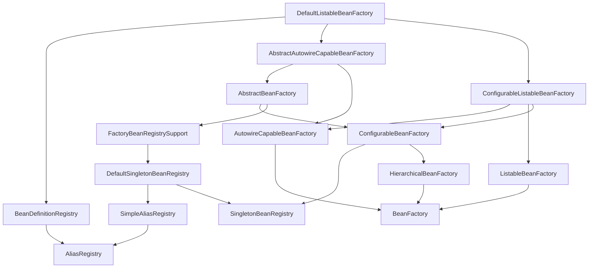

> ```java
> @SpringBootApplication
> public class 启动类名 {
>  public static void main(String[] args){
>      SpringApplication.run(启动类名.class,args);
>  }
> }
> ```

> springboot为我们提供的最大感受就是很多繁复的各种配置工作都极度简化了。主要的原因在于springboot依托于spring构建的控制反转，切面等功能，将原本复杂的项目转化成一个有组织的小单位的集合体，springboot作为中央部门负责协调各单位的依赖关系以及调度即可。
>
> 而彻底实现这些，需要做的工作就和搭建化学实验室一样。我们的目标是有一个设施齐全的工作室，且各设备的电源应该可以随时开关，各种设备也应该摆放有序，可以随意拿取，最好有个智能的机器人替我们完成一些清理打扫的工作。而当我们准备开始一天的工作时，告诉机器人今天的任务，应该为我们提前运行起需要的设备。
>
> 上述的智能实验室，就可以看作一个springboot为我们提供的工作环境。
>
> 而springboot的底层为了实现这些，在运行后，自然需要先完成各个实验室的建造，
>
> 基础的工作可以视为，
>
> - 获得打包寄来的各种实验仪器和检测设备，
> - 拆开包装，并分门别类摆放，
> - 查看今天的工作任务，
> - 部署相关的检测设备，摆放好需要的实验仪器
> - 正式工作时，负责清洗使用过的仪器并重新摆放

启动类的主要工作如下，

==++++++++++++++首先++++++++++++++++++++++++++++++++++++++==

# 自动装配

> 1. 获取资源加载器
>
> 2. 获取主资源，其实就是我们定义的那个启动类
>
> 3. 获取web的应用类型
>
> 4. 然去加载`ApplicationContextInitializer`对应的各种类，
>
>    > 这里的操作是提取springboot依赖中的`META-INF/spring.factories`的文件，
>    >
>    > 例如以下的内容，
>    >
>    > ```properties
>    > # Initializers
>    > org.springframework.context.ApplicationContextInitializer=\
>    > org.springframework.boot.autoconfigure.SharedMetadataReaderFactoryContextInitializer,\
>    > org.springframework.boot.autoconfigure.logging.ConditionEvaluationReportLoggingListener
>    > ```
>    >
>    > 这个文件本身就算是一个properties的文件，springboot的初始化过程就是先加载这些对应的类，springboot本身也会有多个组件，因此不同的springbootd依赖可能都会有自己的一份spring.factories文件，而启动时，这些对应的文件都会被提取。
>
> 5. 类似地还会去提取`ApplicationListener`的对应的类
>
>    > 如
>    >
>    > ```properties
>    > # Application Listeners
>    > org.springframework.context.ApplicationListener=\
>    > org.springframework.boot.autoconfigure.BackgroundPreinitializer
>    > ```
>
> 6. 最后，再获取我们设置的主类，当然还是我们的启动类，只不过之前是作为配置类，这次是单纯作为启动类。

==++++++++++++++++然后，进行准备工作+++++++++++++++++++++++++++++++++==

# 准备工作

对应的方法就是

```java
public ConfigurableApplicationContext run(String... args) {
    StopWatch stopWatch = new StopWatch();
    stopWatch.start();
    //以上就是计时的
    
    ConfigurableApplicationContext context = null;
    Collection<SpringBootExceptionReporter> exceptionReporters = new ArrayList();
    this.configureHeadlessProperty();
    
    //这里是关键，获取监听器，到时候就可以读取我们设置的@Controller或@Component等注解，并进行操作
    //这个监听器的获得一样还是去到spring.factories的文件中获取具体的监听器类
    SpringApplicationRunListeners listeners = this.getRunListeners(args);

    listeners.starting();
    Collection exceptionReporters;
    try {
        ApplicationArguments applicationArguments = new DefaultApplicationArguments(args);
        
        //这里就是根据监听器和我们给定的参数准备一个环境
        //可以实现类似 读取当前系统的环境变量 的功能
        ConfigurableEnvironment environment = this.prepareEnvironment(listeners, applicationArguments);
        this.configureIgnoreBeanInfo(environment);
        
        Banner printedBanner = this.printBanner(environment);//这行不是关键，只是实现了打印我们常看到启动时的那个springboot图标

        context = this.createApplicationContext();//创建应用上下文
        
        exceptionReporters = this.getSpringFactoriesInstances(SpringBootExceptionReporter.class, new Class[]{
            ConfigurableApplicationContext.class
           	 }, context);
        
        //获取一些必要的环境属性，
        //读取我们指定的主类，确定该主类有一个包含@Component的注解，然后将其进行注册
        //这其中，还会顺便执行一下我们主类的方法
        this.prepareContext(context, environment, listeners, applicationArguments, printedBanner);
        
        //这个方法最终主要调用的就是org\springframework\context\support\AbstractApplicationContext.class中的refresh()方法
        //我们可以截取其中部分代码分析,见附录 AbstractApplicationContext.class++>refresh()
        //主要就是通过解析主类的注解,建立各种bean
        this.refreshContext(context);
        
        //下面就是正常的使用
        this.afterRefresh(context, applicationArguments);
        stopWatch.stop();
        if (this.logStartupInfo) {
            (new StartupInfoLogger(this.mainApplicationClass)).logStarted(this.getApplicationLog(), stopWatch);
        }

        listeners.started(context);
        this.callRunners(context, applicationArguments);
    } catch (Throwable var10) {
        this.handleRunFailure(context, var10, exceptionReporters, listeners);
        throw new IllegalStateException(var10);
    }

    try {
        listeners.running(context);
        return context;
    } catch (Throwable var9) {
        this.handleRunFailure(context, var9, exceptionReporters, (SpringApplicationRunListeners)null);
        throw new IllegalStateException(var9);
    }
}
```


# Bean


# spring 循环依赖

## 产生

所谓的依赖是来源于类的实例化期间，需要赋予一个其它类的实例，

> 关键就在于，那个所谓的其他类，自己在实例化出一个对象时，里面也需要赋予一个另外一个类的实例，而不幸的是，这个所谓的另外的类就是前面我们试图实例的那个。
>
> 于是，导致我们在创建一个名为A的类的实例，里面一定要赋予一个名为B的类的实例对象，而B本身在实例化期间同样需要一个A的实例。
>
> ```java
> public class A{
>     private B b;
>     public A(B b){
>         this.b=b;
>     }
> }
> ```
>
> ```java
> public class B{
>     private A a;
>     public B(A a){
>         this.a=a;
>     }
> }
> ```
>
> 如果我们只是简单的使用java，可以直接随便new一个对应的类，随便写个空对象也可以应付。
>
> 但是在spring中，我们默认的单例模式，也就是，一个类只有一个对象实例，这样就导致了A和B的实例化就必须是使用对方才能获得一个是实例，但是对方没有实例，自己也无法称为一个实例，
>
> > 简单的归纳一下就是，在spring的单例模式中，这种实例化的依赖关系成为 ·我不实例化就无法实例化· 的死循环问题。

另外，上面的代码中，我们使用的是构造器注入实例对象，这种方式就是一种`懒加载`，是不存在方法来破除这种死循环。

**我们所能解决的是，那种由`set注入`引发的依赖问题**

## 解决

spring的解决方法称为`三级缓存`，这三个缓存就是`DefaultSingletonBeanRegistry`类中的三个Map的对象，

> ```java
> //一级缓存
> /** Cache of singleton objects: bean name to bean instance. */
> private final Map<String, Object> singletonObjects = new ConcurrentHashMap<>(256);
> 
> //三级缓存
> /** Cache of singleton factories: bean name to ObjectFactory. */
> //我们可以发现，这一缓存的最大不同在于泛型中是 ·ObjectFactory<?>·
> //看名字就知道，是一个用于生产object的工厂，它内部会使用代理方式创建一个对应bean的代理对象
> private final Map<String, ObjectFactory<?>> singletonFactories = new HashMap<>(16);
> 
> //二级缓存
> /** Cache of early singleton objects: bean name to bean instance. */
> private final Map<String, Object> earlySingletonObjects = new ConcurrentHashMap<>(16);
> ```

大致的操作过程可以同样查看附录的[AbstractApplicationContext.class++>refresh()](#AbstractApplicationContext.class++>refresh())中的`finishBeanFactoryInitialization(beanFactory)`方法。

大致的解决过程是，如果A需要B，B也需要A，那么就先建立一个空壳的A，然后再建立B，此时B只看到有A了，不关心你的内涵，总之自己的内部数据是完整的，于是首先称为真正的bean，而A尾随其后，把B拿过来填补自己，也成为了bean。

而缓存的分级则是将不同阶段的bean分隔开。为什么需要这些不同级别的缓存。

> 因为各个bean直接可能存在极度复杂的关系，为了真正实例化一个bean，我们可能需要实例化其它数个bean，这些bean之间可能有错综复杂的关系，也可能有需要牵扯其它的新的bean。
>
> 那么，为了避免进一步把各个bean的关系复杂化，我们应该尽可能快地把bean实例化。
>
> 那么如果单纯地划分出已实例化的和未彻底实例化的，我们无法明确哪些是已经准备了好久的bean，哪些是刚刚创建的空壳子。【如果根本不划分，那么对于其它线程而言，可能直接使用了bean的半成品，也是使用ConcurrentHashMap的原因。更关键的是，我们单纯的使用Map，是无法主动区分半成品】
>
> 于是，我们需要一个中间的缓存，就像繁忙的餐馆，位子有限，我们点了单，但饭菜还需要准备，那么智能让其它有饭菜的人先在餐桌吃饭，我们就先在外面的椅子上等着。

> 如果试图形象的表述这个问题和解决方案，可以想象一下以下的场景。
>
> > 我身无分文，但有一块祖上留下的地皮，我希望在这个地皮上盖一个大房子，但打工一辈子也盖不了房子。解决的方案是，向银行贷款，但银行要求抵押物必须是房产而不是地皮，这就是个问题，我们没有贷款就没有房子，但没有房子就不能拿钱盖房子。
>
> 于是，我选择欺骗，我首先找一些破木板搭建出一个房子的模样，然后去政府申请房产证，虽然房子不像样，但起码基于自己的地皮，有一个合法的房产证。
>
> 用房产证去银行拿了不算太多的钱，用这些钱我去请了一批手艺不错的工匠，盖了不错的房子，然后我拿它做租赁，依靠租金还了工匠和贷款的钱，取回自己的房产证，然后又去政府换了一个现在的房产证。
>
> > ~当然了，这里的政府属于好糊弄的。~
>
> 上面的场景中，大房子就是我们需要的bean A，而钱就是B，地皮是系统一开始为我划分的一块内存空间。
>
> 我一开始在内存空间上搭建了一个徒有其表的破房子，但起码收获了第一笔资金，但这笔钱是不完整的，因为是要还的，换言之就是去创建一个不完整的bean B，其后通过收租金的手段，认可了这个房子的合法性，于是我们的钱逐渐完整，最后偿还了债务，我们的钱才是真正的钱，此时，我们的大房子才是真正属于自己的房子。
>
> > 而缓存的分级，在这里就对应着不同的时间片段。
> >
> > 一开始的三级缓存，我们搭建的破房子就是一个欺骗用的，在我们看来它是一个骗钱的工具，
> >
> > 获得房产证后二级缓存，破房子就没必要存在了，转而是工匠修建的房子，
> >
> > 还清债款后一级缓存，此时，我们才真正是房子的主人了，拥有一切的使用权力。

# 附录

## AbstractApplicationContext.class++>refresh()

```java
// Prepare this context for refreshing.
prepareRefresh();
// Tell the subclass to refresh the internal bean factory.
ConfigurableListableBeanFactory beanFactory = obtainFreshBeanFactory();
// Prepare the bean factory for use in this context.
prepareBeanFactory(beanFactory);
try {
    // Allows post-processing of the bean factory in context subclasses.
    postProcessBeanFactory(beanFactory);

    //---------准备工作，阅读这里------------
    /*
    	上面的工作主要就是为了得到一个完整的bean工厂，下面的这个方法才是关键，
    	其内部使用的各种方法，最终的目的在于确认我们给定主类是否包含@Configuration注解，
    	除此之外，再去查看和解析主类包含的其它注解，
    	比如我们常使用的@ComponentScan，都会在这个时候被处理。
    	最重要的是，扫描其中所有的@import注解
    */
    //---------准备工作的介绍到这里就可以了----------
    // Invoke factory processors registered as beans in the context.
    invokeBeanFactoryPostProcessors(beanFactory);
    
    // Register bean processors that intercept bean creation.
    registerBeanPostProcessors(beanFactory);
    // Initialize message source for this context.
    initMessageSource();
    // Initialize event multicaster for this context.
    initApplicationEventMulticaster();
    
    //这个方法内部会试图创建育成web服务器，如果我们不设置的话，就会去使用tomcat
    // Initialize other special beans in specific context subclasses.
    onRefresh();
    
    // Check for listener beans and register them.
    registerListeners();
    
    //----------循环依赖，阅读这里--------------
    //实例化bean
    //这个在循环依赖的介绍中，也会常提及
    //因为前面的种种操作，最多是在内存中为对象分配一块空间，而这里则真正赋予其中的内容
    //也正是如此，当我们的类涉及循环依赖时，前面的操作是感知不到的，是由这里会切实地去检查当前的缓存中，我们是否之前已经得到这样的一个对象
    //检查时使用的是我们定义或按类名默认的beanName去搜索，因此两个相同的beanName会产生异常
    //另外，这些名字之前会保存在一个 List<String>的对象中，
    /*
    spring就是使用简单的 for 循环进行逐一的检查与实例化
    而检查的位置，则是提及的三个缓存中的一级缓存
    在检查没有对应的对象后，开始建立的其对象,
    前面我们使用了 for 循环一个个地检查bean，并且每次处理一个bean，
    那么对于单例模式，一些类的bean并没有创建出来，而当前bean的完整实现却需要一个这样的对象
    但是，单例模式要求这些bean又必须存在，就导致了循环依赖的问题，
    问题的解决在于递归，假设我们现在正在创建的bean是类A的名为 a的bean，
    而它其中需要注入一个类B 的名为b的bean,
    此时，a已经被分配了一个对应的内存空间，但内部的那些bean的具体属性还是null，是不被承认为bean的，
    此时使用一个匿名内部类对a做代理，底层就是AOP的编程，一番操作后，新的代理对象转移到二级缓存中，
    这个代理对象会保证在获得所需bean之后，立马生产一个真正的bean a,再放到一级缓存中，
    此时，也触发了创建b，b的创建就是a同样的路径，就是递归操作，
    b创建的空壳首先放在三级缓存中，幸运的是，它很快就能发现在二级缓存中有自己需要的bean,
    于是b首先创建成功，继而导致a的彻底创建成功，
    */
    //这样，就能够把对应的bean彻底实现
    //---------
    //----------循环依赖到这里结束--------------------
    // Instantiate all remaining (non-lazy-init) singletons.
    finishBeanFactoryInitialization(beanFactory);
    
    // Last step: publish corresponding event.
    finishRefresh();
}
```


## 容器加载相关类图




