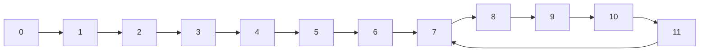

# 交换数组的两个元素

```java
a[i]=a[i] ^ a[j]; //(1)
a[j]=a[i] ^ a[j]; //(2)
a[i]=a[i] ^ a[j]; //(3)
```

上面是或运算，就是对应的二进制数的对应的各位，如果相同就得到0，否则为1。

(2)的操作实际是`a[j]=(a[i] ^ a[j]) ^ a[j]=a[i] ^ (a[j] ^ a[j])=a[i] ^ 0=a[i]`

同理的

(3)实际是`a[i]=(a[i] ^ a[j]) ^ a[i]=a[i] ^ a[i] ^ a[j]=0 ^ a[j]=a[j]`。

# 二进制取1

取出一个数的最右侧的1，

```java
// int a
int right=a & (~a +1);
// 自身取反，再加1，再和自己与运算
// 得到那个最右侧的1
```

# 取中点

给定两个位置a，b，取中间位置，正常来说，直接$\frac{a+b}{2}$，但是可能出现a+b过大而溢出的现象，因此需要使用$a+\frac{b-a}{2}$，避免溢出的事件，代码则用

```java
int mid=a+((b-a) >> 1);//这样更快
```

# 递归master

$T(N)=a\times T(\frac{N}{b})+O(N^d)$

> $\frac{N}{b}$是子问题的规模，a是调用次数。
>
> $log_b a>d \longrightarrow 复杂度为O(N^{log_b a})$
>
> $log_b a=d \longrightarrow O(N^d\times logN)$
>
> $log_b a<d \longrightarrow O(N^d)$
>
> 详解见附录[master](#master)


# 堆

小根堆在java中就是优先级队列`PriorityQueue`。

堆排序：

> 就是让数组构建成一个堆，因为堆的头要不是最小的，又不是最大的，弹出头，把该元素与数组的前或后的元素交换一次，即构建出一个有序数组。
>
> 然后把新的堆的头整理一下位置，得到新的头，重复操作，得到有序数组。且空间复杂度很低。


# 入桶

在基数排序中，会按照数字的不同位的数字简单的入不同的桶，完成再倒出，就得到按某一位数字大小的排序。依次从低到高完成入桶出桶的操作，就相当于我们先按照高位的数字排，再依次按照低位排，得到顺序。

而入桶的操作，可以准备10个桶，对应不同位可能出现的0~9，但是每个桶的容量无法给定，就容易浪费存储空间。

于是，先准备一个等容量的数组help，再准备一个容量10的数组count。

> 先依次遍历元素，对应位出现依次就在conut数组的对应位置+1。
>
> 完成后，再从0位置向后累计，就比如
>
> > 原conut
> >
> > 1,2,3,4,5
> >
> > 累加后，
> >
> > 1,3,6,10,15
>
> 此时，再从原数组从后向前遍历元素，查看对应位置的数字，在查看一下count对应位置的数字n，该元素就放在help的n-1位置。同时，n减1。
>
> 一通操作结束后，count数字的各位置的数字，就对应的着某一类数字的在help中的起始位置。

# 排序算法选择

需要稳定性： 归并  ；数据量：就使用插入排序

需要时间：快速 ；数据量：就使用插入排序

需要空间：堆

# 复制链表

存在一种情况，链表的节点本身就是比较复杂的内容，它可能有多个指针，如果需要复制一个同样结构的链表，可以使用Map结构指定就节点与新节点的映射关系，此时，可以借助旧节点的指针关系方便地获得对应的新节点。

另外，在不依赖额外空间时，通过将新节点放在对应旧节点之后，那么，就通过这种关系也建立了一种映射关系，只需要在最后将新链表提取出来即可。

# 链表环

一个单链表，如果有环，确定入环的节点。

> 1. 快慢指针，一个走1，一个走2，在进入环中之后，不超过1圈，快慢指针会相遇
> 2. 此时，快指针回到链头，变成慢指针，两个指针一起前进
> 3. 双方必然会在入环的节点相遇

[解释](#链环)

# n皇后问题

在已有的基础上做优化，

> 正常的方法就是，前面的皇后位置保存，并且前面的都是按照行数依次向下，下一行的皇后就与前面几行的皇后比较，如果当前的位置可以就记录。

而现在的优化则在于，不去假象它有一个矩阵的表格，一个个判断，而是使用几个二进制数表示下一行不可使用的位置。

> 比如，表格边长是4，那么搞一个4个位长度的二进制，其中对应列存在皇后的记为1，
>
> 比如，第2列存在皇后，则记为0100，那么它还附带着限制，对应的斜线位置也是不能放其它皇后，
>
> 于是，我们还有两外几个数字，左斜线限制1000，右斜线限制0010，
>
> 这三个数字异或一下得到1110，表明了只有第四列可以放其它皇后。
>
> 依靠位运算的快速，可以极快地确定位置的合法性。

三个限制或完之后，得到的是1代表不可以的位置，0是合法的位置。

这里就需要考虑实际的变成问题，我们一般会使用int类型，这样实际的位数是32，而当我们的皇后没那么多的时候，高位就是0，会干扰之后的判断，因此我们需要加强结果，

> 准备一个限制a，在当前的场景中，它是低位的4个位均是1。我们之前异或的结果为b，
>
> 令c=a & ~b
>
> c就成为了1代表合法的位置，而其它的位置包括高位都是0.

此时，我们就能够放心地去使用其中1对应的位置，而是去位置的方式，就可以使用[二进制取1](#二进制取1)的手段，这个结果与之前的几个限制取异或，左限制或右限制再左移或右移一位，即可得到新的限制结果，方便之后的皇后选择。

# 附录

## master

$$
\begin{eqnarray*}
T(N) &=& a \cdot T(\frac{N}{b}+O(N^d))\\
&=& a\cdot \{a\cdot T(\frac{N}{b^2})+O((\frac{N}{b^2})^d)\}+O(N^d)\\
&&\vdots \\
&=& a^n\cdot T(\frac{N}{b^n})+\sum_{i=0}^n a^i\cdot O((\frac{N}{b^i})^d)
\end{eqnarray*}
$$

其中,$\frac{N}{b^n}$，认为不可再分，可以认为对应的$T(\frac{N}{b^n})=1$，或其它常数，总之影响不大。

> 假设$N=p\cdot b^n$，则有$n=log_b (\frac{N}{p}),a^n=(\frac{N}{p})^{log_ b a}$

另外，$O(N^d)$为了方便，我们可以假设为等于$N^d$，至于其中的系数也不会有影响，因为我们也不需要计较系数的大小。

于是有，
$$
T(N)=a^n+N^d\sum_{i=0}^n (\frac{a}{b^d})^i
$$

- 现在，就考虑一个情况，$\frac{a}{b^d}=1$，即$d=log_b a$则有

$$
T(N)&=& a^n+(n+1)N^d\\
&=&  (\frac{N}{p})^{log_b a}+(log_b (\frac{N}{p})N^d)\\
&=& N^d\cdot (\frac{1}{p^d}+log_b (\frac{N}{p}))
$$

此时，作为取最大次数而言，括号中的额外因素去除，就是我们的结论$N^d\cdot log N$。

- 如果$\frac{a}{b^d} \neq1$

  寻找最大次数，就看$a^n$和$N^d\cdot (\frac{a}{b^d})^i$ ，
  -  $\frac{a}{b^d} < 1$

    就看$a^n$和$N^d$，其中此时$log_b a<d$
    $$
    O(N)=a^n+N^d=(\frac{N}{p})^{log_b a}+N^d=N^d
    $$

  - $\frac{a}{b^d} > 1$

    $log_b a > d$，就是，
    $$
    O(N)&=& a^n+N^d\cdot (\frac{a}{b^d})^n\\
    &=& (\frac{N}{p})^{log_b a} + N^d\cdot \frac{(\frac{N}{p})^{log_b a}}{(\frac{N}{p})^d}\\
    去除额外的系数常数，即\\
    &=& N^{log_b a}
    $$

## 链环



可见7就是入环节点。

前面的链路长度是7，记作`k`，后面的环长度是5，记作`l`。

所谓在环中相遇就是取模的问题。我们入环的位置可以视为环位置的0位置。

令$k=t\cdot l+b$，满指针走的长度是`d`，

> 那么，满指针在环中的位置就视为$(d-k)\, \%\, l$ 。
>
> 快指针走的长度自然就是`2d`，对应环中的位置就是$(2d-k)\%l$，
> $$
> (2d-k)\% l=((d-k)\,\%\, l\, +\, d\,\%\, l)\,\% \,l
> $$
> 也就是表名，只要$d\,\%\,l=0$，快慢指针就会相遇。
>
> 那么$d=k+c=t\cdot l+b+(l-b)$，即满指针在环中走$c=l-b$即可。
>
> 那么快指针一步步从链头过来，就走了k长度，满指针的在环中的位置就是$c+k=c+t\cdot l+b=(t+1)\cdot l$，取模之后，满指针就回到了环的0位置。
>
> 快慢指针在入环节点相遇。


