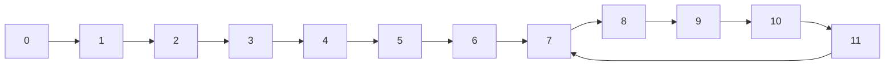

# 交换数组的两个元素

```java
a[i]=a[i] ^ a[j]; //(1)
a[j]=a[i] ^ a[j]; //(2)
a[i]=a[i] ^ a[j]; //(3)
```

上面是或运算，就是对应的二进制数的对应的各位，如果相同就得到0，否则为1。

(2)的操作实际是`a[j]=(a[i] ^ a[j]) ^ a[j]=a[i] ^ (a[j] ^ a[j])=a[i] ^ 0=a[i]`

同理的

(3)实际是`a[i]=(a[i] ^ a[j]) ^ a[i]=a[i] ^ a[i] ^ a[j]=0 ^ a[j]=a[j]`。

# 二进制取1

取出一个数的最右侧的1，

```java
// int a
int right=a & (~a +1);
// 自身取反，再加1，再和自己与运算
// 得到那个最右侧的1
```

# 取中点

给定两个位置a，b，取中间位置，正常来说，直接$\frac{a+b}{2}$，但是可能出现a+b过大而溢出的现象，因此需要使用$a+\frac{b-a}{2}$，避免溢出的事件，代码则用

```java
int mid=a+((b-a) >> 1);//这样更快
```

# 递归master

$T(N)=a\times T(\frac{N}{b})+O(N^d)$

> $\frac{N}{b}$是子问题的规模，a是调用次数。
>
> $log_b a>d \longrightarrow 复杂度为O(N^{log_b a})$
>
> $log_b a=d \longrightarrow O(N^d\times logN)$
>
> $log_b a<d \longrightarrow O(N^d)$
>
> 详解见附录[master](#master)


# 堆

小根堆在java中就是优先级队列`PriorityQueue`。

堆排序：

> 就是让数组构建成一个堆，因为堆的头要不是最小的，又不是最大的，弹出头，把该元素与数组的前或后的元素交换一次，即构建出一个有序数组。
>
> 然后把新的堆的头整理一下位置，得到新的头，重复操作，得到有序数组。且空间复杂度很低。


# 入桶

在基数排序中，会按照数字的不同位的数字简单的入不同的桶，完成再倒出，就得到按某一位数字大小的排序。依次从低到高完成入桶出桶的操作，就相当于我们先按照高位的数字排，再依次按照低位排，得到顺序。

而入桶的操作，可以准备10个桶，对应不同位可能出现的0~9，但是每个桶的容量无法给定，就容易浪费存储空间。

于是，先准备一个等容量的数组help，再准备一个容量10的数组count。

> 先依次遍历元素，对应位出现依次就在conut数组的对应位置+1。
>
> 完成后，再从0位置向后累计，就比如
>
> > 原conut
> >
> > 1,2,3,4,5
> >
> > 累加后，
> >
> > 1,3,6,10,15
>
> 此时，再从原数组从后向前遍历元素，查看对应位置的数字，在查看一下count对应位置的数字n，该元素就放在help的n-1位置。同时，n减1。
>
> 一通操作结束后，count数字的各位置的数字，就对应的着某一类数字的在help中的起始位置。

# 排序算法选择

需要稳定性： 归并  ；数据量：就使用插入排序

需要时间：快速 ；数据量：就使用插入排序

需要空间：堆

# 复制链表

存在一种情况，链表的节点本身就是比较复杂的内容，它可能有多个指针，如果需要复制一个同样结构的链表，可以使用Map结构指定就节点与新节点的映射关系，此时，可以借助旧节点的指针关系方便地获得对应的新节点。

另外，在不依赖额外空间时，通过将新节点放在对应旧节点之后，那么，就通过这种关系也建立了一种映射关系，只需要在最后将新链表提取出来即可。

# 链表环

一个单链表，如果有环，确定入环的节点。

> 1. 快慢指针，一个走1，一个走2，在进入环中之后，不超过1圈，快慢指针会相遇
> 2. 此时，快指针回到链头，变成慢指针，两个指针一起前进
> 3. 双方必然会在入环的节点相遇

[解释](#链环)

# n皇后问题

在已有的基础上做优化，

> 正常的方法就是，前面的皇后位置保存，并且前面的都是按照行数依次向下，下一行的皇后就与前面几行的皇后比较，如果当前的位置可以就记录。

而现在的优化则在于，不去假象它有一个矩阵的表格，一个个判断，而是使用几个二进制数表示下一行不可使用的位置。

> 比如，表格边长是4，那么搞一个4个位长度的二进制，其中对应列存在皇后的记为1，
>
> 比如，第2列存在皇后，则记为0100，那么它还附带着限制，对应的斜线位置也是不能放其它皇后，
>
> 于是，我们还有两外几个数字，左斜线限制1000，右斜线限制0010，
>
> 这三个数字异或一下得到1110，表明了只有第四列可以放其它皇后。
>
> 依靠位运算的快速，可以极快地确定位置的合法性。

三个限制或完之后，得到的是1代表不可以的位置，0是合法的位置。

这里就需要考虑实际的变成问题，我们一般会使用int类型，这样实际的位数是32，而当我们的皇后没那么多的时候，高位就是0，会干扰之后的判断，因此我们需要加强结果，

> 准备一个限制a，在当前的场景中，它是低位的4个位均是1。我们之前异或的结果为b，
>
> 令c=a & ~b
>
> c就成为了1代表合法的位置，而其它的位置包括高位都是0.

此时，我们就能够放心地去使用其中1对应的位置，而是去位置的方式，就可以使用[二进制取1](#二进制取1)的手段，这个结果与之前的几个限制取异或，左限制或右限制再左移或右移一位，即可得到新的限制结果，方便之后的皇后选择。

# 布隆过滤器

目的是检测给定的值，是否已经被我们获取过，当数量特别大时，常用的hash表方法需要极大的空间，成本过高。

由此，则希望使用一种近似手段，可以理解为网站上为电影打标签，如果我们划分的标签足够多，那么我们指定足够多的标签，全部符合的恐怕就是有限几个。如果我们不记录电影名，而只记录是否存在对应的标签组合，就可以近似地确定我们是否收录了对应的电影。

而布隆过滤器的思想，就在于通过对给定值进行几次哈希运算，得到对应的标签，而标签的记录则使用位图，

> 即用比特数组来记录标签，所谓的标签就是哈希运算后取模，对比特数组的对应位置改为1，即标记了标签的存在。
>
> 比特数组的使用，
>
> > 使用long或int整数的数组，作为实际的比特数组，如果要
> >
> > - 获取 i 位置的信息
> >
> >   ```java
> >   // 假设数组位 a
> >   // long或int对应的位数为p
> >   int x=i/p;
> >   int y=i%p;
> >   //分别获取对应的数组位置，和对应整数的二进制位
> >   int s=((a[x] >> y) & 1);//获取到对应位置的信息
> >   ```
> >
> > - 修改 i 位置的信息
> >
> >   ```java
> >   //改为 1
> >   a[x]=a[x] | (1 << y);
> >   //改为 0
> >   a[x]=a[x] & (~(1 << y));
> >   //如果是long类型，记得用 1L
> >   ```
>
> 由于是近似，自然存在判断失误，而比特数组的量如果小的话，数据量较大时，填满了就没有价值了。
>
> 需要考虑的是，可以分配给比特数组的空间大小，和标签数量，也就是需要使用的不同哈希函数，
>
> > 数据量n，容许的失误率p。那么比特数组空间大小m和哈希函数个数k,
> > $$
> > m=-\frac{n\cdot lnp}{(ln2)^2}\\
> > k=ln2\quad\cdot\frac{m}{n} \\
> > 另外，实际的的空间大小$m_真$和哈希数量$k_真$，\\可能会看情况上调一下，对应的实际失误率$p_真$\\
> > p_真=(1-exp(-\frac{n\cdot k_真}{m_真}))^{k_真}
> > $$

# 一致性哈希

在数据的均衡负载问题上，如果只是简单地实现一个chord环，节点的插入可以很简单，但是导致数据的分配不均匀。

为此，不再让节点实际作为插入环的节点，而是在环上均匀划分处几组节点位置，将这些位置分别于不同的实际节点对应。只需要实现一个中间的转换层，为不同节点分配位置即可。

同时，可以通过指定节点的位置数量实现基于性能的负载均衡。

# 并查集

这是在我们做一个集合的合并与查询操作时的高效方法。简单理解的话，如果只是采用链表的话，合并快，但查询慢，如果是哈希表，则查询快而合并慢。

为此，就需要整合二者的优势，

> ```mermaid
> flowchart BT
> h((head));h1((head1));h2((head2))
> n1((n));n2((n));n11((n));n12((n));n21((n));n22((n))
> h1-->h;h2-->h;h-->h
> n11-->h1;n12-->h1
> n1-->h;n2-->h
> n21-->h2;n22-->h2
> h3((head3));n3((n));n31((n))
> h3-->h3;n3-->h3;n31-->h3
> ```
>
> 如上图，一个集合选择出一个head，其它的几个元素可以向上连接它，当然也不要求都向上连接这个头。
>
> 并且最上面的元素是指向自己的。
>
> 我们建立一个map，记录各个节点，
>
> > 如果我们需要判断两个节点是否在同一个集合中，只需要让两个节点向上搜索，知道节点就是节点自身，就代表到达顶点，如果两个节点查询的结果节点是同一个就代表它们是同一个集合。
>
> 合并
>
> > 如果发现不是同一个集群，我们试图去合并两个集群。比如希望合并head3和head2，直接把head3的指针指向head2即可。
>
> 但这有一个问题，如果上面的图层数过高，怎么办
>
> > 就是在查询过程中，经历的底层节点顺便指向顶点即可。
>
> 此外我们还有一个map是负责记录当前不同集合内部元素的数量，以后合并的时候是小的集合放在大集合下面。

大概的过程就是如此，实现也比较简单，而且各方面效率也很优秀，

> 其中的关键在于我们的操作核心是去查找集合的顶点，我们前面提及了防止层数过多，就是在这个过程中顺便操作的。
>
> 数学上也证明，如果查找顶点的操作接近集合的元素数量，那么查询复杂度就逼近$O(\alpha(N))$，$\alpha(N)$是一个增长极为缓慢的函数，因此可以认为，当我们的操作较为频繁时，查询复杂度可以认为就是$O(1)$。

# KMP

这个算法就是负责子字符串的匹配工作。

> s1是子字符串，s是那个大字符串，我们希望在s中找到s1。
>
> 常规方法是s1从s的位置0开始先匹配依次，发现不行，再从1开始，不行，再从2开始。
>
> 但是，有时候虽然失败了，但发现当前的局部几个字符和s1的前面几个是相同的，我们就不需要在一个个地移动着去确认，直接和这几个可以确定的重合，在比较一下在后面的字符是否相同。
>
> > ```mermaid
> > flowchart LR
> > a1((a));a2((a));b((b));a3((a));a4((a));e((e))
> > a1---a2---b---a3---a4---e---.....
> > a11((a));a21((a));b1((b));a31((a));a41((a));f((f))
> > a11---a21---b1---a31---a41---f
> > a1-.-匹配1-.-a11
> > a2-.-原本的匹配2-.-a11
> > e-.-顶替f-.-b1
> > a3-.-匹配2-.-a11
> > a4-.-匹配2-.-a21
> > ```
> >
> > 一开始从0位置开始，后来发现到e的位置是，与s1的f是不同的，于是需要s1向后调整位置，正常的方法就是在s的1位置开始，但此时，KMP则可以跳到3位置。
>
> 读者都知道，KMP需要s1自己准备一个数组，指明不同位置如果失败的话，换自己哪个位置的字符重新开始，上面就是f的5位置出错了，换上2位置的b顶上。
>
> > 实际就是，s1计算每个位置前的字符串的前缀和后缀相等时的最大长度。
> >
> > 对于aabaaf
> >
> > 0: -1
> >
> > 1: 1，它前面的a自己就是自己的后缀，长度是1
> >
> > 2: 2，因为aa也是自己的后缀等于前缀，长度为2
> >
> > 3: 0
> >
> > 4: 1， 前面的0说明之前的位置是不可能与开头相同的，没必要比较，可能的就是当前新出现的a，结果长度是1
> >
> > 5: 2，前面的1表明再前面的字符和前缀是有一个字符相同的，那么就从它开始再加上当前新出现的a比较，发现能匹配的长度是2。如果不能匹配，
> >
> > > 我们是否就需要一个个地去除后缀前面的字符再与s的前缀匹配，直至能相同，就得到新的长度。
> > >
> > > 但这种方法肯定是低效的，假如现在前面字符对于的数组表明以匹配的长度是k，那么我们现在新加入的字符没有成功匹配对应的下一个字符，
> > >
> > > 我们的主要目的当然在于找到前缀，它的末尾就是当前新加入的字符，此时就换了一个方向，不是缩短我们的后缀，而是向前缩短前缀，
> > >
> > > 我们自然是希望匹配的长度更长一些，那么就代表不只是新字符对应相等，还要包含新字符前面的字符，
> > >
> > > 实际就是让前缀那个失败的位置查看一下向前跳到子前缀的位置再比较。
> > >
> > > ```mermaid
> > > graph TD
> > > a1---a2---a3---a4---a5---a6---a7---a8---a9---a10---a11
> > > h[计算a11]-..->a11
> > > style h fill:#ffffff
> > > s([a1,a2,a3与a7,a8,a9是匹配的])
> > > s-.->a7
> > > style s fill:#f5a623
> > > style s' fill:#f5a623
> > > s'([a1和a3是匹配的])-.-a3
> > > s1([a10是当前场景的新字符])-.->a10
> > > style s1 fill:#7ed321
> > > s2([此时需要a10和a4比较])-.->a10
> > > style s2 fill:#7ed321
> > > s3([a4!=a10,就需要将匹配地点跳转到,a4前面的匹配前缀])-.->a4
> > > style s3 fill:#f5a623
> > > style s4 fill:#f5a623
> > > s4([a4失败,自然考虑转移阵地,自然就是让a10和a2比较])-.->a2
> > > ```

# Manacher

这种算法主要是处理字符串的最长回文字串的，与KMP类似，他也是在正常的处理基础上，省去了一一些不必要的比较情况，从而提高效率。

> - 正常的机制，就是在一个位置向两边同步延伸，知道得到的字符不同，可确定回文范围
> - 但考虑到回文字符的数量可能是偶数，导致上述的两边延伸策略不适用，就认为在每两个字符中间插入无意义的字符，充当一个虚位置，由此对于偶数字符数量的回文，也可以通过在一个虚位置向两边延伸而获得
> - 当我们从字符串的头部位置开始做两边延伸的策略去获得，当前位置作为中心能获得的最大回文的情况。此时记录
>   - 该位置对应的回文半径，
>   - 以及回文向后方到达的边界，如果超过以往的边界，就记录下这个边界和对应的中心位置

具体的操作是

> - 从字符串头部开始，以该位置作为中心向两边延伸得到对应最大回文的信息，
> - 接着向后在其它位置上准备按照同样的向两边延伸前，
>   - ==先看当前的位置是否超出上次记录的边界，如果是的，就正常地按照普通的方法确定回文==
>   - 如果没超过，假设当前的位置为 n，就以该边界的中心位置对称过去找到位置 n'，如果 n' 当初查到的回文对应的范围，
>     - 超过了对称的边界或在对称边界里面，此时 n 位置是不需要在考虑回文，直接到下个位置，简单利用 n' 的回文信息处理 n 对应的回文信息
>     - ==如果 n' 对应的回文的范围正好压在对称边界上，那么，n 可以做尝试==

# Morris遍历


# BFPRT算法


# 后缀数组

# k伪进制

即各位不能是0，可以是1~k，因此当普通的k进制导致低位为0时，在伪进制中是不可取的，需要将移除这个高位，由低位组建成原本的大小。

> 比如对于9，在3进制时，是100，
>
> 此时低位为0，不可取，只能由两个低位完成，即23。
>
> 也就是前一个高位必须要留有剩余给低位。

> 那么k伪进制的获取方法就是，如果后面有n个低位，那么代表最小的值是$\sum_{i=0}^{n-1}k^i=\frac{k^n-1}{k-1}$。


# 两段交换

给定一个数组，分为前后两个部分，我们希望通过空间复杂度$O(1)$的方法实现两段交换位置。

方法很简单，就是两个部分自己内部完成一次逆序，前后交换位置，最后再整体完成一次逆序。

# 附录

## master

$$
\begin{eqnarray*}
T(N) &=& a \cdot T(\frac{N}{b}+O(N^d))\\
&=& a\cdot \{a\cdot T(\frac{N}{b^2})+O((\frac{N}{b^2})^d)\}+O(N^d)\\
&&\vdots \\
&=& a^n\cdot T(\frac{N}{b^n})+\sum_{i=0}^n a^i\cdot O((\frac{N}{b^i})^d)
\end{eqnarray*}
$$

其中,$\frac{N}{b^n}$，认为不可再分，可以认为对应的$T(\frac{N}{b^n})=1$，或其它常数，总之影响不大。

> 假设$N=p\cdot b^n$，则有$n=log_b (\frac{N}{p}),a^n=(\frac{N}{p})^{log_ b a}$

另外，$O(N^d)$为了方便，我们可以假设为等于$N^d$，至于其中的系数也不会有影响，因为我们也不需要计较系数的大小。

于是有，
$$
T(N)=a^n+N^d\sum_{i=0}^n (\frac{a}{b^d})^i
$$

- 现在，就考虑一个情况，$\frac{a}{b^d}=1$，即$d=log_b a$则有

$$
T(N)&=& a^n+(n+1)N^d\\
&=&  (\frac{N}{p})^{log_b a}+(log_b (\frac{N}{p})N^d)\\
&=& N^d\cdot (\frac{1}{p^d}+log_b (\frac{N}{p}))
$$

此时，作为取最大次数而言，括号中的额外因素去除，就是我们的结论$N^d\cdot log N$。

- 如果$\frac{a}{b^d} \neq1$

  寻找最大次数，就看$a^n$和$N^d\cdot (\frac{a}{b^d})^i$ ，
  -  $\frac{a}{b^d} < 1$

    就看$a^n$和$N^d$，其中此时$log_b a<d$
    $$
    O(N)=a^n+N^d=(\frac{N}{p})^{log_b a}+N^d=N^d
    $$

  - $\frac{a}{b^d} > 1$

    $log_b a > d$，就是，
    $$
    O(N)&=& a^n+N^d\cdot (\frac{a}{b^d})^n\\
    &=& (\frac{N}{p})^{log_b a} + N^d\cdot \frac{(\frac{N}{p})^{log_b a}}{(\frac{N}{p})^d}\\
    &&去除额外的系数常数，即\\
    &=& N^{log_b a}
    $$

## 链环



可见7就是入环节点。

前面的链路长度是7，记作`k`，后面的环长度是5，记作`l`。

所谓在环中相遇就是取模的问题。我们入环的位置可以视为环位置的0位置。

令$k=t\cdot l+b$，满指针走的长度是`d`，

> 那么，满指针在环中的位置就视为$(d-k)\, \%\, l$ 。
>
> 快指针走的长度自然就是`2d`，对应环中的位置就是$(2d-k)\%l$，
> $$
> (2d-k)\% l=((d-k)\,\%\, l\, +\, d\,\%\, l)\,\% \,l
> $$
> 也就是表名，只要$d\,\%\,l=0$，快慢指针就会相遇。
>
> 那么$d=k+c=t\cdot l+b+(l-b)$，即满指针在环中走$c=l-b$即可。
>
> 那么快指针一步步从链头过来，就走了k长度，满指针的在环中的位置就是$c+k=c+t\cdot l+b=(t+1)\cdot l$，取模之后，满指针就回到了环的0位置。
>
> 快慢指针在入环节点相遇。


